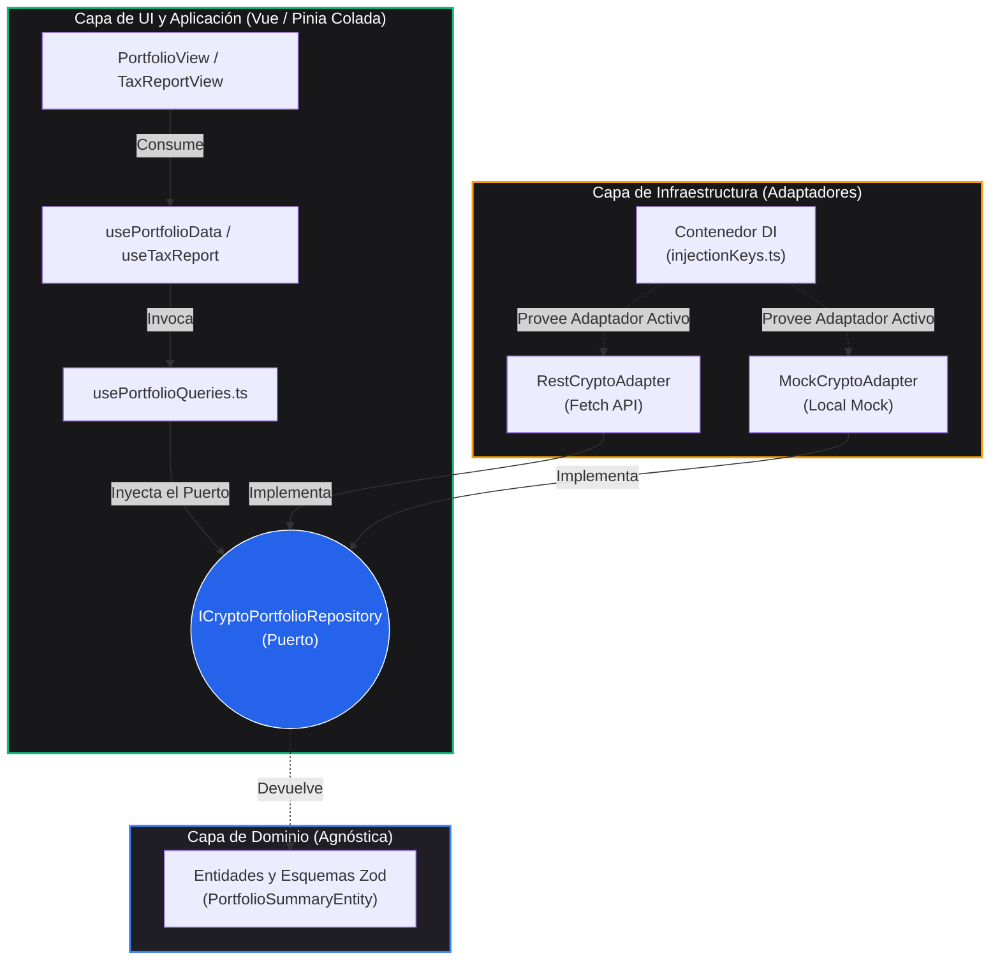

# 📊 Kryptofolio

[](https://github.com/nelomr/kryptofolio/releases/latest)
[](https://github.com/nelomr/kryptofolio/actions/workflows/ci.yml)
[](./CHANGELOG.md)

> 🌍 **Leer en:** [English](README.md) | [Español](README.es.md)


> **Kryptofolio** es un dashboard de portafolio cripto y fiscal de código abierto, construido con Vue 3 y Arquitectura Hexagonal estricta (Puertos y Adaptadores). Funciona como una capa de presentación visual que muestra información fiscal y de transacciones calculada por el backend, utilizando un backend centralizado (`apps/backend`) para conectar la interfaz con las fuentes de datos.
>
> ⚠️ **Nota:** Este proyecto nace como una iniciativa de aprendizaje y se encuentra en desarrollo continuo en sus primeras etapas.

## ✨ Características Principales

- **📊 Presentación de Datos basada en FIFO:** Muestra saldos y datos fiscales estructurados según el método FIFO (First-In-First-Out) calculados previamente por el backend, ofreciendo un resumen visual claro y estandarizado.
- **🧹 Asistente de Ingesta de Datos (Wizard):** Una interfaz en varios pasos que permite subir archivos CSV/XLSX, mapear automáticamente cabeceras de exchanges populares (Binance, Kraken, Coinbase, KuCoin, Bitunix), realizar ajustes manuales con opciones ordenadas alfabéticamente, validar restricciones de Spot vs. Futuros y enviar de forma segura los datos limpios al backend.
- **🏛️ Cumplimiento Fiscal y Tributario:** Una vista dedicada de Informe Fiscal para inspeccionar el historial de transacciones, identificar inconsistencias (ej. bases de coste faltantes o saldos negativos) y presentar datos estructurados listos para informes AEAT.
- **🤖 Preparado para Agentes de IA (Futura Feature):** El frontend está técnicamente diseñado para una futura integración de Agentes de IA (usando Vercel AI SDK o Mastra). Dado que los Casos de Uso y los DTOs están aislados y validados, pueden exponerse directamente como herramientas (Tools / Function Calling) a un LLM en el futuro para consultas en lenguaje natural sin reescribir validaciones.
- **🛡️ Privacidad Primero:** Totalmente self-hosted. El sistema funciona localmente, asegurando que las credenciales de API y las transacciones permanezcan seguras. El backend puede integrarse con bases de datos locales o remotas de forma segura.
- **🔐 Bóveda de Secretos Local:** Bóveda encriptada con AES-256-GCM para almacenar de forma segura credenciales de APIs. El borrado de memoria RAM ("scrubbing") asegura que las claves se destruyen tras su uso. Permite habilitar o deshabilitar integraciones en caliente.
- **🏗️ Arquitectura Hexagonal (Separación en Frontend):** Estricta separación de responsabilidades (Puertos y Adaptadores). La capa de UI del frontend está desacoplada de los protocolos de red y mecanismos de almacenamiento local, garantizando alta testabilidad y seguridad de contratos mediante esquemas de validación Zod.

## 🛠️ Stack Tecnológico y Monorepo

- **Framework**: Vue 3 (Composition API + `<script setup>`)
- **Gestión de Estado**: [Pinia](https://pinia.vuejs.org/) + [Pinia Colada](https://pinia-colada.esm.dev/)
- **Estilos**: TailwindCSS 4
- **Gráficos**: Lightweight Charts (TradingView)
- **Testing**: Vitest
- **Workspace**: pnpm workspaces (Monorepo)

El repositorio está estructurado como un **Monorepo (PNPM Workspaces)** para desacoplar dominios y escalar eficientemente:
- `apps/frontend/`: La aplicación principal en Vue 3 (UI, Pinia stores).
- `apps/backend/`: El servicio core del backend (Hono), encargado de las rutas de la API, bóveda de secretos encriptada y el motor analítico de base de datos dual. Separado de forma limpia en `app.ts` (enrutamiento puro) e `index.ts` (orquestador y bootstrapper). Expone un `AppType` para garantizar type-safety E2E mediante Hono RPC.
- `packages/database/`: Capa de abstracción de base de datos que define la interfaz genérica `IDatabasePort` y los esquemas SQL. Encapsula la arquitectura core: un **SQLite Ledger** (`kryptofolio_ledger.db`) *local-first* para persistencia OLTP, y un **Motor DuckDB** efímero para consultas OLAP federadas de alto rendimiento.
- `packages/core-domain/`: Lógica de negocio pura (Servicios, Casos de Uso, Normalizadores). Totalmente agnóstico del framework.
- `packages/shared-types/`: Esquemas de Zod, DTOs y definiciones de tipos compartidas por todo el monorepo.
- `docs/`: Documentación técnica cubriendo:
  - [Arquitectura del Sistema](docs/architecture.md)
  - [Arquitectura de Base de Datos (SQLite Ledger)](docs/database-architecture.md)
  - [Arquitectura de Series Temporales (DuckDB & Parquet)](docs/architecture/duckdb-parquet-time-series.md)
### Gestión de Dependencias (PNPM Catalogs)
Usamos **PNPM Catalogs** para mantener una única fuente de la verdad en las dependencias comunes de todos los paquetes del monorepo (ej. TypeScript, Zod, Hono).
- Para actualizar una dependencia compartida, modifica el bloque `catalog:` en `pnpm-workspace.yaml` en la raíz y ejecuta `pnpm install`.
- Al añadir una dependencia compartida a un paquete, usa `"nombre-dependencia": "catalog:"` en su `package.json`.

## 🎨 Sistema de Diseño Institucional

Kryptofolio implementa un sistema de diseño estricto **Institucional Light** (Tailwind v4). Puedes leer las especificaciones completas en [DESIGN.md](DESIGN.md).

**Reglas Clave de Uso:**
- **Modo Light Estricto:** La interfaz es exclusivamente modo claro para mantener un aspecto institucional de alto contraste. No uses clases `dark:`.
- **Datos Numéricos:** Todos los datos numéricos (precios, porcentajes, fechas, IDs) DEBEN usar la clase utility `.num` (que aplica `font-mono` de JetBrains Mono y `tabular-nums`) para asegurar una alineación vertical perfecta en tablas y widgets.
- **Color Semántico:** No usamos colores genéricos de Tailwind (`blue-500`, `slate-100`). Usamos tokens semánticos:
  - **Superficies:** `bg-surface`, `bg-surface-2`, `bg-surface-3`
  - **Texto:** `text-fg`, `text-muted`, `text-muted-2`
  - **Financieros:** `text-profit`, `text-loss`, `text-warning`, `text-info`
  - **Interacciones:** `--color-accent` es un índigo institucional. Para hovers sutiles en botones ghost o selects, usa SIEMPRE `hover:bg-accent-soft hover:text-accent-2`.

## 🚀 Inicio Rápido

### Configuración del Entorno

Antes de ejecutar el proyecto, debes configurar tus variables de entorno.
Copia los archivos de ejemplo proporcionados para crear tus entornos locales:

```bash
# Para desarrollo
cp .env.example .env

# Para producción
cp .env.production.example .env.production
```

- `VITE_API_URL`: URL de `apps/backend` desde la perspectiva del frontend (por defecto: `http://localhost:3001`).
- `VITE_APP_LANG`: El idioma de la interfaz. Las opciones válidas actualmente son `es` o `en`.
- `LEDGER_DB_PATH`: (Backend) Ruta al archivo principal de base de datos SQLite (Ledger) para transacciones, bóveda de credenciales encriptadas y configuraciones (`kryptofolio_ledger.db`).
- `HISTORICAL_DATA_PATH`: (Backend) Ruta a la carpeta que contiene los archivos Parquet particionados mediante Hive para datos históricos de precios.
- `MOCK_MODE`: (Backend) Configúralo en `true` para usar una base de datos SQLite en memoria (desarrollo). Por defecto: `false`.

### 🌍 Internacionalización (i18n)

Kryptofolio utiliza un sistema de traducción basado en el entorno y sin dependencias externas.

**Para elegir un idioma:**
Configura `VITE_APP_LANG=en` (Inglés) o `VITE_APP_LANG=es` (Español) en tu archivo `.env` y reinicia el servidor de desarrollo. Si la variable no existe o es inválida, usará Inglés por defecto.

**Para añadir un idioma nuevo (ej. Francés `fr`):**
1. Crea un nuevo archivo `src/i18n/dictionaries/fr.ts`.
2. Copia la estructura de `en.ts` y traduce los valores. Asegúrate de que el objeto cumpla con la interfaz `I18nDictionary`.
3. Abre `src/core/infrastructure/i18n/EnvI18nAdapter.ts`.
4. Importa el nuevo diccionario: `import { fr } from '@/i18n/dictionaries/fr'`
5. Añádelo al mapa `dictionaries` dentro del adaptador:
   ```typescript
   const dictionaries: Record<string, I18nDictionary> = { en, es, fr }
   ```
6. Configura `VITE_APP_LANG=fr` en tu archivo `.env`.

---

### 💻 Desarrollo Local

Asegúrate de tener [pnpm](https://pnpm.io/) instalado.

```bash
# 1. Clonar el repositorio
git clone https://github.com/nelomr/kryptofolio.git
cd kryptofolio

# 2. Instalar dependencias en la raíz del workspace
pnpm install

# 3. Iniciar el entorno de desarrollo
# Para ejecutar el frontend con APIs reales:
pnpm dev

# O BIEN, para ejecutar el frontend junto con el servidor Backend (Hono) local simultáneamente:
pnpm run dev:full
```

> **Nota:** El comando `dev:full` levanta concurrentemente el frontend en Vite y el backend en Hono (`apps/backend`), permitiendo que el frontend consuma datos (o mocks) estrictamente validados a través de RPC.

### 🧪 Pruebas y Validación

Aplicamos estrictos controles de calidad (Arquitectura Limpia y TDD). Ejecuta estos comandos en la **raíz del proyecto** para validar tus cambios localmente:

| Comando | Descripción |
|---------|-------------|
| `pnpm dev` | Inicia el servidor de desarrollo local del frontend (`-F @kryptofolio/frontend`). |
| `pnpm dev:full` | Orquesta con Turborepo el arranque simultáneo del frontend y backend. |
| `pnpm test` | Ejecuta de forma paralela la suite completa de pruebas unitarias usando Turborepo. |
| `pnpm typecheck` | Ejecuta estáticamente **Vue-TSC** y chequeo de tipos en todos los paquetes. |
| `pnpm lint` | Analiza el código con ESLint en todo el workspace. |
| `pnpm build` | Compila y empaqueta el proyecto usando la caché de Turborepo. |

## 📦 Arquitectura: Hexagonal (Puertos y Adaptadores)

Este proyecto se adhiere estrictamente a la **Arquitectura Hexagonal** (Puertos y Adaptadores) en el frontend. Es importante recalcar que **el frontend no ejecuta lógica de negocio de cálculo financiero** (como la asignación de bases de coste por FIFO o el cálculo de pérdidas y ganancias - PnL realizadas o no realizadas). En su lugar:
- **Motor de Cálculo:** El cálculo pesado se delega completamente a la capa del backend.
- **Puertos y Adaptadores del Frontend:** Están diseñados puramente para desacoplar los componentes de la interfaz de usuario y los estados de presentación de los detalles de infraestructura (protocolos de red, contratos de API, bóveda de almacenamiento local, configuraciones de i18n y esquemas de validación).



### 🏛️ Capas Arquitectónicas

1. **Capa de Dominio (`src/core/domain/`)**
   El corazón de la lógica de cliente de la aplicación. **Aislamiento total**: No tiene dependencias externas de frameworks (sin imports de Vue, Axios, ni Zod).
   - **Entidades y Objetos de Valor (`models/`)**: Definidos usando interfaces TypeScript puras. Utilizamos **Branded Types** (tipos marca como `AssetId` o `LotId`) para garantizar type-safety en identificadores. Las cifras financieras se encapsulan estrictamente en un Value Object `Money` usando `decimal.js`, erradicando por completo la "obsesión por los primitivos" y los errores de punto flotante de IEEE-754.
   - **Puertos (`ports/`)**: Interfaces que definen el contrato para las operaciones de datos. El dominio dicta *qué* necesita el cliente, no *cómo* obtenerlo. Nota: NO existe la carpeta `repositories`; las interfaces de repositorios son puertos de salida.

2. **Capa de Aplicación (`src/core/application/`)**
   - **Casos de Uso (`use-cases/`)**: Clases TypeScript puras que coordinan los Puertos del Dominio. Contienen la lógica de orquestación específica del frontend (ej. `SaveVaultKeyUseCase`, `UpdateLanguageUseCase`, `ImportTransactionsUseCase`) sin reactividad de Vue ni dependencias de frameworks. Toda mutación de estado DEBE pasar por un Caso de Uso.

3. **Capa de Infraestructura (`src/core/infrastructure/`)**
   El borde exterior que se comunica con el mundo real y protege al dominio.
   - **Adaptadores (`adapters/`)**: Implementaciones concretas de los puertos del dominio (ej. `RestCryptoAdapter`). Deben tener el sufijo `Adapter`. Nota: Los Mocks y enrutamiento se manejan exclusivamente en la capa del backend.
   - **DTOs y Capa Anticorrupción (`dtos/`)**: Esquemas de validación Zod (`ExternalTaxSchemas.ts`). Mapean los datos brutos de la API a Entidades puras y validan la integridad de la respuesta *antes* de que toque el dominio.
   - **Inyección de Dependencias (`di/`)**: El "Composition Root". Instancia los adaptadores REST y los conecta con Vue (vía provide/inject usando símbolos estrictos como `VAULT_PORT_KEY`).

4. **Capa de Aplicación y UI (`src/composables/` & `src/views/`)**
   - Utilizamos `@pinia/colada` dentro de `composables/queries` específicos para manejar de forma declarativa el fetching asíncrono del estado del servidor.
   - **Nota Estructural**: En este proyecto, **no hay una carpeta global `src/stores/` y los componentes Vue NUNCA importan `bffClient`**. Los componentes consumen `use*Queries` (que delegan a Puertos inyectados) y `use*Mutations` (que delegan a Casos de Uso).
   - **Diseño Orientado a Features (Colocation)**: Los componentes específicos de una vista o feature (ej. `MetricsRow`) deben vivir dentro del directorio `components/` dedicado de su vista (ej. `src/views/Portfolio/components/`). Solo las primitivas de UI estrictamente genéricas y reutilizables (como botones o modales) se ubican en la carpeta global `src/components/`.

### 🛡️ Type Safety Absoluto y Políticas Estrictas
- **No `any` Policy**: El código fuente en producción está 100% tipado estáticamente, sin excepciones. Compilado rigurosamente mediante `vue-tsc --noEmit`.
- **Global Error Bus**: Si un esquema Zod de la Capa Anticorrupción falla, se emite un error controlado al `errorBus`, previniendo cuelgues silenciosos y permitiendo a la UI reaccionar.
- **Single-User Local First**: El modelo de dominio ha erradicado estrictamente el multi-tenancy. No existen campos como `user_id` o `tenant_id`, garantizando una arquitectura localizada y pura para portafolios individuales.
- **Financial Precision Boundaries**: Todos los datos financieros que cruzan la capa ACL DEBEN ser strings y ser parseados por estrictas reglas regex de Zod (ej. `preciseAmountSchema`) antes de entrar al Dominio, previniendo así la pérdida de precisión de punto flotante.

## 🤖 Guías para Agentes y Arquitectura UI

Este proyecto utiliza un enfoque de equipo de agentes de IA vía `.agent/skills` para forzar la arquitectura:
- **Componentes UI (shadcn-vue)**: Deben generarse vía CLI (`pnpm dlx shadcn-vue@latest add <component>`).
- **Gestión de Estado**: Datos asíncronos vía `@pinia/colada`, estado síncrono vía Pinia.
- **Vue Core**: Solo API de Composición (`<script setup>`) y priorizamos Composables.

## 🔖 Versionado (Frontend is King)

Este monorepo utiliza [Changesets](https://github.com/changesets/changesets) para el versionado independiente de paquetes, asegurando que los cambios en un paquete no fuercen la subida de versión de paquetes no relacionados.

Sin embargo, seguimos una filosofía de **"El Frontend es el Rey" (Frontend is King)**:
- La versión de `@kryptofolio/frontend` actúa como la versión global de facto de la aplicación.
- Durante el desarrollo inicial, los desarrolladores deben preferir estrictamente los incrementos de tipo `patch` sobre los de tipo `minor` para características no críticas, asegurando que los números de versión crezcan de forma lenta y deliberada.

### Cómo lanzar una versión

Las versiones están totalmente automatizadas a través de nuestra pipeline de Entrega Continua.
Cuando una Pull Request con un changeset es fusionada (merged) a `main`:
1. La GitHub Action `.github/workflows/release.yml` ejecuta automáticamente `pnpm changeset version`.
2. Sube las versiones en los archivos `package.json` y crea un commit directo a `main`, sin necesidad de revisión de PR.
3. Los paquetes se publican automáticamente.

**Flujo de Trabajo del Desarrollador:**
Antes de abrir una PR hacia `main` que modifique el código de los paquetes, **debes** ejecutar:
```bash
pnpm changeset
```
Sigue las instrucciones para declarar tu intención (patch/minor/major) y escribe una breve descripción. Se generará un archivo `.changeset/*.md` que deberás incluir en tus commits. Sin changeset, no hay nueva versión.

## 📄 Licencia

Este proyecto es de código abierto bajo la [Licencia AGPL-3.0](LICENSE).
