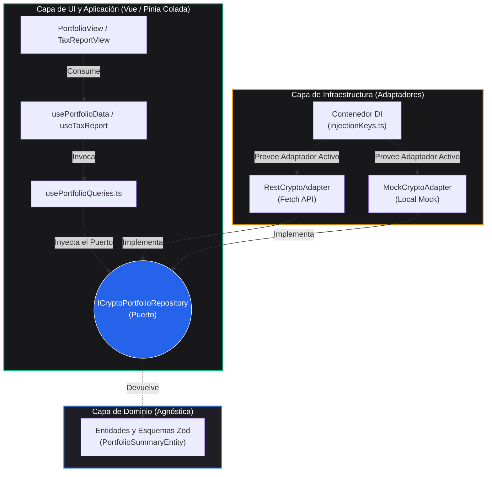

# 📊 Kryptofolio

[](https://github.com/nelomr/kryptofolio/releases/latest)
[](https://github.com/nelomr/kryptofolio/actions/workflows/ci.yml)
[](./CHANGELOG.md)

> 🌍 **Leer en:** [English](README.md) | [Español](README.es.md)


> **Kryptofolio** es un dashboard de portafolio cripto y fiscal de código abierto, construido con Vue 3 y Arquitectura Hexagonal estricta (Puertos y Adaptadores). Diseñado como una plataforma de visualización pura que utiliza un sistema estricto FIFO para la presentación de datos, y técnicamente preparado para una integración fluida con Agentes de IA (Vercel AI SDK + Mastra).

## ✨ Características Principales

- **📊 Presentación de Datos basada en FIFO:** Informes de saldos y transacciones precisos y fiables utilizando una metodología First-In-First-Out (FIFO) para estructurar la lógica de visualización.
- **🏛️ Cumplimiento Fiscal y Tributario:** Una vista dedicada de Informe Fiscal para auditar operaciones, detectar anomalías de integridad (ej. bases de coste faltantes o saldos negativos), y proporcionar datos estructurados listos para informes AEAT.
- **🤖 Preparado para Agentes de IA:** Los modelos de datos del frontend están desacoplados y diseñados específicamente para ser consultados por una futura integración de Agentes de IA (usando Vercel AI SDK y Mastra). Podrás hacer preguntas en lenguaje natural sobre tu portafolio en tiempo real.
- **🛡️ Privacidad Primero:** Totalmente self-hosted. El backend utiliza una base de datos SQLite local (`fiscal.db`), asegurando que tus claves y tu historial de transacciones nunca salgan de tu máquina.
- **🔐 Bóveda de Secretos Local:** Bóveda encriptada con AES-256-GCM para almacenar de forma segura credenciales de terceros (ej. Kraken API) sin exponerlas a la nube. El "memory scrubbing" asegura que las claves se borran de la memoria RAM tras su uso. Incluye un registro dinámico de proveedores y activación/desactivación en caliente de integraciones bajo arquitectura Hexagonal.
- **🏗️ Arquitectura Hexagonal:** Estricta separación de responsabilidades (Puertos y Adaptadores). La capa de UI está completamente desacoplada de la obtención de datos, permitiendo una alta testabilidad y validación robusta en tiempo de ejecución mediante Zod.

## 🛠️ Stack Tecnológico y Monorepo

- **Framework**: Vue 3 (Composition API + `<script setup>`)
- **Gestión de Estado**: [Pinia](https://pinia.vuejs.org/) + [Pinia Colada](https://pinia-colada.esm.dev/)
- **Estilos**: TailwindCSS 4
- **Gráficos**: Lightweight Charts (TradingView)
- **Testing**: Vitest
- **Workspace**: pnpm workspaces (Monorepo)

El repositorio está estructurado como un monorepo para soportar paquetes desacoplados:
- `apps/frontend/`: La aplicación principal en Vue 3.
- `packages/api-gateway/`: El Backend For Frontend (BFF) basado en Hono que provee seguridad de tipos E2E.
- `packages/`: Lógica compartida, contratos y configuraciones (futuro).
- `docs/`: Documentación técnica detallando la arquitectura, integración de APIs y extensibilidad.

## 🎨 Sistema de Diseño Institucional

Kryptofolio implementa un sistema de diseño estricto **Institucional Light** (Tailwind v4). Puedes leer las especificaciones completas en [DESIGN.md](DESIGN.md).

**Reglas Clave de Uso:**
- **Modo Light Estricto:** La interfaz es exclusivamente modo claro para mantener un aspecto institucional de alto contraste. No uses clases `dark:`.
- **Datos Numéricos:** Todos los datos numéricos (precios, porcentajes, fechas, IDs) DEBEN usar la clase utility `.num` (que aplica `font-mono` de JetBrains Mono y `tabular-nums`) para asegurar una alineación vertical perfecta en tablas y widgets.
- **Color Semántico:** No usamos colores genéricos de Tailwind (`blue-500`, `slate-100`). Usamos tokens semánticos:
  - **Superficies:** `bg-surface`, `bg-surface-2`, `bg-surface-3`
  - **Texto:** `text-fg`, `text-muted`, `text-muted-2`
  - **Financieros:** `text-profit`, `text-loss`, `text-warning`, `text-info`
  - **Interacciones:** `--color-accent` es un índigo institucional. Para hovers sutiles en botones ghost o selects, usa SIEMPRE `hover:bg-accent-soft hover:text-accent-2`.

## 🚀 Inicio Rápido

### Configuración del Entorno

Antes de ejecutar el proyecto, debes configurar tus variables de entorno.
Copia los archivos de ejemplo proporcionados para crear tus entornos locales:

```bash
# Para desarrollo
cp .env.example .env

# Para producción
cp .env.production.example .env.production
```

**Variables Clave:**
- `VITE_USE_MOCK`: Configúralo en `true` para usar los adaptadores mock locales (útil si no tienes el backend de Python ejecutándose localmente). Configúralo en `false` para usar los adaptadores reales de la API REST.
- `VITE_API_BASE_URL`: La URL del backend de Python (ej. `http://localhost:8000`).
- `VITE_APP_LANG`: El idioma de la interfaz. Las opciones válidas actualmente son `es` o `en`.

### 🌍 Internacionalización (i18n)

Kryptofolio utiliza un sistema de traducción basado en el entorno y sin dependencias externas.

**Para elegir un idioma:**
Configura `VITE_APP_LANG=en` (Inglés) o `VITE_APP_LANG=es` (Español) en tu archivo `.env` y reinicia el servidor de desarrollo. Si la variable no existe o es inválida, usará Inglés por defecto.

**Para añadir un idioma nuevo (ej. Francés `fr`):**
1. Crea un nuevo archivo `src/i18n/dictionaries/fr.ts`.
2. Copia la estructura de `en.ts` y traduce los valores. Asegúrate de que el objeto cumpla con la interfaz `I18nDictionary`.
3. Abre `src/core/infrastructure/i18n/EnvI18nAdapter.ts`.
4. Importa el nuevo diccionario: `import { fr } from '@/i18n/dictionaries/fr'`
5. Añádelo al mapa `dictionaries` dentro del adaptador:
   ```typescript
   const dictionaries: Record<string, I18nDictionary> = { en, es, fr }
   ```
6. Configura `VITE_APP_LANG=fr` en tu archivo `.env`.

---

### 💻 Desarrollo Local

Asegúrate de tener [pnpm](https://pnpm.io/) instalado.

```bash
# 1. Clonar el repositorio
git clone https://github.com/nelomr/portfolio-dashboard.git
cd portfolio-dashboard

# 2. Instalar dependencias en la raíz del workspace
pnpm install

# 3. Iniciar el entorno de desarrollo
# Para ejecutar el frontend con APIs reales:
pnpm dev

# O BIEN, para ejecutar el frontend junto con el servidor Backend-for-Frontend (BFF) Mock local:
pnpm run dev:mock
```

> **Nota:** El comando `dev:mock` levanta concurrentemente el frontend en Vite y el API Gateway en Hono, permitiendo que el frontend consuma datos de prueba estrictamente validados a través de RPC.

### 🧪 Pruebas y Validación

Aplicamos estrictos controles de calidad (Arquitectura Limpia y TDD). Ejecuta estos comandos en la **raíz del proyecto** para validar tus cambios localmente:

| Comando | Descripción |
|---------|-------------|
| `pnpm dev` | Inicia el servidor de desarrollo local del frontend (`-F @kryptofolio/frontend`). |
| `pnpm test` | Ejecuta de forma recursiva (`-r`) la suite completa de pruebas unitarias en todo el workspace. |
| `pnpm test:ui` | Abre el dashboard de interfaz de Vitest en el frontend. |
| `pnpm typecheck` | Ejecuta estáticamente **Vue-TSC** recursivamente en todos los paquetes del workspace. |
| `pnpm build` | Compila y empaqueta el frontend para su despliegue en producción. |

## 📦 Arquitectura: Hexagonal (Puertos y Adaptadores)

Este proyecto se adhiere estrictamente a la **Arquitectura Hexagonal** (Puertos y Adaptadores) para asegurar que la interfaz de usuario esté completamente desacoplada de la obtención de datos, contratos de API y dependencias externas.



### 🏛️ Capas Arquitectónicas

1. **Capa de Dominio (`src/core/domain/`)**
   El corazón de la aplicación. **Aislamiento total**: No tiene dependencias externas de frameworks (sin imports de Vue, Axios, ni Zod).
   - **Entidades y Objetos de Valor (`models/`)**: Definidos usando interfaces TypeScript puras. Utilizamos **Branded Types** (tipos marca como `AssetId` o `LotId`) para evitar la "primitive obsession" y garantizar type-safety en identificadores.
   - **Puertos (`ports/`)**: Interfaces que definen el contrato para las operaciones de datos. El dominio dicta *qué* necesita, no *cómo* obtenerlo. Nota: NO existe la carpeta `repositories`; las interfaces de repositorios son puertos de salida.

2. **Capa de Aplicación (`src/core/application/`)**
   - **Casos de Uso (`use-cases/`)**: Clases TypeScript puras que coordinan los Puertos del Dominio. Contienen la lógica de orquestación de negocio sin reactividad de Vue ni dependencias de frameworks.

3. **Capa de Infraestructura (`src/core/infrastructure/`)**
   El borde exterior que se comunica con el mundo real y protege al dominio.
   - **Adaptadores (`adapters/`)**: Implementaciones concretas de los puertos del dominio (ej. `RestCryptoAdapter` o `MockCryptoAdapter`). Deben tener el sufijo `Adapter`.
   - **DTOs y Capa Anticorrupción (`dtos/`)**: Esquemas de validación Zod (`ExternalTaxSchemas.ts`). Mapean los datos brutos de la API (ej. snake_case o timestamps) a Entidades puras y validan la integridad de la respuesta *antes* de que toque el dominio.
   - **Inyección de Dependencias (`di/`)**: El "Composition Root". Evalúa las variables de entorno e instancia el adaptador correcto. Aquí se aloja `pinia.d.ts` para tipar estrictamente los repositorios inyectados de forma global.

3. **Capa de Aplicación y Presentación (`src/composables/` & `src/views/`)**
   - Utilizamos `@pinia/colada` para gestionar de forma declarativa la obtención asíncrona de datos del servidor.
   - **Nota Estructural**: En este proyecto **no existe la típica carpeta global `src/stores/` ni `src/types/`**. Los tipos pertenecen a sus dominios respectivos, y el estado de la aplicación se delega a Pinia Colada (Server State) y Composables (Local UI State). Las vistas principales orquestan mediante dependencias inyectadas puras.

### 🛡️ Type Safety Absoluto y Políticas Estrictas
- **No `any` Policy**: El código fuente en producción está 100% tipado estáticamente, sin excepciones. Compilado rigurosamente mediante `vue-tsc --noEmit`.
- **Global Error Bus**: Si un esquema Zod de la Capa Anticorrupción falla, se emite un error controlado al `errorBus`, previniendo cuelgues silenciosos y permitiendo a la UI reaccionar.

## 🤖 Guías para Agentes y Arquitectura UI

Este proyecto utiliza un enfoque de equipo de agentes de IA vía `.agent/skills` para forzar la arquitectura:
- **Componentes UI (shadcn-vue)**: Deben generarse vía CLI (`pnpm dlx shadcn-vue@latest add <component>`).
- **Gestión de Estado**: Datos asíncronos vía `@pinia/colada`, estado síncrono vía Pinia.
- **Vue Core**: Solo API de Composición (`<script setup>`) y priorizamos Composables.

## 🔖 Versionado (Versioning)

Este proyecto sigue el [Versionado Semántico](https://semver.org) (`MAJOR.MINOR.PATCH`) y usa [Conventional Commits](https://www.conventionalcommits.org) para automatizar las releases.

| Tipo de Commit | Salto de Versión | Ejemplo |
|-------------|-------------|---------|
| `feat: ...` | **minor** `0.x.0` | Nueva característica |
| `fix: ...` | **patch** `0.0.x` | Corrección de bug |
| `feat!: ...` o `BREAKING CHANGE:` | **major** `x.0.0` | Cambio que rompe compatibilidad |
| `docs: / test: / chore: / perf: / refactor:` | **ninguno** | Documentación, pruebas, refactor |

> ⚠️ **Ritmo de Versionado (Release Rules):** Para evitar un avance descontrolado de versiones por pequeños cambios técnicos, **solo los commits `feat` (minor) y `fix` (patch) generarán nuevas versiones**. Los commits de tipo `docs`, `refactor`, `test` y `perf` registrarán el cambio en git, pero *no* forzarán una subida de versión en `package.json` ni crearán una nueva release en GitHub.

Cada push a `main` dispara la pipeline CI. Si se detectan commits válidos (`feat` o `fix`), `semantic-release` automáticamente:
1. Actualiza la versión en `package.json` y hace commit.
2. Actualiza el `CHANGELOG.md` (con el título principal "Kriptofolio").
3. Crea una Release en GitHub con las notas generadas.
4. Etiqueta el commit (`vX.Y.Z`).

## 📄 Licencia

Este proyecto es de código abierto bajo la [Licencia MIT](LICENSE).
