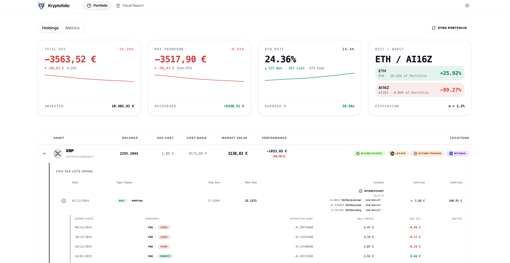

# 📊 Kryptofolio

[](https://github.com/nelomr/kryptofolio/releases/latest)
[](https://github.com/nelomr/kryptofolio/actions/workflows/ci.yml)
[](./CHANGELOG.md)

> 🌍 **Read this in:** [English](README.md) | [Español](README.es.md)



> **Kryptofolio** is an open-source crypto portfolio tracker built with Vue 3 and strict Hexagonal Architecture (Ports and Adapters). It serves as a visual presentation layer that displays transaction and tax information computed by the backend, utilizing a centralized backend (`apps/backend`) to bridge the UI with the data sources.
>
> ⚠️ **Note:** This project was born as a learning endeavor and is in continuous development in its early stages.

## ✨ Key Features

- **📊 Institutional Analytics & Time Series Engine:** DuckDB-powered OLAP queries for daily valuation, 30d annualized volatility, ATH drawdowns, and risk metrics (Sharpe Ratio, Alpha, Beta, Win Rate, Best/Worst performing asset).
- **🏛️ Strict Domain Isolation & Precise Financial Precision:** Pure domain architecture using `PreciseAmount` branded string value objects (`string & { __brand: 'PreciseAmount' }`), isolating domain logic from external math libraries and guaranteeing zero decimal truncation.
- **🔄 Synchronized Portfolio Materializer & Dynamic Base Currency:** Real-time FIFO recalculation and materialization across SQLite transaction ledgers and DuckDB analytical views, with dynamic base currency configuration from user settings.
- **🧹 Data Ingestion Wizard:** A multi-step interface to upload CSV/XLSX files, automatically map headers for popular exchanges (Binance, Kraken, Coinbase, KuCoin, Bitunix), perform manual adjustments with alphabetically sorted options, validate Spot vs. Futures constraints, and gracefully push valid data to the backend.
- **🏛️ Fiscal & Tax Compliance:** A dedicated Tax Report view to inspect transaction logs, identify gaps (missing cost bases or negative balances), and present clean data for AEAT-compliant reporting.
- **📡 Real-Time Market Data Providers:** Seamlessly orchestrates live price streaming (Server-Sent Events) and REST endpoints using a hot-swappable provider architecture. Supports Kraken, Binance, Coinbase, Bit2Me, and CoinGecko with automated caching via DuckDB and InMemory layers.
- **🤖 AI Agent Ready (Future Feature):** The frontend is technically prepared for future AI Agent integration (e.g., Vercel AI SDK or Mastra). Since Use Cases and DTOs are isolated and validated, they can be directly exposed as LLM Tools (function calling) for natural language querying without rewriting validations.
- **🛡️ Privacy First:** Fully self-hosted. The system operates locally, ensuring API credentials and transactions are kept secure. The backend can integrate with any local database or external data source securely.
- **🔐 Local Secrets Vault:** AES-256-GCM encrypted local vault for securely storing API keys. RAM memory scrubbing ensures keys are erased after use. Integrations can be dynamically enabled or disabled.
- **🏗️ Hexagonal Architecture (Frontend Separation):** Strict separation of concerns (Ports & Adapters). The frontend UI layer is decoupled from network protocols and local storage mechanisms, enabling absolute testability and contract safety via Zod validation schemas.


## 🛠️ Tech Stack & Monorepo

- **Framework**: Vue 3 (Composition API + `<script setup>`)
- **State Management**: [Pinia](https://pinia.vuejs.org/) + [Pinia Colada](https://pinia-colada.esm.dev/)
- **Styling**: TailwindCSS 4
- **Charts**: Lightweight Charts (TradingView) & vue-chartjs (Chart.js)
- **Testing**: Vitest
- **Workspace**: pnpm workspaces (Monorepo)

The repository is structured as a **PNPM Workspaces Monorepo** to cleanly decouple domains and scale efficiently:
- `apps/frontend/`: The main Vue 3 application (UI, Pinia stores).
- `apps/backend/`: The Hono backend service — handles API routes, encrypted secrets vault, and the dual-database analytical engine. Cleanly separated into `app.ts` (routing) and `index.ts` (orchestration). Exposes an `AppType` for end-to-end Hono RPC type safety.
- `packages/core-domain/`: Pure business logic (e.g., Services, Use Cases, Normalizers). Completely framework-agnostic.
- `packages/shared-types/`: Zod schemas, DTOs, and type definitions shared across the entire monorepo.
- `packages/database/`: Database abstraction layer — defines the generic `IDatabasePort` interface and SQL schema files. It encapsulates the core architecture: a local-first **SQLite Ledger** (`kryptofolio_ledger.db`) for OLTP persistence, and an ephemeral **DuckDB Engine** for high-performance OLAP federated queries.
- `docs/`: Technical documentation covering:
  - [System Architecture](docs/architecture.md)
  - [SQLite Transactional Ledger](docs/database-architecture.md)
  - [DuckDB & Parquet Time-Series Architecture](docs/architecture/duckdb-parquet-time-series.md)
### Dependency Management (PNPM Catalogs + Turborepo)
We use **PNPM Catalogs** to maintain a single source of truth for common dependencies across all workspace packages (e.g., TypeScript, Zod, Hono).
- To update a shared dependency, edit the `catalog:` block in `pnpm-workspace.yaml` at the root and run `pnpm install`.
- When adding a shared dependency to a package, use `"dependency-name": "catalog:"` in its `package.json`.

**Turborepo** orchestrates all build, test, lint, and typecheck tasks across the monorepo with automatic caching.
- `pnpm build` → `turbo run build` (respects `^build` dependency order)
- `pnpm test` → `turbo run test` (cached, parallelized)
- `pnpm typecheck` → `turbo run typecheck`

## 🎨 Institutional Design System

Kryptofolio implements a strict **Institutional Light** design system (Tailwind v4). You can read the full specifications in [DESIGN.md](DESIGN.md).

**Key Rules & Usage:**
- **Strict Light Mode:** The interface is exclusively light mode to maintain a high-contrast, institutional appearance. Do not use `dark:` classes.
- **Tabular Data:** All numerical data (prices, percentages, dates, IDs) MUST use the `.num` utility class (which applies `font-mono` from JetBrains Mono and `tabular-nums`) to ensure perfect vertical alignment in tables and widgets.
- **Semantic Coloring:** We do not use generic Tailwind colors (`blue-500`, `slate-100`). Use semantic tokens:
  - **Surfaces:** `bg-surface`, `bg-surface-2`, `bg-surface-3`
  - **Text:** `text-fg`, `text-muted`, `text-muted-2`
  - **Financial:** `text-profit`, `text-loss`, `text-warning`, `text-info`
  - **Interactions:** `--color-accent` is a deep institutional indigo. For subtle hovers in ghost buttons or selects, ALWAYS use `hover:bg-accent-soft hover:text-accent-2`.

## 🚀 Quick Start

### Environment Configuration

```bash
# For development
cp .env.example .env

# For production
cp .env.production.example .env.production
```

**Key Variables:**
- `VITE_API_URL`: URL of `apps/backend` from the frontend's perspective (default: `http://localhost:3001`).
- `VITE_APP_LANG`: The language for the interface. Valid options are currently `es` or `en`.
- `LEDGER_DB_PATH`: (Backend) Path to the primary SQLite ledger database file for transactions, encrypted credentials vault, and settings (`kryptofolio_ledger.db`).
- `HISTORICAL_DATA_PATH`: (Backend) Path to the folder containing Hive-partitioned Parquet files for historical pricing data.
- `MOCK_MODE`: (Backend) Set to `true` to use an in-memory SQLite DB (development). Default: `false`.

### 🌍 Internationalization (i18n)

Kryptofolio uses a zero-dependency, environment-based translation system.

**To choose a language:**
Set `VITE_APP_LANG=en` (English) or `VITE_APP_LANG=es` (Spanish) in your `.env` file and restart the development server. If the variable is missing or invalid, it defaults to English.

**To add a new language (e.g., French `fr`):**
1. Create a new file `src/i18n/dictionaries/fr.ts`.
2. Copy the structure from `en.ts` and translate the values. Ensure the object satisfies the `I18nDictionary` interface.
3. Open `src/core/infrastructure/i18n/EnvI18nAdapter.ts`.
4. Import the new dictionary: `import { fr } from '@/i18n/dictionaries/fr'`
5. Add it to the `dictionaries` map inside the adapter:
   ```typescript
   const dictionaries: Record<string, I18nDictionary> = { en, es, fr }
   ```
6. Set `VITE_APP_LANG=fr` in your `.env` file.

### Local Development

Ensure you have [pnpm](https://pnpm.io/) installed.

```bash
# 1. Clone the repository
git clone https://github.com/nelomr/kryptofolio.git
cd kryptofolio

# 2. Install dependencies at the workspace root
pnpm install

# 3. Start the development environment

# Frontend only (requires apps/backend running separately)
pnpm dev

# Backend only (serves mock data on :3001)
pnpm dev:backend

# Full stack: frontend + backend simultaneously
pnpm dev:full
```

> **Note:** `dev:full` concurrently spins up the Vite frontend and the Hono backend (`apps/backend`), which serves type-safe mock data via Hono RPC. Set `VITE_API_URL` in `apps/frontend/.env` to point to your own backend if needed (BYOB).

### 🧪 Testing and Validation

We apply strict quality controls (Clean Architecture and TDD). Run these commands at the **project root** to validate your changes locally:

| Command | Description |
|---------|-------------|
| `pnpm dev` | Starts the local frontend development server (`-F @kryptofolio/frontend`). |
| `pnpm dev:full` | Orchestrates simultaneous frontend and backend startup via Turborepo. |
| `pnpm test` | Runs the complete unit test suite in parallel across the workspace using Turborepo. |
| `pnpm typecheck` | Statically runs **Vue-TSC** and type checking across all packages. |
| `pnpm lint` | Analyzes code with ESLint across the workspace. |
| `pnpm build` | Compiles and bundles the project using Turborepo's caching. |

## 🏗️ Architecture: Hexagonal (Ports & Adapters)

This project strictly adheres to **Hexagonal Architecture** (Ports and Adapters) in the frontend. It is important to note that **the frontend does not execute core financial business logic** (such as FIFO cost-basis allocation or realized/unrealized PnL calculation). Instead:
- **Calculation Engine:** The heavy lifting is delegated to the backend layer.
- **Frontend Ports & Adapters:** Designed purely to decouple the UI components and presentation states from network protocols, API contracts, local storage vaults, i18n configurations, and validation formats.

### 🏛️ Architectural Layers

1. **Domain Layer (`src/core/domain/`)**
   The heart of the application's client-side logic. **Total Isolation**: It has absolutely zero external framework dependencies (no Vue, Axios, or Zod imports).
   - **Entities & Value Objects (`models/`)**: Defined using pure TypeScript interfaces. We heavily utilize **Branded Types** (e.g. `AssetId` or `LotId`) to guarantee type-safety across identifiers. Financial figures are strictly encapsulated in a `Money` Value Object using `decimal.js`, entirely eradicating primitive obsession and IEEE-754 floating-point errors.
   - **Ports (`ports/`)**: Interfaces defining the contract for data operations. The domain dictates *what* the client needs, not *how* to get it. Note: There is NO `repositories` folder; repository interfaces are outgoing ports.

2. **Application Layer (`src/core/application/`)**
   - **Use Cases (`use-cases/`)**: Pure TypeScript classes that coordinate the Domain Ports. They contain frontend-specific orchestration logic (e.g. `SaveVaultKeyUseCase`, `UpdateLanguageUseCase`, `ImportTransactionsUseCase`) without any Vue reactivity or framework imports. All state mutations MUST pass through a Use Case.

3. **Infrastructure Layer (`src/core/infrastructure/`)**
   The outer edge that communicates with the real world and protects the domain.
   - **Adapters (`adapters/`)**: Concrete implementations of the Domain Ports (e.g. `RestCryptoAdapter`). Must be suffixed with `Adapter`. Note: Mocks and API routing are managed exclusively at the backend layer.
   - **DTOs & Anti-Corruption Layer (`dtos/`)**: Strict Zod validation schemas (`ExternalTaxSchemas.ts`). These map raw API data to pure Entities and validate payload integrity *before* it ever touches the domain.
   - **Dependency Injection (`di/`)**: The "Composition Root". It instantiates the REST adapters and wires them into Vue (via provide/inject using strict symbols like `VAULT_PORT_KEY`).

4. **Application & UI Layer (`src/composables/` & `src/views/`)**
   - We utilize `@pinia/colada` inside specific `composables/queries` to declaratively manage asynchronous server state fetching.
   - **Structural Note**: In this project, **there is no global `src/stores/` folder and Vue components NEVER import `bffClient`**. Components consume `use*Queries` (which delegate to injected Ports) and `use*Mutations` (which delegate to Use Cases).
   - **Feature-Sliced Design (Colocation)**: Components specific to a single view/feature (e.g., `MetricsRow`) must live inside the view's dedicated `components/` directory (e.g., `src/views/Portfolio/components/`). Only strictly generic, reusable UI primitives (like buttons or modals) are placed in the global `src/components/` folder.

### 🛡️ Absolute Type Safety & Strict Policies
- **No `any` Policy**: The production source code is 100% statically typed, with no exceptions. It is rigorously compiled using `vue-tsc --noEmit`.
- **Global Error Bus**: If a Zod schema in the Anti-Corruption Layer fails, a controlled error is emitted to the `errorBus`, preventing silent runtime crashes and allowing the UI to react gracefully.
- **Single-User Local First**: The domain model has strictly eradicated multi-tenancy. There are no `user_id` or `tenant_id` fields, guaranteeing a localized and pure architecture for individual portfolios.
- **Financial Precision Boundaries**: All financial data crossing the ACL MUST be strings and parsed by strict Zod regex rules (e.g., `preciseAmountSchema`) before entering the Domain to prevent floating-point precision loss.

## 🔖 Versioning (Frontend is King)

This monorepo uses [Changesets](https://github.com/changesets/changesets) for independent package versioning, ensuring changes in one package do not artificially bump unrelated packages.

However, we follow a **"Frontend is King"** philosophy:
- The `@kryptofolio/frontend` version acts as the de facto global application version.
- During early development, developers should strongly prefer `patch` bumps over `minor` bumps for non-critical features to ensure version numbers grow slowly and deliberately.

### How to release

Releases are fully automated via our Continuous Delivery pipeline. 
When a pull request with a changeset is merged to `main`:
1. The `.github/workflows/release.yml` GitHub Action automatically runs `pnpm changeset version`.
2. It bumps the `package.json` files and creates a direct commit to `main` bypassing PR reviews.
3. Packages are published automatically.

**Developer Workflow:**
Before opening a PR to `main` that modifies package code, you **must** run:
```bash
pnpm changeset
```
Follow the prompts to declare your intent (patch/minor/major) and write a brief description. A `.changeset/*.md` file will be generated which you must commit. No changeset, no release.

## 📄 License

This project is open-source under the [AGPL-3.0 License](LICENSE).
