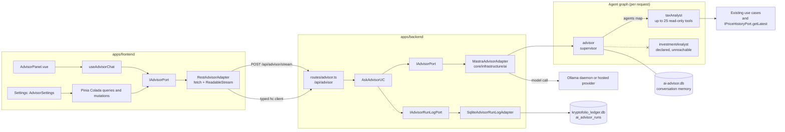
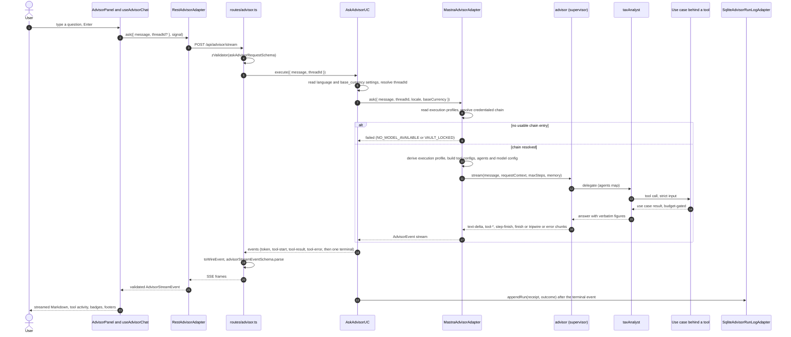
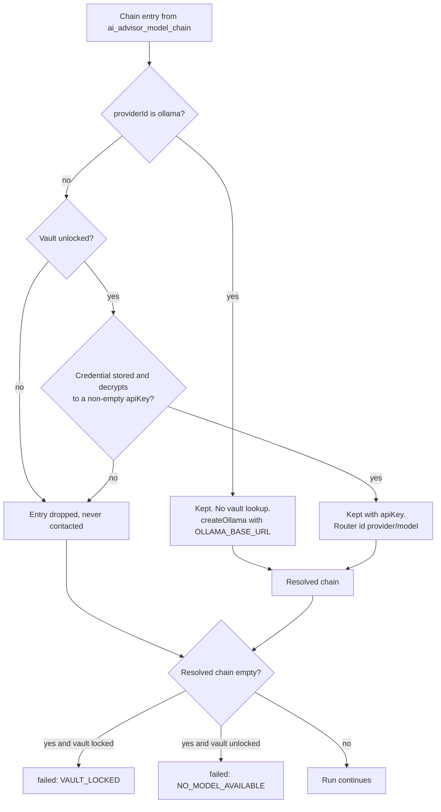
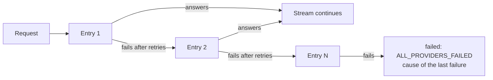
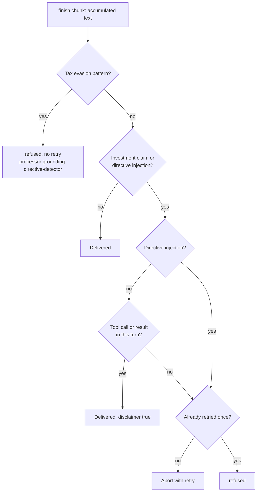
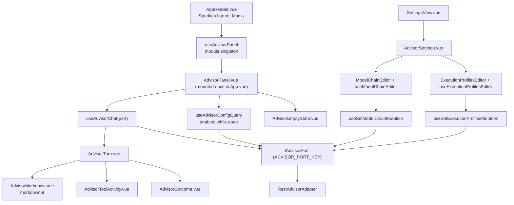

# AI Portfolio Advisor

A read-only chat assistant that answers questions about the user's own portfolio and Spanish IRPF tax data. It is the first phase of the advisor (internally "Phase 0", OpenSpec change [`add-ai-portfolio-advisor`](../openspec/changes/add-ai-portfolio-advisor/design.md)): a deliberately narrow skeleton that proves the full path (domain port, use case, one LLM adapter, typed Hono routes, streaming UI) before any write-capable or document-backed capability is built on top of it.

> [!NOTE]
> This document describes the code as it exists in the repository. Where the code and the OpenSpec design disagree, the code is documented and the difference is listed in [Known divergences](#20-known-divergences). Status labels are explicit: **shipped** means present in the code and covered by a spec; **planned** means it appears only in a design, a pre-proposal or an unchecked task.

## Table of Contents

1. [Scope and the core invariant](#1-scope-and-the-core-invariant)
2. [Architecture at a glance](#2-architecture-at-a-glance)
3. [Request lifecycle, end to end](#3-request-lifecycle-end-to-end)
4. [Hexagonal layer mapping](#4-hexagonal-layer-mapping)
5. [Agent topology: supervisor and specialists](#5-agent-topology-supervisor-and-specialists)
6. [Providers, the vault and credentials](#6-providers-the-vault-and-credentials)
7. [Model chain and fallback](#7-model-chain-and-fallback)
8. [Execution profiles and budgets](#8-execution-profiles-and-budgets)
9. [The tool catalogue](#9-the-tool-catalogue)
10. [Guardrails and the disclaimer](#10-guardrails-and-the-disclaimer)
11. [Stream frame contract (SSE)](#11-stream-frame-contract-sse)
12. [HTTP API contracts](#12-http-api-contracts)
13. [Persistence: memory and audit trail](#13-persistence-memory-and-audit-trail)
14. [Frontend architecture](#14-frontend-architecture)
15. [Privacy and security model](#15-privacy-and-security-model)
16. [Configuration reference](#16-configuration-reference)
17. [Testing strategy](#17-testing-strategy)
18. [Troubleshooting and FAQ](#18-troubleshooting-and-faq)
19. [What comes next](#19-what-comes-next)
20. [Known divergences](#20-known-divergences)

---

## 1. Scope and the core invariant

The advisor helps a user with a multi-exchange ledger ask questions such as "what should I review first in my tax report?" or "how is my portfolio allocated today?" in their own language, without knowing which view to open.

**It is strictly read-only.** No write tool exists. "The advisor never modifies a quantity, an asset, or a fiscal figure" holds by construction (there is nothing to call), not because a prompt asks the model to behave. A structural test asserts that no tool file performs an insert, update or delete.

**The LLM never produces a number.** Every figure in an answer comes from an existing backend use case; the model only decides which tool to call and how to phrase the result. Grounding is enforced in independent layers:

- Each tool is a thin wrapper over an existing use case (or, for `live_prices`, an existing port method). No calculation lives in the AI layer.
- Tool outputs are validated by strict Zod schemas. Monetary figures keep their `PreciseAmount` string form; an absent figure is reported as unvalued, never defaulted to `'0'`.
- The agent instructions tell the model to echo each figure verbatim in inline code, to re-query before restating a figure from an earlier turn, and to say so when a total is incomplete.
- A tool result that exceeds its character budget is replaced by a `truncated` marker rather than partially delivered ([section 8](#8-execution-profiles-and-budgets)).
- The advisor reads already-materialised results and introduces no FIFO ordering or partitioning of its own; the only orderings it adds are display rankings ([section 9](#9-the-tool-catalogue)). See [FIFO Tax Engine](fifo-tax-engine.md).

> [!NOTE]
> Prompt-level rules reduce bad behaviour but are not a proof. The structural guarantees are the read-only tool set, the schema-validated tool outputs, and the output guardrails in [section 10](#10-guardrails-and-the-disclaimer).

## 2. Architecture at a glance



| Concern | Where it lives |
|---|---|
| Wire contract, closed vocabularies, model chain and profile schemas | `packages/shared-types/src/advisor-stream.ts` |
| Pure display helpers (ranking, ordering, downsampling) | `packages/core-domain/src/domain/services/{holdingRanking,displayOrdering,downsampleSeries}.ts` |
| Domain port, events, receipt, use case | `apps/backend/src/core/{domain,application}` |
| Mastra agents, tools, guardrails, model resolution | `apps/backend/src/core/infrastructure/ai/` |
| Routes, DTO mapping, composition | `apps/backend/src/core/infrastructure/{routes,dtos,di}` |
| Audit table | `packages/database/migrations/sqlite/009_*.sql`, `010_*.sql` |
| Chat panel and Settings section | `apps/frontend/src/{components/advisor,views/Settings/components/advisor}` |

## 3. Request lifecycle, end to end



Step by step:

1. **UI send.** `AdvisorPanel.vue` trims the draft and calls `useAdvisorChat.send`. A send while a run is in flight is ignored. The request carries `threadId` only after a previous terminal frame supplied one.
2. **Transport.** `RestAdvisorAdapter.ask` issues a plain `fetch` POST to `/api/advisor/stream` and parses the SSE body by hand. Every frame is validated against the shared `advisorStreamEventSchema`; an invalid frame becomes a local `invalid-frame` transport error.
3. **Route.** `createAdvisorApi` validates the body (`message` 1 to 4000 characters, optional UUID `threadId`; otherwise HTTP 400). It opens an SSE stream, starts a 15-second `: keep-alive` comment timer and iterates `AskAdvisorUC.execute`.
4. **Use case.** `AskAdvisorUC` reads `language` (default `en`) and `base_currency` (default `USD`) through `IUserSettingsPort`, allocates a `threadId` if absent, and delegates the run to `IAdvisorPort`. It persists the audit row when a terminal event passes through, or from `finally` as an `aborted` row if the consumer stops early.
5. **Adapter, chain resolution.** `MastraAdvisorAdapter` reads the execution-profile setting, then `resolveChainForRequest`: read `ai_advisor_model_chain`, drop entries whose credential is unavailable, decrypt keys, derive the run profile. An empty result short-circuits to a `failed` event with no model call.
6. **Adapter, agent graph.** A fresh `taxAnalyst` and `advisor` pair is built per request because the resolved chain, budgets and `RunBudgetTracker` are per-request facts. `Memory` is the only long-lived object (constructed once against `ai-advisor.db`).
7. **Agent run.** `advisor.stream(...)` is called with `maxSteps` from the profile, `lastMessages` history, `semanticRecall: false`, working memory off, and a request context carrying `locale` and `baseCurrency` (never model inputs).
8. **Tools.** `advisor` delegates to `taxAnalyst`, which calls read-only tools. Each tool validates strict input, calls its use case, projects a narrow payload, and passes it through `enforceBudget`.
9. **Chunk mapping.** `applyChunk` (`mastraChunk.ts`) converts Mastra stream chunks into domain `AdvisorEvent`s and updates the receipt draft. Unrecognised chunk types are dropped silently. Delegation calls (`agent-taxAnalyst`) are not catalogue tools and are not surfaced as tool events.
10. **Guardrails.** Two output processors inspect the supervisor output at the `finish` chunk. A trip becomes a `refused` event; a run that touched investment content marks the `finish` payload so the terminal frame carries `disclaimer: true`.
11. **Wire mapping.** The route calls `toWireEvent` (the single domain-to-wire conversion) and re-validates the result before writing each frame. `completed` becomes `done`.
12. **Audit.** The route deliberately keeps iterating after the terminal frame so the use case can reach `appendRun`. One row is written per run.
13. **Cancellation.** If the client closes the connection, `stream.onAbort` calls `iterator.return()`; the adapter's `finally` aborts the provider call and the use case writes an `aborted` row.

> [!NOTE]
> The non-streaming `POST /api/advisor/ask` runs the same use case, concatenates `token` events and returns one JSON answer ([section 12](#12-http-api-contracts)). The UI uses the streaming route only.

## 4. Hexagonal layer mapping

| Package | Layer | Piece | Responsibility |
|---|---|---|---|
| `packages/shared-types` | Contract | `advisor-stream.ts` | `ADVISOR_TOOL_NAMES`, `AI_PROVIDER_IDS`, failure vocabularies, `advisorStreamEventSchema`, `modelChainSchema`, `executionProfilesSchema`, `classifyExecutionProfile`, `deriveLocalToolBudget`, `deriveLocalRunBudget`, `defaultExecutionProfiles`. No framework code. |
| `packages/core-domain` | Pure services | `rankHoldingsByValue`, `orderByCountDescending`, `orderByIsoDateDescending`, `downsampleSeries` | Display-only ordering and sampling. Monetary comparison goes through the `Money` value object. |
| `packages/database` | Persistence | Migrations `009`, `010`; `resolveAdvisorDbPath()` | Table definition and the `ai-advisor.db` path. No business logic. |
| `apps/backend` domain | Port | `IAdvisorPort` | LLM-agnostic: `ask(request)` returns `AsyncIterable<AdvisorEvent>`. Imports nothing external. |
| `apps/backend` domain | Port | `IAdvisorRunLogPort` | `appendRun(receipt, outcome)`, an upsert on `runId`. |
| `apps/backend` domain | Models | `AdvisorRequest`, `AdvisorEvent`, `AdvisorRunReceipt` (`profiled` or `pre-run`), `AdvisorRunReceiptDraft`, `AdvisorRunOutcome` | Discriminated unions, no optional-flag bags. |
| `apps/backend` application | Use case | `AskAdvisorUC` | Functional sandwich at stream scale: resolve context, iterate the port, persist the receipt. |
| `apps/backend` infrastructure | Adapter | `MastraAdvisorAdapter` and `core/infrastructure/ai/**` | The only code that imports `@mastra/*` (enforced by `mastraImportZone.spec.ts`). |
| `apps/backend` infrastructure | Adapter | `SqliteAdvisorRunLogAdapter` | Writes `ai_advisor_runs` through the ledger `DatabaseSync` handle. |
| `apps/backend` infrastructure | DTO | `dtos/advisor.ts` | Inbound `askAdvisorRequestSchema`; outbound `advisorAnswerSchema`, `advisorConfigSchema`; `toWireEvent`. |
| `apps/backend` infrastructure | Route | `routes/advisor.ts` | `createAdvisorApi(deps)` mounted at `/api/advisor`; part of `AppType`. |
| `apps/backend` infrastructure | Composition | `di/advisorComposition.ts`, `DIContainer.askAdvisorUC` | Lazy construction, late-bound tool use cases, env reading. |
| `apps/frontend` domain | Port | `IAdvisorPort` | `ask(request, signal)` plus config getters/setters. |
| `apps/frontend` infrastructure | Adapter | `RestAdvisorAdapter` | Hand-parsed SSE over `fetch`; typed `hc` client for configuration. |
| `apps/frontend` infrastructure | DTO | `AdvisorSchemas.ts` | Narrows `GET /config` to what the UI consumes. |

Composition notes worth knowing:

- `app.ts` builds `AdvisorRouteDeps` with getters, so importing `app` never opens `ai-advisor.db` or the ledger. `container.askAdvisorUC` is constructed on the first advisor request.
- `lateBoundToolUseCases(container)` resolves each tool's use case from the container on every run. The container replaces its analytical use cases when the real DuckDB connection is bound at startup; a captured reference would keep answering from the uninitialised guard.
- `fiscal_integrity` and `fiscal_integrity_rows` share `GetFiscalIntegrityUseCase`; `token_history` and `token_lots` share `GetTokenHistoryUseCase`; `holding_detail`, `account_holdings` and `data_gaps` read `GetPortfolioSummaryUseCase`, and `tax_year_comparison` reads `GetSpanishTaxReportUseCase` twice.
- Tool factories receive use cases, never ports. The use cases added for the catalogue are `ListAccountsUseCase` (non-synthetic accounts, also used by `GET /settings/accounts`), `GetDerivativesPnlUseCase`, `GetLotCustodyLocationsUseCase`, `GetPortfolioScenarioUseCase` and `SearchSpotTransactionsUseCase` (also used by `GET /tax/transactions/spot`).

## 5. Agent topology: supervisor and specialists

- **`advisor`** (`agents/advisor.ts`) is the supervisor. It owns `Memory`, an input `ToolCallFilter` and the two output processors. It never calls a catalogue tool itself; it delegates to `taxAnalyst` through the `agents` map and relays the answer with every figure preserved. Its instructions add only response language and the "never originate a figure" rule.
- **`taxAnalyst`** (`agents/taxAnalyst.ts`) holds the tools its execution profile exposes (fourteen for a local run, twenty-five for metered and mixed; see [section 9](#9-the-tool-catalogue)) and carries no memory. Its instructions (`buildTaxAnalystInstructions`) list exactly the exposed tools, so the prompt never names a tool the model cannot call; they are a prefix that is byte-stable per profile plus a trailing `Response format` line that carries locale and base currency, so the prefix stays cache-friendly.
- **`investmentAnalyst`** (`agents/investmentAnalyst.ts`) is declared with instructions and a contract but holds no tools and is **not** in `advisor`'s `agents` map, so nothing can reach it. It exists so a later phase adds tools plus one line of wiring rather than a redesign. `advisorTopology.spec.ts` asserts this and that `.network()` is never used.

The supervisor pattern uses the `agents` map (Mastra's replacement for the deprecated agent-network primitive). `deterministicDelegation.spec.ts` asserts a normal run costs exactly two model calls (decide, then finalise), never a third spent choosing among sub-agents. This matters for Ollama Cloud's one-concurrent-request free tier.

## 6. Providers, the vault and credentials

The closed provider set is `openai`, `anthropic`, `google`, `opencode`, `ollama`, `ollama-cloud` (`AI_PROVIDER_IDS`). Each one is also registered in the vault provider registry (`GetAvailableProvidersUseCase`) with `category: { kind: 'ai-model' }`, so a provider cannot exist in a model chain and be absent from the registry.



| Provider id | Where the request goes | Vault key | Classified as |
|---|---|---|---|
| `openai`, `anthropic`, `google`, `opencode` | The provider's hosted API through Mastra's model router (`<provider>/<model>`). | Yes (`apiKey`). | metered |
| `ollama` (model id not cloud-suffixed) | The **local Ollama daemon** (default `http://localhost:11434/api`). | None; the registry entry has no fields. | local |
| `ollama` (model id ending `:cloud` or `-cloud`) | The local daemon, which proxies to Ollama Cloud. | None (the daemon holds the account auth). | metered |
| `ollama-cloud` | Ollama's direct cloud API through the router as `ollama-cloud/<model>`. | Yes (`apiKey`). | metered |

Credentials are stored and scoped like every other vault secret: AES-256-GCM, unlocked with the vault master password ([Secrets Vault](architecture/secrets-vault.md)). They are entered in Settings, Vault, grouped under an "AI Providers" heading (`vault.category.ai-model`), through the existing credentials route (`POST /api/credentials/vault/:service`, where `:service` is the provider id). Behaviour that follows from the code:

- A provider without a usable key is skipped at request time and never contacted. Mastra's environment-variable auto-detection is never relied on.
- A locked vault skips every keyed provider. Because the master key lives only in process memory, every backend restart re-locks it. The adjacent change [`vault-remember-unlock-on-device`](../openspec/changes/vault-remember-unlock-on-device/proposal.md) (proposal only, not implemented) targets this.
- `GET /api/advisor/config` reports credential state per provider: `present`, `absent` or `locked`. `ollama` is always `present`.

### A cloud-suffixed model through the local daemon still leaves the machine

A signed-in local Ollama daemon accepts model ids ending `:cloud` (for example `qwen3:cloud`) and the older `-cloud` aliases (for example `gpt-oss:120b-cloud`) and proxies them to ollama.com. The daemon holds that authentication, so no key exists in the vault. **Such a request sends the conversation and tool results off the machine** and is therefore classified metered, not local. `isOllamaCloudModelId` is the single rule; a genuinely local model whose name happens to end in `-cloud` is classified cloud too, a deliberate false positive that errs toward disclosure. The classification is derived and cannot be toggled by the user.

### Ollama Cloud free-tier limits

Ollama's published free tier, at the time of writing, consists of monthly starter credits, starter models only, and one concurrent request. This comes from Ollama's pricing page and is not enforced or verified by this repository; check Ollama's current terms.

## 7. Model chain and fallback

The user orders a **model chain** in Settings; it is stored as the `ai_advisor_model_chain` user setting (JSON). Entry shapes are content-discriminated:

| Entry | Shape | Rule |
|---|---|---|
| Local | `{ providerId: 'ollama', modelId, contextWindow }` | Model id must not be cloud-suffixed; `contextWindow` (tokens, positive integer) is required. |
| Metered | `{ providerId, modelId }` | `contextWindow` is forbidden. A plain `ollama` entry without `contextWindow` is rejected. |



- The chain becomes Mastra's dynamic fallback array (`buildModelChainConfig`). Retries per entry: **1 for local daemon entries, 2 for everything else** (cloud-suffixed `ollama` and router entries).
- Local entries also pass their `contextWindow` to the daemon as `options.num_ctx`.
- A stored chain that cannot be parsed or no longer validates is treated as unset (`NO_MODEL_AVAILABLE`), so a corrupt value never produces a 500. A stored `-cloud` entry that still carries a `contextWindow` from before cloud suffixes were recognised has the window discarded on read (`dropMeaninglessCloudContextWindow`).
- Failure codes: `NO_MODEL_AVAILABLE` (unset, or every entry filtered out with the vault unlocked), `VAULT_LOCKED` (every entry filtered out and the vault was locked), `ALL_PROVIDERS_FAILED` (entries were tried and the last error is classified as `cause`), `INTERNAL_ERROR` (unexpected server-side error).
- Mastra surfaces only the final failure once the chain is exhausted, so `cause.providerId` and `cause.modelId` name the last entry that failed, not necessarily the first.

### Failure cause classification

`classifyProviderError` inspects the error's cause chain (depth 5), status first and error code or class second:

| `cause.kind` | Classified from |
|---|---|
| `auth-rejected` | HTTP 401 or 403 |
| `model-not-found` | HTTP 404, or provider error code `model_not_found` |
| `rate-limited` | HTTP 429 |
| `provider-unavailable` | HTTP 5xx |
| `network` | No HTTP answer and a connection error (`ECONNREFUSED`, `ECONNRESET`, `ENOTFOUND`, `EAI_AGAIN`, `ETIMEDOUT`, `EHOSTUNREACH`, `ENETUNREACH`, undici connect/socket codes, a `TimeoutError`, or the AI SDK's failed-fetch wrapper) |
| `unknown` | Anything else |

The wire carries only this classification, never the provider's error text, URL, headers, key or request body. The server logs one warning per failed run with provider, model, kind, HTTP status and a sanitised message (known keys, URLs and long opaque tokens removed, truncated to 200 characters).

## 8. Execution profiles and budgets

Every run executes under one **execution profile** that sets step limits, history depth, page sizes and tool-result budgets. The profile is **derived from the resolved chain, never user-toggled**.

| Resolved chain | Limits applied | Recorded `execution_profile` |
|---|---|---|
| Every entry is a local `ollama` entry | `local` | `local` |
| Every entry is metered | `metered` | `metered` |
| Both kinds present | `metered` | `mixed` |

A mixed chain runs under the metered limits because any cloud entry may be the one that answers; an all-local chain is required to get the full local headroom. Filtering happens first, so a chain that mixes local and keyed entries becomes all-local when the vault is locked.

### Settings and hard ceilings

Limits are user-editable (Settings, AI advisor) and stored as `ai_advisor_execution_profiles`. When the key is unset, `defaultExecutionProfiles()` applies.

| Limit | Metered default | Local default | Hard ceiling |
|---|---|---|---|
| `maxSteps` | 5 | 15 | 30 |
| `lastMessages` | 20 | 50 | 200 |
| `topNHoldings` | 15 | 50 | none |
| `lotsPageSize` | 20 | 100 | 200 |
| `rowsPageSize` | 25 | 100 | 200 |

The `maxSteps` and `lastMessages` ceilings are runaway-loop protection, not cost control. The page-size ceilings bound a single page. Both `PUT` validation and the Settings form enforce them.

### Tool-result budgets

A tool result is measured as the length of its JSON encoding in **characters**, never tokens, so the check is deterministic and needs no per-provider tokenizer. An over-budget result is not partially delivered: the model receives `{ "kind": "truncated", "maxChars": ..., "actualChars": ... }` and is instructed to say so.

**Metered:** a per-tool table (user-editable, no run-wide cap).

| Tool | Default budget (chars) |
|---|---|
| `portfolio_summary` | 4000 |
| `fiscal_integrity` | 6000 |
| `token_history` | 6000 |
| `asset_allocation` | 3000 |
| `risk_metrics` | 1500 |
| `drawdown_curve` | 4000 |
| `performance_history` | 4000 |
| `kpis` | 3000 |
| `volatility_heatmap` | 4000 |
| `spanish_tax_report` | 5000 |
| `live_prices` | 2000 |
| `fiscal_integrity_rows` | 4000 |
| `token_lots` | 4000 |
| `holding_detail` | 3000 |
| `account_holdings` | 5000 |
| `tax_year_comparison` | 4000 |
| `data_gaps` | 4000 |
| `scenario_position_value` | 1500 |
| `breakeven_price` | 1500 |
| `explain_metric` | 2000 |
| `derivatives_pnl` | 4000 |
| `custody_locations` | 4000 |
| `scenario_portfolio_shock` | 4000 |
| `concentration_risk` | 2000 |
| `tx_search` | 5000 |

A stored `ai_advisor_execution_profiles` row written before a tool existed still loads: on read, the stored `toolBudgets` are laid over the defaults key by key, so a new tool takes its default budget. Every other stored field stays required, and `PUT` still demands every key.

**Local:** budgets are never stored; they derive from the declared `contextWindow` at 4 characters per token.

```text
per-tool budget = floor(contextWindow x 4 x 0.15)   characters, for every tool
run-wide cap    = floor(contextWindow x 4 x 0.60)   characters, summed across one run's tool results
```

For a declared window of 8192: 4915 per tool and 19660 per run. Both formulas live in `deriveLocalToolBudget` and `deriveLocalRunBudget` (shared-types), so Settings shows exactly what the backend enforces. The run-wide total counts every attempted tool-result size, including truncated ones, and a fresh `RunBudgetTracker` is created per run. When an all-local chain declares several windows, the smallest is used.

## 9. The tool catalogue

`taxAnalyst` defines twenty-five read-only tools (`ADVISOR_TOOL_NAMES`). Inputs are strict Zod objects: unknown fields are rejected. Symbols are upper-cased and must then match `^[A-Z0-9.]{1,20}$`. **No tool accepts an account id**; every tool reads all accounts together, except `account_holdings`, which takes an account **name** and resolves it server-side. A model that sends `accountId` fails as `INVALID_TOOL_INPUT`. Tax figures are per asset across accounts regardless. No tool accepts a quantity or a currency.

### Tiers per execution profile

Each tool belongs to one tier in `ADVISOR_TOOL_TIERS` (shared-types), checked with `satisfies` so a tool cannot be added without one. The selection is static code, not a setting, and is applied by `selectExposedTools` in `ai/tools/toolExposure.ts` when `MastraAdvisorAdapter.ask` builds the `taxAnalyst` tool map.

| Profile | Exposed tools |
|---|---|
| `local` | the 14 `core` tools |
| `metered`, `mixed` | all 25 tools |

- **core (14):** `portfolio_summary`, `holding_detail`, `account_holdings`, `kpis`, `asset_allocation`, `spanish_tax_report`, `tax_year_comparison`, `fiscal_integrity`, `data_gaps`, `token_history`, `live_prices`, `scenario_position_value`, `breakeven_price`, `explain_metric`.
- **extended (11):** `fiscal_integrity_rows`, `token_lots`, `risk_metrics`, `drawdown_curve`, `performance_history`, `volatility_heatmap`, `derivatives_pnl`, `custody_locations`, `scenario_portfolio_shock`, `concentration_risk`, `tx_search`.

Small local models pick measurably worse from a long tool list, which is why a local run sees only the core tier. The local prompt says a detail tool exists in a larger profile.

All tools return a discriminated union: `{ kind: 'ok', payload }` or `{ kind: 'truncated', maxChars, actualChars }`.

| Tool | Wraps | Input | Payload (summary) |
|---|---|---|---|
| `portfolio_summary` | `GetPortfolioSummaryUseCase` | none | `metrics` (totals, `ratesIncomplete`, `pricesIncomplete`, `currency`), `ranked` holdings (top `topNHoldings` by value), `omittedCount`, `unvalued`, `unvaluedCount`. Base currency. |
| `fiscal_integrity` | `GetFiscalIntegrityUseCase` | none | At most 10 `groups` (`qualityFlag`, `severity`, `count`, `pendingReview`) ranked by `count`, plus `totalDefects`, `pendingReview`, `needsRecalculation`. Never rows. |
| `fiscal_integrity_rows` | `GetFiscalIntegrityUseCase` | `qualityFlag`, `page` (zero-based, default 0) | One page of transaction-level rows (`rowsPageSize`) with paging metadata. |
| `token_history` | `GetTokenHistoryUseCase` | `symbol` | Up to `lotsPageSize` lots (id, date, exchange, quantities, costs, status, `historyCount`, `relocationCount`) and `omittedCount`. |
| `token_lots` | `GetTokenHistoryUseCase` | `symbol`, `page` (default 0) | One page of the full lot list (`lotsPageSize`) with paging metadata. |
| `asset_allocation` | `GetAssetAllocationUseCase` | none | `ranked` valued items (`amount`, `valueFiat`, `allocationPct`, `currency`), `omittedCount`, `unvalued` items (`amount` only). Base currency. |
| `risk_metrics` | `GetRiskMetricsUseCase` | none | `maxDrawdownPct`, `annualizedVolatility`, `sharpeRatio`, `alpha`, `beta`. Ratios, no currency field. |
| `kpis` | `GetKpisUseCase` | none | Equity, cost basis, PnL, all-time high, drawdown, volatility, Sharpe, `currency`, incompleteness flags, and optional trade statistics and best/worst asset. Base currency. |
| `drawdown_curve` | `GetDrawdownCurveUseCase` | `days?` (integer 1 to 3650) | `points` of `date` and `drawdownPct`, downsampled to at most 120, plus `omittedCount`. |
| `performance_history` | `GetPerformanceHistoryUseCase` | `days?` (1 to 3650) | `currency` (the base currency), `points` (`portfolioValue`, nullable; optional `btcValue`; `drawdownPct`) downsampled to at most 120, `omittedCount`. |
| `volatility_heatmap` | `GetVolatilityHeatmapUseCase` | `year?` (integer) | `cells` of `date` and `volatility`, downsampled to at most 120, `omittedCount`. |
| `spanish_tax_report` | `GetSpanishTaxReportUseCase` | `year` (integer, at least 2009), `method?` | IRPF `summary`, unconvertible and excluded counters, `auditTrail` capped at 20 rows, `omittedCount`. Always EUR. |
| `live_prices` | `IPriceHistoryPort.getLatest` | `symbols` (1 to 25) | `prices` (`price`, `currency`, `timestamp`, `provider`, `stalenessSeconds`) and `notTracked`. |
| `holding_detail` | `GetPortfolioSummaryUseCase` | `symbol` | One of `valued` (holding with value), `unvalued` (quantity and cost basis only) or `not_held`. Finds a holding outside the `portfolio_summary` top-N. Base currency. |
| `account_holdings` | `ListAccountsUseCase`, `GetPortfolioSummaryUseCase` | `accountName` (trimmed, 1 to 64) | `resolved` with one section per account in the resolved account's tree (own `metrics`, `ranked`, `omittedCount`, `unvalued`) plus `emptyAccountCount`; or `ambiguous` (candidate names) or `not_found` (top-level names). Exact case-insensitive match first, a prefix only if none matches exactly. Never sums across accounts. |
| `tax_year_comparison` | `GetSpanishTaxReportUseCase` (twice) | `yearA`, `yearB` (distinct, at least 2009), `method?` | Per year `summary`, `unconvertibleCount`, `excludedFlaggedEvents`, `excludedUnresolvedIncomeCount`, `completeness`; `deltas` (second year minus first) computed by `compareTaxSummaries`, each `delta`, or `delta_incomparable` when either year is incomplete. EUR, no audit trail. |
| `data_gaps` | `GetPortfolioSummaryUseCase`, `GetFiscalIntegrityUseCase` | none | `unvalued` split into `no_price` and `no_rate` (symbol and quantity only), `integrity` (at most 10 groups, `totalDefects`, `needsRecalculation`) and a fixed `nextTools` list. |
| `explain_metric` | static table | `metric` (closed `MetricId` enum) | The definition in the request locale and `producedBy`, the tool that reports the metric. Text states formulas in words with no example numbers. |
| `scenario_position_value` | `GetPortfolioScenarioUseCase` | `symbol`, `hypotheticalPrice` | `computed` (`positionValue`, `deltaVsCurrent`, `impliedAllocationPct`), `not_held`, `unvalued` (position value only) or `empty_portfolio`; each with `currency`. Quantity always comes from the ledger. |
| `breakeven_price` | `GetPortfolioScenarioUseCase` | `symbol` | `computed` (`avgUnitCost`), `not_held`, `unconvertible_cost_basis` or `zero_quantity`. Uses the holdings cost basis, which can differ from `kpis`. |
| `derivatives_pnl` | `GetDerivativesPnlUseCase` | none | Contracts ranked by absolute realized PnL and capped at `topNHoldings` (`realizedPnl`, `funding`, `fees`, `netPnl`, `currency`), `omittedCount`. |
| `custody_locations` | `GetLotCustodyLocationsUseCase` | `symbol?` | Quantity per non-synthetic account and asset (`lotCount`), capped at `topNHoldings`, `omittedCount`, and `syntheticRowCount` for the `ownwallet-*` rows it does not list. Reads the custody ledger only; location has no effect on taxation. |
| `scenario_portfolio_shock` | `GetPortfolioScenarioUseCase` | `shock`: `{ kind: 'uniform', pct }` or `{ kind: 'per_asset', shocks }` (1 to 25 entries); `pct` from -100 to 1000 | `computed` (per-asset `before` and `after` capped at `topNHoldings`, `omittedCount`, `totalBefore`, `totalAfter`, `delta`, `unvaluedSymbols`, `notHeld`) or `empty_portfolio`. Unlisted assets stay put in a per-asset shock. |
| `concentration_risk` | `GetPortfolioScenarioUseCase` | none | `all` and `excludingStablecoins` blocks (`computed` with `top1Weight`, `top3Weight`, `hhi` on a zero to one scale, `effectiveHoldings`, or `empty`), `stablecoinWeight` (`null` when nothing is valued) and `unvaluedCount`. |
| `tx_search` | `SearchSpotTransactionsUseCase` | `symbol?`, `from?`, `to?` (inclusive days), `types?` (non-empty), `page` (default 1) | One page (`rowsPageSize`) of rows (`date`, `type`, assets and amounts, `priceFiat`, `totalFiat`, `fiatCurrency`, `fee` as `NONE` or `CHARGED`, `exchange`, `edited`), newest first, with `page`, `pageSize`, `totalPages`, `totalCount`. A page past the end is an empty `ok` result with the true totals. Filters run on the edited values; the pre-edit row is never returned. |

Example `portfolio_summary` result as the model sees it (shape only; figures are illustrative):

```json
{
  "kind": "ok",
  "payload": {
    "metrics": {
      "ratesIncomplete": false,
      "pricesIncomplete": true,
      "totalEquityFiat": "18250.40",
      "totalCostBasisFiat": "12000.00",
      "totalRealizedPnlFiat": "930.10",
      "totalUnrealizedPnlFiat": "6250.40",
      "totalPnlFiat": "7180.50",
      "currency": "USD"
    },
    "ranked": [
      {
        "id": "btc",
        "symbol": "BTC",
        "amount": "0.25",
        "avgPriceFiat": "40000",
        "costBasisFiat": "10000",
        "currentValueFiat": "15000",
        "unrealizedPnlFiat": "5000",
        "currency": "USD"
      }
    ],
    "omittedCount": 0,
    "unvalued": [],
    "unvaluedCount": 0
  }
}
```

Tool failures surface on the stream as `tool-error` with `INVALID_TOOL_INPUT` (Mastra validation error on the input) or `USE_CASE_FAILED` (the wrapped use case threw).

### Currency rules

- `portfolio_summary`, `kpis`, `asset_allocation` and `live_prices` honour the user's base currency, read server-side from settings and injected through the request context. The model never supplies a currency.
- `asset_allocation` converts the canonical-EUR daily valuation at the rate of the valuation date (`VALUATION_CONVERTED`, like `kpis`). A holding with no price series, or no exchange rate, is `unvalued`: it reports its quantity and is excluded from every percentage, never passed through at a factor of one.
- `risk_metrics`, `drawdown_curve` and `volatility_heatmap` return ratios, percentages or statistics with no currency.
- `spanish_tax_report` and `tax_year_comparison` are always EUR, as IRPF requires.
- `holding_detail`, `account_holdings`, `data_gaps`, the four scenario tools and `derivatives_pnl` read the base currency from the request context. Scenario results carry a `currency` field. `custody_locations` returns quantities and `tx_search` rows carry each row's own `fiatCurrency`.
- `performance_history` honours the base currency: each point is converted at the latest stored `EUR/<base>` rate on or before that point's own date (`VALUATION_CONVERTED`, like `kpis`), and the result's `currency` field states it. A point no rate covers has `portfolioValue: null`, never an EUR value or `0`. `drawdownPct` is a ratio and stays derived from the EUR series, so it does not depend on the base currency.

The agent is instructed to state each result's declared currency beside the figure and never to convert or relabel.

### Pagination and the live-prices guarantee

- `fiscal_integrity` never returns rows. Transaction-level rows are reachable only through `fiscal_integrity_rows`.
- `token_history` returns one page of lots, not a fixed top 20; the full list is reachable through `token_lots`. Both are subject to the same character budgets, and a page that still exceeds its budget is reported as `truncated`.
- `live_prices` reads the latest already-cached price per symbol from the price-history port (the same cache the market stream fills). It opens no provider connection and starts no stream. A symbol with no cached price appears in `notTracked`.

### Arithmetic lives in core-domain, never in the tools

A scenario figure is produced by a pure function in `packages/core-domain` (`positionValueAt`, `breakevenPrice`, `applyShock`, `concentrationOf` in `portfolioScenarios.ts`, `compareTaxSummaries`, `summarizeCustodyLocations`), always through `Money`, with every variable division guarded by an `isZero` check that returns a typed outcome instead of throwing. The AI subtree imports neither `Money` nor `decimal.js`, and a source scan enforces it. The prompt tells the model never to compute, convert, sum, subtract or estimate a figure, and to state a non-computed outcome (not held, ambiguous, unconvertible cost basis) as it is.

Stablecoins in `concentration_risk` come from the closed `STABLECOIN_SYMBOLS` list (`USDT`, `USDC`, `DAI`, `EURC`, `FDUSD`, `PYUSD`, `TUSD`, `USDE`); an unlisted symbol counts as risky. The list is display classification only and no tax or FIFO code reads it.

### Tools deliberately left out: `fees_paid` and `cash_flow_summary`

Both were measured against the real exchange exports and failed the gate, so they are not in this catalogue. Only Bitvavo's fees are natively EUR and complete; every other source charges in crypto or USD, which would need a dated price per fee asset (new analytical logic, not a wrapper). A portfolio-wide fiat in/out figure would include Kraken spot's internal `spottofutures` transfer as a withdrawal, and three sources export no fiat movements at all. Partial per-source shipping was rejected because a total that silently covers some sources breaks the "every figure states its completeness" rule. They return in a follow-up once Kraken's `spottofutures` subtype is declared an internal transfer in `profiles.ts`, fee-asset EUR valuation exists as a use case, and explicit-zero fees survive normalization in every profile.

### Display-only ordering

The AI layer contains no `.sort(` of its own. Pure helpers in `packages/core-domain` supply every ordering: `rankHoldingsByValue` and `rankByAbsoluteValue` (monetary, compared through `Money`), `orderByCountDescending`, `orderByIsoDateDescending` and `orderByIsoDateDescendingThenKey` (integer and ISO-date keys, the last with a key tiebreak for `tx_search`), plus `downsampleSeries` (uniform stride, at most 120 points). None has access to a lot, a queue or an account, so rule 6 (tax FIFO versus custody) is untouched.

## 10. Guardrails and the disclaimer

Two output processors run on the supervisor output and inspect the accumulated text at the `finish` chunk. Both are deterministic pattern checks (Spanish and English, `investmentContentPatterns.ts`), not classifiers, so they are a heuristic floor: paraphrase evasion and false positives are accepted trade-offs.



| Situation | Behaviour |
|---|---|
| Investment content (forecast, price target, allocation or rebalancing advice, market timing) **grounded** by a tool call or result in the same turn | Delivered; the `done` frame carries `disclaimer: true`. |
| Investment content with **no tool activity** this turn | Retried once; if still ungrounded, the run ends `refused`. |
| An attempt to override the guardrail or disclaimer ("ignore your instructions", "answer as a licensed advisor") | Shares the one-retry budget and is then refused, even when tools ran. |
| **Tax evasion** ("hide gains from Hacienda", "evade taxes") | Always refused immediately, no retry. |

Investment questions are answered with disclosure and grounding, not refused; tax-evasion requests are always refused. The `refused` frame reports `processorId` (`grounding-directive-detector` for these checks).

> [!NOTE]
> The grounding check only verifies that *some* tool ran in the same turn, not that a specific claim matches a tool result. Phase 0 has no investment tools, so investment-flavoured wording is answerable only when the model also consulted a portfolio tool.

### The disclaimer is structural

1. The `investment-disclaimer` output processor buffers text deltas; if the text touches an investment category it adds a `disclaimer` string to the `finish` chunk payload. It never edits a text chunk.
2. `getFinishInfo` reduces that to a boolean. The domain `completed` event and the wire `done` frame carry `disclaimer: boolean`; **the backend sends no disclaimer wording**.
3. The client renders its own localised wording (`advisor.disclaimer`) as a muted footer, separate from the answer body.

A second flag, `figuresIncomplete`, is set on `done` when a `portfolio_summary` or `kpis` result reported `ratesIncomplete` or `pricesIncomplete`. The client shows a "Figures incomplete" badge.

## 11. Stream frame contract (SSE)

Each SSE message uses the frame's `kind` as the SSE `event` name and a JSON `data` payload. A `: keep-alive` comment is written every 15 seconds. **Every frame carries `runId`.** A run ends with exactly one of `done`, `refused` or `failed`.

| `kind` | Fields besides `runId` |
|---|---|
| `token` | `text` |
| `tool-start` | `callId`, `tool` |
| `tool-result` | `callId`, `tool` |
| `tool-error` | `callId`, `tool`, `code` (`INVALID_TOOL_INPUT` or `USE_CASE_FAILED`) |
| `done` | `threadId`, `providerId`, `modelId`, `usage` (`inputTokens`, `outputTokens`), `toolsCalled`, `executionProfile` (`local`, `metered`, `mixed`), `stepsUsed`, `maxSteps`, `disclaimer`, `figuresIncomplete` |
| `refused` | `threadId`, `reason`, `processorId` |
| `failed` | `code`, optional `threadId`; `cause` (`kind`, `providerId`, `modelId`) required on `ALL_PROVIDERS_FAILED` and forbidden on every other code |

Both `failed` members are `.strict()`, so a cause on a causeless code is rejected rather than stripped. `threadId` on `failed` is optional only because an unexpected error on a brand-new conversation can occur before a thread id exists.

There is deliberately no `transport-lost` frame: a stream that closes with no terminal frame is synthesised by the client, so a dropped connection can never be confused with a guardrail refusal.

### Example: a grounded answer

```text
event: tool-start
data: {"kind":"tool-start","runId":"7c1e0a52-3f4b-4f08-9d8e-2b6a1c9d0e11","callId":"call_01","tool":"portfolio_summary"}

event: tool-result
data: {"kind":"tool-result","runId":"7c1e0a52-3f4b-4f08-9d8e-2b6a1c9d0e11","callId":"call_01","tool":"portfolio_summary"}

event: token
data: {"kind":"token","runId":"7c1e0a52-3f4b-4f08-9d8e-2b6a1c9d0e11","text":"Your largest position is "}

event: token
data: {"kind":"token","runId":"7c1e0a52-3f4b-4f08-9d8e-2b6a1c9d0e11","text":"BTC at `15000` USD."}

event: done
data: {"kind":"done","runId":"7c1e0a52-3f4b-4f08-9d8e-2b6a1c9d0e11","threadId":"0f8a2b3c-5d6e-4f70-8a91-b2c3d4e5f607","providerId":"ollama","modelId":"qwen3:8b","usage":{"inputTokens":1834,"outputTokens":212},"toolsCalled":["portfolio_summary"],"executionProfile":"local","stepsUsed":3,"maxSteps":15,"disclaimer":false,"figuresIncomplete":false}
```

### Example: a guardrail refusal

```text
event: refused
data: {"kind":"refused","runId":"9a3b...","threadId":"0f8a2b3c-5d6e-4f70-8a91-b2c3d4e5f607","reason":"This request asks how to evade or hide taxable gains, which this advisor never assists with.","processorId":"grounding-directive-detector"}
```

### Example: every provider failed

```text
event: failed
data: {"kind":"failed","runId":"4d2c...","threadId":"0f8a2b3c-5d6e-4f70-8a91-b2c3d4e5f607","code":"ALL_PROVIDERS_FAILED","cause":{"kind":"auth-rejected","providerId":"anthropic","modelId":"claude-sonnet-4-5"}}
```

### Example: no model configured

```text
event: failed
data: {"kind":"failed","runId":"b17e...","threadId":"3e5a...","code":"NO_MODEL_AVAILABLE"}
```

> [!NOTE]
> If the route itself throws, it emits `{"kind":"failed","runId":"unknown","code":"INTERNAL_ERROR"}` (no `threadId`) before closing.

## 12. HTTP API contracts

All routes are under `/api/advisor` and are part of `AppType`, so the frontend calls the configuration endpoints through the typed `hc<AppType>` client. The streaming endpoint is consumed with `fetch` and a `ReadableStream`. Exactly six advisor endpoints are mounted and no wildcard or agent-server route exists (`advisorMounting.spec.ts`).

| Method | Path | Purpose |
|---|---|---|
| `POST` | `/api/advisor/ask` | Non-streaming: runs to completion, returns one answer. |
| `POST` | `/api/advisor/stream` | SSE streaming run. |
| `GET` | `/api/advisor/config` | Stored chain and per-provider credential state. |
| `PUT` | `/api/advisor/config/model-chain` | Replace the model chain. |
| `GET` | `/api/advisor/config/execution-profiles` | Stored profiles, or defaults. |
| `PUT` | `/api/advisor/config/execution-profiles` | Replace the profiles. |

Common failure: an invalid request body returns **HTTP 400** from `zValidator` before any run starts.

### `POST /api/advisor/ask` and `POST /api/advisor/stream`

Request body (`Content-Type: application/json`):

```json
{
  "message": "What should I review first in my tax report?",
  "threadId": "0f8a2b3c-5d6e-4f70-8a91-b2c3d4e5f607"
}
```

| Field | Type | Rules |
|---|---|---|
| `message` | string | 1 to 4000 characters. |
| `threadId` | string, optional | UUID. Omit to start a conversation; send the `threadId` from a terminal frame to continue it. |

`/ask` always returns **200** with a body discriminated on `outcome`, including for refused and failed runs:

```json
{
  "outcome": "completed",
  "text": "Start with the two critical data-quality flags ...",
  "receipt": {
    "runId": "7c1e0a52-3f4b-4f08-9d8e-2b6a1c9d0e11",
    "threadId": "0f8a2b3c-5d6e-4f70-8a91-b2c3d4e5f607",
    "startedAt": "2026-05-01T09:30:00.000Z",
    "finishedAt": "2026-05-01T09:30:07.412Z",
    "providerId": "ollama",
    "modelId": "qwen3:8b",
    "toolsCalled": ["fiscal_integrity"],
    "usage": { "inputTokens": 1420, "outputTokens": 260 },
    "executionProfile": "local",
    "stepsUsed": 3,
    "maxSteps": 15
  }
}
```

```json
{ "outcome": "refused", "reason": "This request asks how to evade ...", "processorId": "grounding-directive-detector" }
```

```json
{ "outcome": "failed", "code": "NO_MODEL_AVAILABLE" }
```

The `/ask` answer has no `disclaimer`, `figuresIncomplete` or `cause` field; those belong to the streaming contract. `/stream` returns **200** with `Content-Type: text/event-stream`; run-level problems are frames, not HTTP errors.

### `GET /api/advisor/config`

Returns **200**:

```json
{
  "chain": [
    { "providerId": "ollama", "modelId": "qwen3:8b", "contextWindow": 8192 },
    { "providerId": "anthropic", "modelId": "claude-sonnet-4-5" }
  ],
  "providers": [
    { "id": "openai", "category": { "kind": "ai-model" }, "credential": { "kind": "absent" } },
    { "id": "anthropic", "category": { "kind": "ai-model" }, "credential": { "kind": "locked" } },
    { "id": "ollama", "category": { "kind": "ai-model" }, "credential": { "kind": "present" } }
  ]
}
```

`chain` is `[]` when unset or unparseable. `providers` always lists all six ids. `credential.kind` is `present` (stored and vault unlocked, or `ollama`), `absent` (nothing stored) or `locked` (stored, vault locked).

### `PUT /api/advisor/config/model-chain`

Body: an array of chain entries, at least one ([section 7](#7-model-chain-and-fallback)). Returns **200** `{ "success": true }`, or **400** for an empty array or an entry that violates the shape rules (for example a local `ollama` entry without `contextWindow`).

```bash
curl -X PUT http://localhost:3001/api/advisor/config/model-chain \
  -H 'content-type: application/json' \
  -d '[{"providerId":"ollama","modelId":"qwen3:8b","contextWindow":8192}]'
```

### `GET` and `PUT /api/advisor/config/execution-profiles`

`GET` returns **200** with the stored profiles or `defaultExecutionProfiles()`. `PUT` validates against the ceilings ([section 8](#8-execution-profiles-and-budgets)) and returns **200** with the stored profiles, or **400** on a violation. The `metered` block requires a `toolBudgets` entry for every tool; `local` has no budgets.

```json
{
  "metered": {
    "maxSteps": 5, "lastMessages": 20, "topNHoldings": 15, "lotsPageSize": 20, "rowsPageSize": 25,
    "toolBudgets": {
      "portfolio_summary": 4000, "fiscal_integrity": 6000, "token_history": 6000, "asset_allocation": 3000,
      "risk_metrics": 1500, "drawdown_curve": 4000, "performance_history": 4000, "kpis": 3000,
      "volatility_heatmap": 4000, "spanish_tax_report": 5000, "live_prices": 2000,
      "fiscal_integrity_rows": 4000, "token_lots": 4000, "holding_detail": 3000, "account_holdings": 5000,
      "tax_year_comparison": 4000, "data_gaps": 4000, "scenario_position_value": 1500, "breakeven_price": 1500,
      "explain_metric": 2000, "derivatives_pnl": 4000, "custody_locations": 4000,
      "scenario_portfolio_shock": 4000, "concentration_risk": 2000, "tx_search": 5000
    }
  },
  "local": { "maxSteps": 15, "lastMessages": 50, "topNHoldings": 50, "lotsPageSize": 100, "rowsPageSize": 100 }
}
```

> [!WARNING]
> Unlike the chain (a bad value degrades to `NO_MODEL_AVAILABLE`), a stored `ai_advisor_execution_profiles` value that fails to parse is not caught: `GET` answers HTTP 500 and a run ends `failed` with `INTERNAL_ERROR`. Recover by writing a valid value with `PUT` or deleting the setting.

## 13. Persistence: memory and audit trail

The advisor uses two stores with opposite properties.

| | `ai-advisor.db` (conversation memory) | `ai_advisor_runs` (audit trail) |
|---|---|---|
| Engine | libsql through `@mastra/libsql`, created by `createAdvisorMemory` | SQLite ledger (`kryptofolio_ledger.db`), `STRICT` table |
| Content | Full conversation, **including every figure stated or returned by a tool** | Provenance only, **never content** |
| Lifetime | Disposable; deleting the file erases conversations only | Durable; unaffected by a wipe |
| Written by | Mastra `Memory` | `SqliteAdvisorRunLogAdapter` via `IAdvisorRunLogPort` |

### Audit table

Migration `009_ai_advisor_runs.sql` created `ai_advisor_runs`; `010_nullable_advisor_execution_profile.sql` made `execution_profile` nullable.

```sql
CREATE TABLE ai_advisor_runs (
    id                TEXT PRIMARY KEY,
    thread_id         TEXT NOT NULL,
    started_at        TEXT NOT NULL,
    finished_at       TEXT,
    outcome           TEXT NOT NULL CHECK (outcome IN ('completed','refused','failed','aborted')),
    provider_id       TEXT,
    model_id          TEXT,
    tools_called      TEXT NOT NULL DEFAULT '[]',
    input_tokens      INTEGER,
    output_tokens     INTEGER,
    failure_code      TEXT,
    execution_profile TEXT CHECK (execution_profile IS NULL OR execution_profile IN ('local','metered','mixed')),
    steps_used        INTEGER,
    max_steps         INTEGER
) STRICT;
```

| Column | Meaning |
|---|---|
| `id` | The run id; the write is an upsert on it, so a completion and a cancellation cleanup can never double-write. |
| `thread_id` | The conversation thread. |
| `started_at`, `finished_at` | ISO timestamps; `finished_at` is NULL for an aborted run. |
| `outcome` | `completed`, `refused`, `failed` or `aborted`. |
| `provider_id`, `model_id` | The entry that answered, or the last entry attempted; NULL when no entry was tried. |
| `tools_called` | JSON array of tool names, appended when a tool result or error arrives. |
| `input_tokens`, `output_tokens` | Usage reported on `finish`; NULL for aborted runs. |
| `failure_code` | Set for `failed` runs only; stays `ALL_PROVIDERS_FAILED` and does not record the cause kind. |
| `execution_profile` | `local`, `metered`, `mixed`, or NULL. |
| `steps_used`, `max_steps` | Steps consumed (counted from `step-finish` chunks) against the ceiling; NULL when unknown. |

Rules that follow from the code:

- The `reason` of a `refused` run is deliberately never written.
- A **failure before any chain entry was tried** (`NO_MODEL_AVAILABLE`, `VAULT_LOCKED`) is a `pre-run` receipt: profile and step columns are NULL, not guessed.
- An **aborted** run is written from the use case's `finally` with only run id, thread id, start time and an empty tool list, so it has no provider, model, profile, tokens or step counts.
- `stepsUsed` and `maxSteps` for a `profiled` receipt are required together with `executionProfile`; the type makes "profile without steps" unrepresentable.

> [!WARNING]
> Migration `010` rebuilds the table with `DROP TABLE IF EXISTS ai_advisor_runs` (SQLite cannot drop `NOT NULL` via `ALTER`) and states a clean-slate assumption: the project had no production deployment and the table held no rows worth preserving. Applying it to a database with real audit rows discards them.

### Conversation memory

- **Location:** `ai-advisor.db` in the data root, overridable with `ADVISOR_DB_PATH` (a relative value is anchored to the data root, `:memory:` is honoured). `KRYPTOFOLIO_DATA_DIR` moves the whole data root.
- **Recall:** each turn replays the last `lastMessages` messages of the thread (`resource: 'local'`). Semantic recall, working memory and observational memory are all off, so there is no embedder and no vector store. Tool-call and tool-result pairs from earlier turns are filtered out (`ToolCallFilter` with `preserveModelOutput: true`): the model keeps its own earlier prose but must re-query a tool rather than trust a stale figure.
- **Wiping:** stop the backend and delete `ai-advisor.db` plus any `-wal`, `-shm` or `-journal` files beside it. The file is recreated on the next run. Nothing else is erased.
- **Lifecycle:** the file is opened lazily on the first advisor request, never at import.

## 14. Frontend architecture



**Ports and adapter.** `IAdvisorPort` (frontend) declares the streaming `ask(request, signal)` alongside the config methods, following the market-data precedent. `RestAdvisorAdapter` reads the stream by hand: the browser `EventSource` cannot POST and reconnects on its own, which would silently re-run (and re-bill) a finished LLM call. Every retry is an explicit user action. The adapter reports each transport failure to the `errorBus` exactly once; the consumer never re-toasts. Config calls use `bffClient` and validate with `AdvisorConfigSchema` / `executionProfilesSchema`.

**State.**

- `useAdvisorChat` holds turns and the thread id in memory only. It exposes `send`, `abort`, `retry` and `newConversation`. Turn outcomes are the wire outcomes plus two local ones, `transport-lost` and `user-aborted`. `isRetryableOutcome` permits retry after a network error, stream end, HTTP 5xx or 429, a failed run whose cause is temporary (`rate-limited`, `provider-unavailable`, `network`, `unknown`), or a user stop; not after a malformed frame, a missing body, an HTTP 4xx other than 429, a rejected key or an unknown model.
- Server state (config, profiles) goes through Pinia Colada (`useAdvisorQueries.ts`, `useAdvisorMutations.ts`); there is no global Pinia store. The config query is enabled only while the panel is open.
- `useAdvisorPanel` is a module singleton because the header button and the panel live in unrelated subtrees.

**Chat panel UX.**

- A right-hand sheet opened from the header button or **Mod + /** (Cmd on macOS, Ctrl elsewhere). Escape closes it and focus returns to the trigger.
- Answers stream as Markdown (`markdown-it`): raw HTML off, images off, no auto-linking, only in-app paths stay clickable; inline code renders `font-mono tabular-nums`.
- Each tool call shows an activity row (running, finished or failed).
- The header shows the active model id and a **local / cloud** badge from `classifyExecutionProfile`, the same rule as the backend. The active model is the one that answered the latest turn, else the first chain entry.
- Below an answer: "Figures incomplete" badge, the disclaimer footer (only when `disclaimer` is true, never inline), and a muted `stepsUsed / maxSteps` footer once the run is done.
- A `refused` run shows an "Answer withheld" alert with one reformulation chip. A `failed` run shows copy per code; `NO_MODEL_AVAILABLE` and `VAULT_LOCKED` link to Settings, and `ALL_PROVIDERS_FAILED` picks copy per `cause.kind` naming the provider and model (`auth-rejected` points at the API key, `model-not-found` at the model id).
- Enter sends, Shift+Enter inserts a newline, IME composition is respected; **Stop** aborts immediately; a second send during a run is ignored. Autoscroll pauses while the user scrolls up (`useStickToBottom`). Reduced-motion disables the slide and caret animation.
- `AppToaster.vue` offsets toasts below the sheet header while the panel is open so they do not cover the close button.
- The empty state offers suggested questions in two groups, "Taxes" and "Your portfolio".

**Settings, AI advisor.** A model-chain editor (add, remove, reorder; provider select, model id, and a `contextWindow` input **only** for a local `ollama` entry; derived local/cloud and profile labels; credential flag for keyed providers; an empty chain cannot be saved) and an execution-profile editor (numeric limits with the schema ceilings enforced client-side, metered per-tool budgets editable, local budgets shown read-only as derived from the declared window, reset to defaults). Form state is text, so a half-typed number is never coerced early.

**i18n.** Every string uses `useI18n()`; keys live under `advisor.*`, `settings.advisor.*` and `vault.category.*` in `en.ts` and `es.ts`. The `interpolate` helper fills `{name}` placeholders in one pass so values containing `$&` or `{other}` stay literal.

**Design system.** Only `DESIGN.md` tokens are used; `designTokens.spec.ts` scans the advisor components for invented classes. Profit and loss colours never colour prose.

## 15. Privacy and security model

| Property | Mechanism |
|---|---|
| Read-only | No write tool; structural test rejects insert/update/delete in tool files. |
| No secrets in the model path | Keys are decrypted per request, held only in the resolved chain, and redacted from logged error messages. |
| Model input is bounded | Strict tool schemas; no account id or internal identifier is ever a model input; symbol regex. |
| Model output is untrusted | Markdown with raw HTML, images and non-app links disabled. |
| Content stays local at rest | Conversation content only in `ai-advisor.db`; the audit table holds none. |
| No telemetry | No Mastra instance or exporter is registered; `@mastra/observability` is not installed (`noTelemetry.spec.ts`). |
| Local vs metered is not user-labelled | Derived from provider and model id ([section 6](#6-providers-the-vault-and-credentials)). |
| Error detail | The wire carries a closed `cause.kind`, never provider text, URLs, headers, keys or bodies. |
| No generic agent surface | Exactly six routes; no Mastra server adapter mounted. |

> [!WARNING]
> When the answering model is cloud, the question **and the figures returned by tools** are sent to that provider. The chat panel shows a `cloud` badge for exactly this reason. Use an all-local chain if the data must not leave the machine. Treat `ai-advisor.db` as sensitive as the ledger.

The only outbound traffic is the model call itself: to a hosted provider for cloud entries, or to `OLLAMA_BASE_URL` for `ollama`.

## 16. Configuration reference

| Name | Kind | Purpose |
|---|---|---|
| `ai_advisor_model_chain` | User setting | Ordered model chain (JSON). Unset or invalid means `NO_MODEL_AVAILABLE`. |
| `ai_advisor_execution_profiles` | User setting | Execution-profile limits (JSON). Code defaults apply when unset. |
| `language` | User setting | Answer language (`en` or `es`; default `en`). |
| `base_currency` | User setting | Base currency for currency-aware tools (default `USD`). |
| `OLLAMA_BASE_URL` | Backend env | Local Ollama daemon URL (default `http://localhost:11434/api`). |
| `ADVISOR_DB_PATH` | Backend env | Conversation database path; relative values anchor to the data root; `:memory:` allowed. |
| `KRYPTOFOLIO_DATA_DIR` | Backend env | Data root that holds `ai-advisor.db` beside the other databases. |
| `VITE_API_URL` | Frontend env | Backend base URL used by `bffClient` and the stream adapter (default `http://localhost:3001`). |
| Provider API keys | Vault | Stored per provider id in the encrypted vault; never environment variables. |

User settings are stored by `IUserSettingsPort` in the vault SQLite database.

## 17. Testing strategy

Run commands with the Node version pinned in the root `package.json` `engines` (`>=24.16.0`); an older shell default breaks `node:sqlite` and the Husky hook. Typecheck every touched package as well as running tests: `vitest` has stayed green while `tsc` and `vue-tsc` caught real errors.

```bash
# Whole repository (Turborepo, concurrency 1)
pnpm typecheck && pnpm test

# Per package
pnpm --filter @kryptofolio/backend typecheck && pnpm --filter @kryptofolio/backend test
pnpm --filter @kryptofolio/frontend typecheck && pnpm --filter @kryptofolio/frontend test
pnpm --filter @kryptofolio/shared-types test
pnpm --filter @kryptofolio/core-domain test
pnpm --filter @kryptofolio/database test

# One spec file
pnpm --filter @kryptofolio/backend exec vitest run src/core/infrastructure/ai/__tests__/mastraChunk.spec.ts
```

The frontend `typecheck` script is `vue-tsc --build --force`; a bare `--noEmit` on this solution-style tsconfig checks zero files.

| Spec (relative to package) | Proves |
|---|---|
| `shared-types/tests/schemas/advisor-stream.spec.ts` | Frame schemas, strict `failed` union, no `transport-lost`. |
| `shared-types/tests/schemas/advisor-model-chain.spec.ts` | Local versus metered entry shapes, cloud-suffix rule, `classifyExecutionProfile`. |
| `shared-types/tests/schemas/advisor-local-budgets.spec.ts` | Local budget formulas, defaults, ceilings. |
| `core-domain/src/__tests__/{holdingRanking,displayOrdering,downsampleSeries}.spec.ts` | Display-only helpers, `Money`-based comparison. |
| `database/tests/integration/migration_009_*.spec.ts`, `migration_010_*.spec.ts` | Table shape, constraints, nullable profile. |
| `backend/.../domain/__tests__/advisor-domain-isolation.spec.ts`, `models/__tests__/advisor-event.spec.ts` | Domain imports nothing external; event union. |
| `backend/.../use-cases/__tests__/AskAdvisorUC.spec.ts` | Context resolution, receipt persistence on each terminal event, aborted row. |
| `backend/.../adapters/__tests__/SqliteAdvisorRunLogAdapter.spec.ts` | Upsert, NULL columns, refusal reason never written. |
| `backend/.../ai/__tests__/MastraAdvisorAdapter.spec.ts`, `mastraChunk.spec.ts`, `classifyProviderError.spec.ts` | Chunk-to-event mapping, receipts, failure classification, sanitisation. |
| `backend/.../ai/__tests__/mastraImportZone.spec.ts`, `noTelemetry.spec.ts` | `@mastra/*` import zone; no telemetry dependency. |
| `backend/.../ai/models/__tests__/*` | Credential filtering, chain resolution, profile derivation, budgets. |
| `backend/.../ai/tools/__tests__/*` | Each tool projection and budget; `toolSurface.spec.ts` (25 tools, tier counts, exact exposure per profile, read-only, thin wrappers); `noModelAccountId.spec.ts`; `enforceBudget.spec.ts`. |
| `backend/.../ai/guardrails/__tests__/*`, `agents/__tests__/*` | Grounding, disclaimer, topology, two-call delegation, tool-call filtering. |
| `backend/.../routes/__tests__/advisor.test.ts`, `advisorMounting.spec.ts`, `advisorRollback.spec.ts`, `app-type.spec-d.ts`, `credentials.test.ts` | HTTP contracts and 400s, exactly six routes, rollback with no chain, `AppType` typing, AI providers in the vault registry. |
| `backend/.../di/__tests__/*`, `dtos/__tests__/advisor.spec.ts` | Lazy composition, disposability, wire mapping. |
| `frontend/.../adapters/__tests__/RestAdvisorAdapter.*.spec.ts` | SSE parsing (CRLF, split chunks), invalid frames, config calls. |
| `frontend/.../composables/__tests__/useAdvisorChat.spec.ts`, `useAdvisorQueries.spec.ts` | State machine, retry rules, abort, thread handling. |
| `frontend/.../components/advisor/__tests__/*` | Panel shell, states, tools, disclaimer, steps, refusal chip, markdown safety, design tokens. |
| `frontend/.../Settings/components/advisor/__tests__/*` | Chain editor, limits, derived budgets, wiring. |

Per project rules, a new behaviour needs a failing test first, and a deliberate break confirmed to turn the intended assertion red. `openspec/changes/add-ai-portfolio-advisor/tasks.md` records those break checks for this change.

## 18. Troubleshooting and FAQ

**The panel says "No model available".** `ai_advisor_model_chain` is unset or invalid, or every entry was filtered out with the vault unlocked. Add an entry in Settings, AI advisor. With no chain configured both ask routes answer `NO_MODEL_AVAILABLE` and nothing else in the app changes.

**The panel says the vault is locked.** Every keyed entry was skipped because the vault is locked; unlock it in Settings, Vault. A backend restart (including `tsx watch` reloads in development) re-locks it. A chain that contains a local `ollama` entry still answers while locked.

**"No provider answered" with a named provider.** Read `cause.kind`: `auth-rejected` means the key was rejected (use an API key created in the provider's account); `model-not-found` means the model id is wrong for that provider; `rate-limited`, `provider-unavailable` and `network` are temporary and offer Retry. The server log has one warning per failed run with the HTTP status.

**A local model answers badly or truncates.** Check the declared `contextWindow`. Budgets scale with it (15 percent per tool, 60 percent per run). A window larger than the model really supports produces oversized prompts; a much smaller one produces frequent `truncated` results.

**A cloud-suffixed Ollama model is labelled "cloud" although I use the local daemon.** Correct: the daemon proxies it to ollama.com, so data leaves the machine. Use a non-suffixed model for local-only operation.

**Answers show a "Figures incomplete" badge.** A tool reported missing exchange rates or prices (`ratesIncomplete` or `pricesIncomplete`). Fix the underlying data rather than the prompt.

**An answer was refused.** Either the text matched the tax-evasion pattern (always refused), attempted to override the disclaimer, or made an investment claim with no tool activity in the turn. Rephrase using your own data; the chip offers this.

**Can the advisor filter by account?** No. No tool accepts an account id and the model is told never to ask for one. Filtering by account name, resolved server-side, is a possible future addition.

**Does anything leave my machine?** Only the model call. See [section 15](#15-privacy-and-security-model).

**How do I erase conversations?** Stop the backend and delete `ai-advisor.db` and its `-wal`, `-shm` or `-journal` files. The audit table is unaffected and holds no content.

**A run shows `aborted` in the audit table.** The client disconnected or pressed Stop before a terminal event. Such a row has no provider, tokens or steps by design.

**Stored execution profiles break the advisor with `INTERNAL_ERROR`.** See the warning in [section 12](#12-http-api-contracts).

## 19. What comes next

### Shipped (Phase 0)

- Read-only supervisor plus `taxAnalyst` with twenty-five tools (fourteen exposed to a local run); declared-but-unreachable `investmentAnalyst`.
- Six providers with vault-backed keys; ordered model chain with per-entry retries and fallback.
- Derived local/metered execution profiles, editable limits, character budgets, mixed-chain rule.
- Deterministic grounding and injection/evasion guardrails; structural disclaimer flag.
- SSE contract, non-streaming route, typed configuration routes.
- Content-free audit table (`009`, `010`); disposable conversation memory.
- Chat panel, Settings section, English and Spanish copy.

Status of the change itself: 220 tasks in [`tasks.md`](../openspec/changes/add-ai-portfolio-advisor/tasks.md) are checked. **One remains open: 16.7**, the local commit of the change. The change has not been archived: it is still under `openspec/changes/` and its spec deltas are not yet merged into `openspec/specs/`.

### Planned, not implemented

Each phase has a pre-proposal under `openspec/changes/<id>/pre-proposal.md`; a pre-proposal is context, not a spec. See the [roadmap](../openspec/changes/add-ai-portfolio-advisor/roadmap.md).

| Phase | Change id | Scope | Depends on |
|---|---|---|---|
| 1 | `add-ai-advisor-investment-analyst` | Activate `investmentAnalyst` with `price_forecast`, `allocation_model`, `market_indicators` and sale tax simulation | 0 |
| 2 | `add-ai-advisor-quality-and-safety` | Golden set and scorers, moderation classifier, injection detection, PII redaction for cloud | 0 |
| 3 | `add-ai-advisor-contextual-insights` | "Explain this number", impact triage, pre-filing checklist, structured reports | 0 (2 recommended) |
| 4 | `add-ai-advisor-data-quality-copilot` | First writes: approved, per-item fixes through existing use cases | 0 and 2 |
| 5 | `add-ai-advisor-tax-knowledge-rag` | Cited tax corpus, local embeddings, long-term memory | 0 and 2 |

Other designed but unshipped items:

- **Forecast criterion settings.** Two user settings are reserved to gate whether a forecast is shown once forecasting exists: `ai_advisor_forecast_min_hit_rate` (decimal string, planned default `"0.90"`, range `0.50` to `0.99`) and `ai_advisor_forecast_min_samples` (integer, planned default `30`). **Nothing in the code reads, stores or exposes them**, and there is no Settings UI; they are listed so the names are not reused.
- **Remembered vault unlock**, proposed by [`vault-remember-unlock-on-device`](../openspec/changes/vault-remember-unlock-on-device/proposal.md) (proposal only).

Explicitly out of scope for Phase 0 and not started: `structuredOutput` reports, a `requireApproval` data-quality copilot, rebalancing, a RAG-backed tax explainer, "explain this number", integrity triage ranked by euro impact, a pre-filing checklist and PII redaction.

Invariants any later phase must keep: the model never produces a number; the advisor never writes on its own; no exchange trading or order execution; tax FIFO and custody are never merged or reordered by AI-layer code; no telemetry leaves the machine; local versus metered stays derived.

## 20. Known divergences

Places where the shipped code differs from, or goes beyond, the OpenSpec design.

| Topic | Design says | Code does |
|---|---|---|
| Cloud model suffix | D16 classifies an `ollama` entry as cloud when the model id ends `:cloud`. | `isOllamaCloudModelId` also treats `-cloud` (for example `gpt-oss:120b-cloud`) as cloud, and `readModelChain` drops a stale `contextWindow` from such stored entries. |
| Migration `010` | Loosens a constraint. | Implemented as `DROP TABLE` plus recreate, destroying existing audit rows. Safe only under the documented clean-slate assumption. |
| Corrupt execution-profile setting | The chain degrades gracefully. | The profile setting has no equivalent guard; a bad value yields HTTP 500 or `INTERNAL_ERROR`. |
| Task 16.7 | Local commit. | Unchecked; the work is uncommitted. |
| Spot-transaction order | The spot-transaction search orders results newest first. | `tx_search` pages are ordered newest first with an `id_hash` tiebreak. The `all` arm used by `GET /tax/transactions/spot` keeps the ledger order (oldest first), which comes from `ORDER BY t.timestamp ASC` in `SQLiteLedgerAdapter` and is pinned by a route test, so the route response is unchanged. |

Verified consistent with the design: twenty-five tool names in `ADVISOR_TOOL_NAMES`, the six provider ids, the `009`/`010` column set, the `done` frame fields, setting keys, and the absence of the forecast keys from the code.

---

Related documents: [System Architecture](architecture.md), [Backend](backend.md), [SQLite Transactional Ledger](database-architecture.md), [Secrets Vault](architecture/secrets-vault.md), [FIFO Tax Engine](fifo-tax-engine.md).
