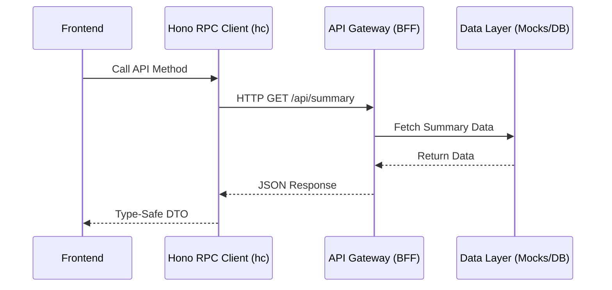

# API Gateway & Backend-for-Frontend (BFF)

This document outlines the architecture, routing, and data integrity logic of the Kryptofolio API Gateway.

## High-Level Overview

The API Gateway acts as a Backend-for-Frontend (BFF) built on **Hono**. It serves as the single entry point for the frontend, abstracting away internal data sources, mock logic, and legacy APIs. The gateway ensures that the frontend only interacts with a consistent set of interfaces via Hono RPC (`hc`).

> [!NOTE]
> The BFF supports two operational modes (configured via the `MODE` environment variable):
> - **`mock`**: Serves sophisticated static data subsets directly out of memory, eliminating the need for local JSON imports.
> - **`prod`**: Acts as a secure reverse proxy, forwarding requests to the actual backend (`PROD_API_URL`) while injecting sensitive credentials like `SECRET_API_KEY`.

## Architecture & Data Flow

The API Gateway provides a type-safe RPC client to the frontend.



## Strict Request Validation (`zValidator`)

To ensure perfect End-to-End Type Safety, any endpoint that expects a JSON body (e.g. `POST`, `PUT`) MUST use `@hono/zod-validator`.

> [!WARNING]
> Do **not** use `z.any()` in validators. If the backend fails to specify a validator, the `hc` client will throw TypeScript errors when the frontend attempts to pass a `json` property. Use strict DTO schemas or at least `z.record(z.unknown())`.

## API Contracts

Below are the primary endpoints exposed by the API Gateway during the mock execution. 

### `GET /api/summary`
Retrieves the total portfolio summary metrics and current holdings.

- **Request Body:** None
- **Response Format:** `PortfolioSummaryEntity`
- **Example Response:**
  ```json
  {
    "metrics": {
      "total_equity_eur": 142580.45,
      "total_realized_pnl_eur": 12400.00,
      "total_unrealized_pnl_eur": 45000.00
    },
    "holdings": [
      {
        "symbol": "BTC",
        "amount": 1.5,
        "avg_price_eur": 30000,
        "current_value_eur": 90000,
        "cost_basis_eur": 45000,
        "portfolio_locations": []
      }
    ]
  }
  ```

### `GET /api/wallets`
Retrieves the registered logical wallets and their associated blockchain addresses.

- **Request Body:** None
- **Response Format:** `LogicalWalletEntity[]`

### `GET /api/transactions`
Retrieves raw transaction data used primarily for tax calculations and history.

- **Request Body:** None
- **Response Format:** `TaxTransactionEntity[]`

### `GET /api/tax`
Retrieves the pre-calculated tax report for a specific year (default 2024).

- **Request Body:** None
- **Response Format:** `TaxReportEntity`

### `GET /api/metrics/kpis`
Retrieves top-level KPIs such as overall ROI, drawdowns, and best/worst performing assets.

- **Request Body:** None
- **Response Format:** `CryptoKpis`

### `GET /api/metrics/performance`
Retrieves historical performance points for charting.

- **Query Params:** `days` (number, default: 30)
- **Response Format:** `{ history: PerformancePoint[], metrics: PerformanceMetrics }`

## Referential Integrity & Mocks

### Vault Secrets Management (`/vault`)

The API Gateway also exposes a secure, encrypted local vault used to store third-party credentials (like API keys) securely using AES-256-GCM. 

#### Semantic Error Codes
The Vault API endpoints strictly follow the Anti-Corruption Layer pattern by returning semantic string codes in the `error` or `message` fields. This keeps the backend decoupled from frontend UI translations:
- `VAULT_UNLOCKED`: Vault was successfully unlocked.
- `CREDENTIALS_SECURED`: Credentials were successfully saved.
- `INVALID_PASSWORD`: The provided master password was incorrect.
- `VAULT_LOCKED`: The vault is locked and must be unlocked before proceeding.
- `UNKNOWN_PROVIDER`: The requested integration provider does not exist.
- `INVALID_CREDENTIAL_FORMAT`: The payload format is invalid.

#### Vault Endpoints
- **`GET /api/credentials/vault/status`**: Returns whether the vault is currently unlocked and the lists of configured/enabled providers.
- **`POST /api/credentials/vault/unlock`**: Unlocks or initializes the vault. Accepts `{ password: string }`. Includes a persistent verification payload (`kryptofolio_vault_ok`) to cryptographically verify if the password matches previous sessions.
- **`GET /api/credentials/vault/providers`**: Lists available third-party integrations.
- **`POST /api/credentials/vault/:service`**: Stores credentials securely for a specific service.
- **`PATCH /api/credentials/vault/:service/status`**: Enables or disables a specific service integration.

### User Settings (`/settings`)

Manages the application-wide configuration.

- **`GET /api/settings/language`**: Returns the currently active language preference (`{ language: "en" | "es" }`).
- **`PUT /api/settings/language`**: Updates the language preference. Validates with `zod` ensuring exactly a valid locale length.

## Referential Integrity & Mocks

To ensure the frontend functions exactly as it would in production, the mock data within the API Gateway is strictly validated for **referential integrity**.

> [!IMPORTANT]
> The `integrity.ts` utility validates that the sum of all transaction inflows/outflows for a given asset matches the exact holding amount reported in `/api/summary`.

If the mock data files (e.g., `mockPortfolio.ts`, `mockTax.ts`) are manually updated and integrity is broken, the `validateMockIntegrity` function will throw errors during the test suite, preventing invalid states from reaching the frontend.

## Setup & Execution

To run the API Gateway in mock mode:

```bash
# From the project root
pnpm --filter @dashboar-portfolio/api-gateway dev
```

Alternatively, running the global mock dev script will launch both the frontend and the BFF simultaneously:

```bash
pnpm run dev:mock
```
