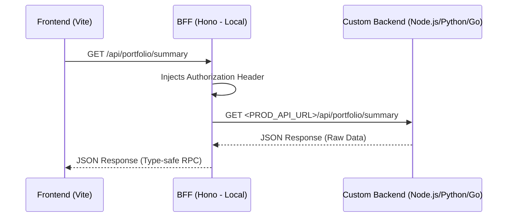

# API & Backend Integration Guide

This document describes how to connect custom backend services to Kryptofolio.

## Backend-for-Frontend (BFF) Proxy Architecture

The frontend is tightly coupled to the BFF (built with **Hono**) using Hono RPC (`hc`) to ensure E2E type safety. Rather than forcing the frontend to point directly to various backends, Kryptofolio uses a Backend-for-Frontend (BFF) proxy pattern. 

### How it Works in Production (`MODE=prod`)
1. The Vite frontend always sends requests to the local BFF instance (`VITE_API_BASE_URL`).
2. When the BFF is started with `MODE=prod`, it acts as a **reverse proxy** for all `/api/*` endpoints, forwarding them to the external production API defined in `PROD_API_URL`.
3. The BFF automatically injects the `SECRET_API_KEY` into the HTTP request headers as:
   ```http
   Authorization: Bearer <SECRET_API_KEY>
   ```
4. This ensures that:
   - Your production API does not need to handle public CORS headers directly for the frontend (the BFF manages CORS).
   - Sensitive backend tokens are never exposed to the frontend/browser.



---

## Future Backend Stack

The production backend (`apps/backend`) is being developed using **Hono + DuckDB** to handle heavy data calculations, FIFO queue matching, and persistence.

As long as any alternative target backend implements the REST endpoints specified below and matches the JSON contracts (using schemas from `@kryptofolio/shared-types`), any framework (Node.js, Rust, Go, Python) could theoretically be used.

---

## API Contracts

If you are developing a custom backend to run with Kryptofolio in `prod` mode, your service must expose the following `/api/*` REST endpoints and satisfy their contracts.

### 📊 Portfolio Endpoints

#### `GET /api/portfolio/summary`
Retrieves top-level equity metrics and the list of active token holdings.

- **Request Body:** None
- **Response Format:** `200 OK` (JSON)
- **Response Schema:**
  ```json
  {
    "metrics": {
      "total_equity_eur": "number",
      "total_realized_pnl_eur": "number",
      "total_unrealized_pnl_eur": "number"
    },
    "holdings": [
      {
        "symbol": "string",
        "amount": "number",
        "avg_price_eur": "number",
        "current_value_eur": "number",
        "cost_basis_eur": "number",
        "portfolio_locations": "string[]"
      }
    ]
  }
  ```
- **Example Response:**
  ```json
  {
    "metrics": {
      "total_equity_eur": 142580.45,
      "total_realized_pnl_eur": 12400.00,
      "total_unrealized_pnl_eur": 45000.00
    },
    "holdings": [
      {
        "symbol": "BTC",
        "amount": 1.5,
        "avg_price_eur": 30000.00,
        "current_value_eur": 90000.00,
        "cost_basis_eur": 45000.00,
        "portfolio_locations": ["Kraken"]
      }
    ]
  }
  ```

#### `GET /api/portfolio/token/:symbol/history`
Retrieves tax lots (FIFO purchases) and historical balance updates for a specific asset.

- **Route Params:** `symbol` (e.g. `btc`)
- **Response Format:** `200 OK` (JSON)
- **Example Response:**
  ```json
  {
    "lots": [
      {
        "id": "lot-1",
        "date": "2024-01-15T10:00:00Z",
        "amount": 1.0,
        "price_fiat": 30000.00,
        "remaining": 0.5
      }
    ],
    "history": {
      "timestamps": ["2024-01-15T10:00:00Z", "2024-02-15T12:00:00Z"],
      "balances": [1.0, 1.5]
    }
  }
  ```

#### `POST /api/portfolio/rebuild`
Triggers the backend to re-process the FIFO allocation queues from raw transactions.

- **Request Body:** `{}`
- **Response Format:** `200 OK`
  ```json
  { "success": true }
  ```

---

### 🏛️ Tax & Ingestion Endpoints

#### `GET /api/tax/transactions/spot`
Returns a list of all validated Spot transactions.

- **Response Format:** `200 OK` (JSON Array of transactions)
- **Transaction Schema:**
  ```json
  [
    {
      "id": "string",
      "date": "string (ISO 8601)",
      "tx_type": "BUY | SELL | TRANSFER | DEPOSIT | WITHDRAWAL",
      "asset_in": "string (Branded Asset ID)",
      "amount_in": "number",
      "asset_out": "string",
      "amount_out": "number",
      "fee": "number",
      "fee_asset": "string",
      "price_fiat": "number",
      "exchange": "string",
      "tx_id": "string (optional)",
      "metadata": "object (optional)"
    }
  ]
  ```

#### `GET /api/tax/transactions/futures`
Returns a list of all validated Futures/Derivatives transactions.

- **Response Format:** `200 OK` (JSON Array)

#### `GET /api/tax/report`
Generates the annual tax summary required for AEAT (Hacienda) reporting.

- **Response Format:** `200 OK` (JSON)
- **Example Response:**
  ```json
  {
    "year": 2024,
    "realized_pnl_eur": 12400.00,
    "taxable_base_eur": 12400.00,
    "transactions_count": 48,
    "unresolved_gaps_count": 0,
    "warnings": []
  }
  ```

#### `POST /api/tax/import`
Submits validated, auto-mapped rows from the frontend's **Data Ingestion Wizard** into the database.

- **Request Headers:** `Content-Type: application/json`
- **Request Body:**
  ```json
  {
    "rows": [
      {
        "mappedData": {
          "date": "2024-05-10 14:35:00",
          "tx_type": "BUY",
          "asset_in": "BTC",
          "amount_in": 0.05,
          "asset_out": "EUR",
          "amount_out": 3100.00,
          "price_fiat": 62000.00,
          "exchange": "Bitunix",
          "timezone": "Europe/Madrid",
          "timestamp": "2024-05-10T12:35:00Z"
        },
        "originalRow": {
          "Date (UTC)": "2024-05-10 14:35:00",
          "Change": "0.05",
          "trade price": "62000",
          "Outgoing Asset": "EUR"
        }
      }
    ],
    "market": "spot",
    "timezone": "Europe/Madrid"
  }
  ```
- **Response Format:** `200 OK`
  ```json
  { "success": true }
  ```

#### `DELETE /api/tax/transactions/:id`
Deletes a specific transaction record from the DB.

- **Response Format:** `200 OK`
  ```json
  { "success": true }
  ```

#### `PUT /api/tax/transactions/:id`
Updates a single transaction record.

- **Request Body:** `{ ...modified transaction fields... }`
- **Response Format:** `200 OK`
  ```json
  { "success": true }
  ```

#### `DELETE /api/tax/transactions/market/:market`
Bulk deletes transactions of a specific market type.

- **Route Params:** `market` (`spot` | `futures`)
- **Response Format:** `200 OK`
  ```json
  { "success": true }
  ```

#### `GET /api/tax/report/download`
Downloads the generated tax report sheet.

- **Query Params:** `year` (number), `format` (`pdf` | `csv`)
- **Response Format:** `200 OK` (binary stream / file download)

---

### 📈 Metrics & Performance Endpoints

#### `GET /api/metrics/kpis`
Retrieves summary metrics for display on the main dashboard KPIs grid.

- **Response Schema:**
  ```json
  {
    "roi_percentage": "number",
    "best_performing_asset": "string",
    "worst_performing_asset": "string",
    "max_drawdown_percentage": "number"
  }
  ```

#### `GET /api/metrics/allocation`
Returns the breakdown of asset allocations.

- **Response Format:** `200 OK` (JSON)
- **Example Response:**
  ```json
  [
    { "asset": "BTC", "percentage": 65.0, "value_eur": 92677.29 },
    { "asset": "ETH", "percentage": 35.0, "value_eur": 49903.16 }
  ]
  ```

#### `GET /api/metrics/performance`
Provides historical performance points for portfolio charting.

- **Query Params:** `days` (number, default: `30`)
- **Response Schema:**
  ```json
  {
    "history": [
      { "date": "string (YYYY-MM-DD)", "value_eur": "number" }
    ],
    "metrics": {
      "absolute_change_eur": "number",
      "percentage_change": "number"
    }
  }
  ```

#### `GET /api/metrics/heatmap`
Provides monthly/daily volatility heatmaps for advanced trading metrics.

- **Query Params:** `year` (number)
- **Response Format:** `200 OK` (JSON representation)

---

### 🛡️ Local Vault & Settings (Reference)

When running in `prod` mode, these calls are normally handled locally by the BFF if it manages its own DB. However, if your proxy delegates all paths, the backend must support:

- `POST /api/credentials/vault/unlock` (unlocks credentials DB)
- `GET /api/credentials/vault/status` (locked/unlocked, integrations list)
- `POST /api/credentials/vault/:service` (saves API Keys/secrets)
- `PATCH /api/credentials/vault/:service/status` (toggles services)
- `GET /api/settings/language` (user language)
- `PUT /api/settings/language` (saves language preference)
