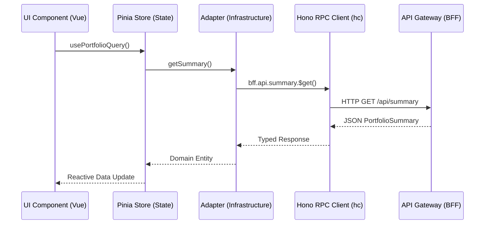
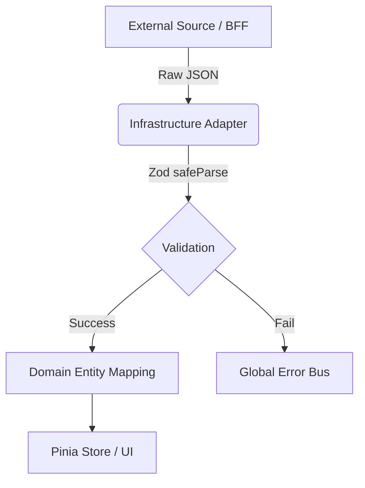

# Core Architecture

This document covers the high-level architecture of the application, detailing the Monorepo structure, the Hexagonal Architecture pattern used across modules, and the role of the Hono Backend For Frontend (BFF).

## Overview

Kryptofolio leverages a strict **Hexagonal Architecture** within a Turborepo monorepo setup. The core principle is that the Domain layer is completely isolated from external concerns, meaning no framework imports, no database logic, and no external UI dependencies are allowed inside `src/core/domain/`.

All external data enters the system through the **Anti-Corruption Layer (ACL)**, primarily using Zod schemas for Data Transfer Objects (DTOs), before being mapped to internal Branded Types and strict Domain Entities.

## Backend-for-Frontend (BFF) Pattern

Instead of the frontend making direct external calls or relying on hardcoded static data files, Kryptofolio implements a BFF using **Hono**. This API Gateway centralizes data fetching, caching, and mocking. 

### Data Flow via Hono RPC

The frontend communicates with the BFF entirely through `hono/client` (`hc<AppType>`). This guarantees end-to-end type safety. The legacy `IHttpClient` string-based interface has been entirely removed.

> [!TIP]
> The `BffClient.ts` handles the environment variables cleanly. In mock mode (`VITE_USE_MOCK=true`), it securely routes to `http://localhost:3001` (the local API Gateway). Otherwise, it targets `VITE_API_BASE_URL`.

### Mock Mode vs Real Mode

The Hexagonal Architecture allows the frontend to swap between `RestCryptoAdapter` and `MockCryptoAdapter` transparently. However, to simplify development, even the `MockCryptoAdapter` utilizes the BFF to fetch static, referentially-validated data sets.

- **Real Mode (`RestCryptoAdapter`)**: Fetches data from external real APIs (or the production API Gateway in the future).
- **Mock Mode (`MockCryptoAdapter`)**: Fetches data from the local API Gateway running in development mode, ensuring the frontend still experiences network latency and asynchronous loading states.

## Anti-Corruption Layer (ACL)

To prevent external API changes from breaking the UI, all adapters must run data through Zod DTOs before instantiating Domain Entities.

