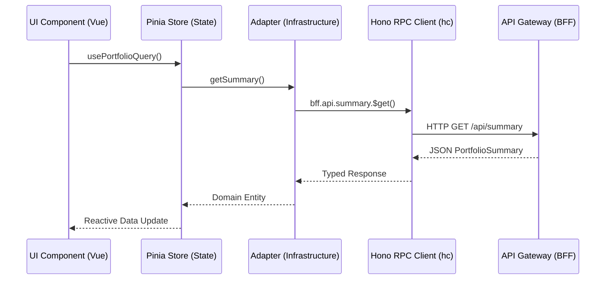
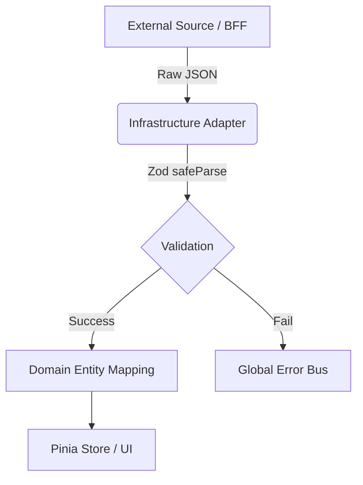

# Core Architecture

This document covers the high-level architecture of the application, detailing the Monorepo structure, the Hexagonal Architecture pattern used across modules, and the role of the Hono Backend For Frontend (BFF).

## Overview

Kryptofolio leverages a strict **Hexagonal Architecture** within a Turborepo monorepo setup. The core principle is that the Domain layer is completely isolated from external concerns, meaning no framework imports, no database logic, and no external UI dependencies are allowed inside `src/core/domain/`.

All external data enters the system through the **Anti-Corruption Layer (ACL)**, primarily using Zod schemas for Data Transfer Objects (DTOs), before being mapped to internal Branded Types and strict Domain Entities.

## Backend-for-Frontend (BFF) Pattern

Instead of the frontend making direct external calls or relying on hardcoded static data files, Kryptofolio implements a BFF using **Hono**. This API Gateway centralizes data fetching, caching, and mocking. 

### Data Flow via Hono RPC

The frontend communicates with the BFF entirely through `hono/client` (`hc<AppType>`). This guarantees end-to-end type safety. The legacy `IHttpClient` string-based interface has been entirely removed.

> [!TIP]
> The `BffClient.ts` handles the environment variables cleanly. It securely routes to `VITE_API_BASE_URL` which points to our API Gateway.

### Backend-for-Frontend as the Single Source of Truth

The Hexagonal Architecture previously allowed the frontend to swap between `RestCryptoAdapter` and local mock adapters. However, to simplify development and eliminate dual maintenance, **mocks are now managed exclusively at the BFF layer**.

- **Frontend Consistency**: The frontend always injects and utilizes the `Rest*` adapters, which point to the BFF.
- **BFF Modes**: The BFF itself dictates whether it serves static mock data (`MODE=mock`) or proxies requests to a live backend (`MODE=prod`). This ensures the frontend consistently experiences network latency, asynchronous loading states, and identical payloads regardless of the environment.

## Anti-Corruption Layer (ACL)

To prevent external API changes from breaking the UI, all adapters must run data through Zod DTOs before instantiating Domain Entities.

