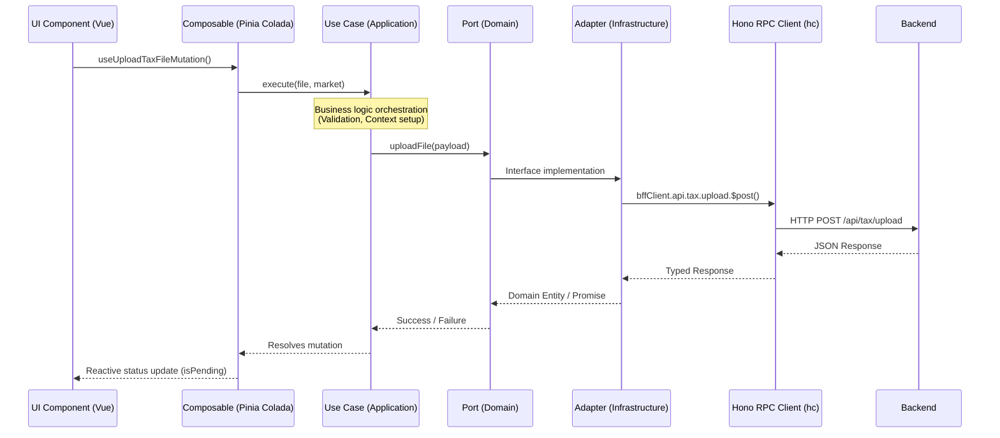
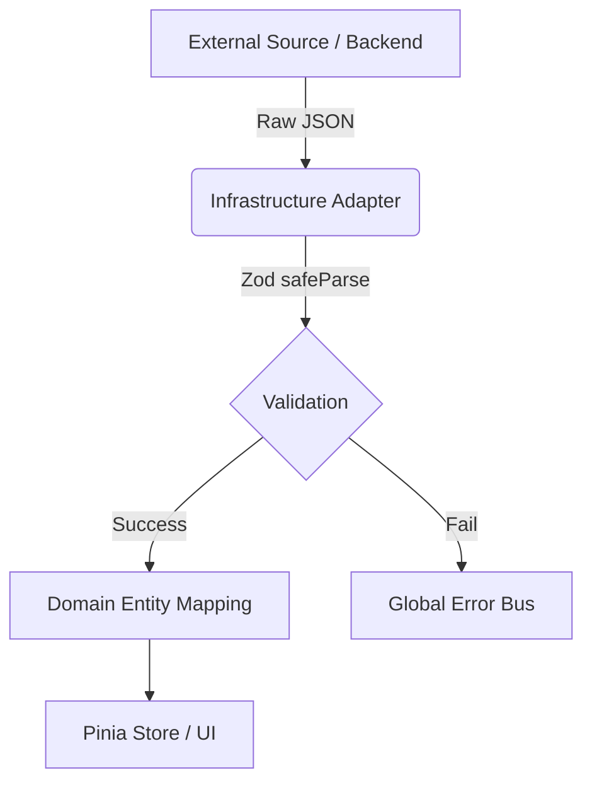
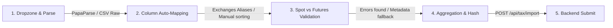

# Core Architecture

This document covers the high-level architecture of the application, detailing the Monorepo structure, the Hexagonal Architecture pattern used across modules, and the role of the Hono Backend For Frontend (BFF).

## Overview

Kryptofolio leverages a strict **Hexagonal Architecture** within a PNPM Workspaces monorepo.

### Monorepo Structure

The project is divided into specialized decoupled packages:
- **`apps/frontend/`**: The main Vue 3 user interface.
- **`apps/backend/`**: The core production backend (Hono + SQLite + DuckDB), handling API routes, encrypted vault, calculations, and database persistence.
- **`packages/database/`**: Database abstraction layer with migrations and generic connection ports for SQLite and DuckDB.
- **`packages/core-domain/`**: Pure business logic (e.g., Services, Normalizers). Completely framework-agnostic.
- **`packages/shared-types/`**: Zod schemas, DTOs, and type definitions shared across the entire monorepo.

The core principle is that the Domain layer (now isolated in `@kryptofolio/core-domain` and `@kryptofolio/shared-types`) is completely isolated from external concerns, meaning no framework imports, no database logic, and no external UI dependencies.

> [!NOTE]
> **Client-Side Domain Boundaries:** The frontend's domain does *not* compute core financial records like FIFO cost-basis matching or realized/unrealized PnL. The frontend acts as a structured presentation client. Its Domain and Application layers are dedicated to UI state orchestration, local storage settings, credential vault encryption, error handling, and translation state management. The calculations are delegated to the backend.

All external data enters the system through the **Anti-Corruption Layer (ACL)**, primarily using Zod schemas for Data Transfer Objects (DTOs), before being mapped to internal Branded Types and strict Domain Entities.

## Backend & Database Orchestration

Instead of the frontend making direct external calls or relying on hardcoded static data files, Kryptofolio implements a centralized backend (`apps/backend`) using **Hono**. This backend acts as the single source of truth for data fetching, calculations, caching, and serving mock data during development.

### Data Flow & Dependency Injection

The frontend communicates with the backend entirely through `hono/client` (`hc<AppType>`). This guarantees end-to-end type safety. The data flow strictly adheres to Hexagonal Architecture, ensuring the UI components never directly call the network or the adapters.

> [!TIP]
> `BffClient.ts` handles the connection securely routing to `VITE_API_URL` which points to our backend.

**Architectural Rules for Data Flow:**
1. **Reads (Queries):** Simple read operations may bypass Use Cases and let the composables delegate directly to the injected Domain Port (acting as a Repository). This follows CQRS principles.
2. **Writes (Mutations):** All state-changing operations MUST be orchestrated through an explicit `UseCase` class in `src/core/application/use-cases/`.
3. **Ports:** All dependencies are injected via Vue's `provide`/`inject` system using strictly typed `InjectionKey`s (e.g., `VAULT_PORT_KEY`).

### Backend as the Single Source of Truth

The Hexagonal Architecture ensures the frontend is agnostic to the actual network implementation. Mocks and network logic are managed exclusively at the backend layer.

- **Frontend Consistency**: The frontend always injects and utilizes the `Rest*` adapters, which point to the backend.
- **Backend Responsibilities**: The backend dictates whether it serves static mock data (until DB integration is complete) or real database queries. This ensures the frontend consistently experiences network latency, asynchronous loading states, and identical payloads regardless of the environment.

## Anti-Corruption Layer (ACL)

To prevent external API changes from breaking the UI, all adapters must run data through Zod DTOs before instantiating Domain Entities.

---

## 🧹 Data Ingestion Wizard Architecture

The **Data Ingestion Wizard** (`apps/frontend/src/modules/data-ingestion/`) is a key component structured using a decoupled, multi-step pipeline pattern:

### Steps Breakdown:
1. **File Parsing & Upload:** CSV/XLSX files are parsed in-browser using `PapaParse` or equivalent utilities.
2. **Column Auto-Mapping:** Mappings are matched automatically against aliases for Binance, Kraken, Coinbase, KuCoin, and Bitunix. If headers are unknown, they default to a `metadata` pass-through object rather than breaking the parser.
3. **Manual Adjustments:** The user can manually map unassigned headers using a dropdown where options are sorted alphabetically based on their translated labels (ensuring quick scanning).
4. **Validation:** Checks are run based on `marketType`:
   - **Spot:** Requires `date` and `tx_type`.
   - **Futures:** Requires `date`, `tx_type` and trade variables like `amount`, `symbol`, `price_fiat`, `asset`. For settlement rows (PnL), if `pnl_currency` is missing, it falls back to the quote currency or asset.
5. **Aggregation & Normalization:** Rows are aggregated and normalized (e.g., timezone to UTC ISO, transaction direction), and a SHA-256 ID hash is generated to avoid duplicate imports.
6. **Submission & Invalidation:** Submitting via `useSubmitIngestionMutation` makes an RPC call to `/api/tax/import`. Upon success, the transactions query caches are invalidated, automatically refetching the tables in the UI.

---

## 🤖 AI Agent Ready (Future Feature)

Although the AI Agent integration (using Vercel AI SDK and Mastra) is a future capability, the application has been designed from the ground up to support it:

- **Isolated Use Cases:** Use cases in `src/core/application/use-cases/` are completely isolated from Vue/UI, expecting pure DTOs.
- **Function Calling Compatibility:** These Use Cases and their Zod schemas are structured so they can be exposed directly as **LLM Tools** (Function Calling) for an AI Agent.
- **Natural Language Execution:** A future LLM agent will be able to invoke operations (e.g., query the vault, request a tax report summary, import a new CSV) by matching user natural language prompts directly to the Use Cases' inputs, without bypassing validation rules or rewriting data models.

