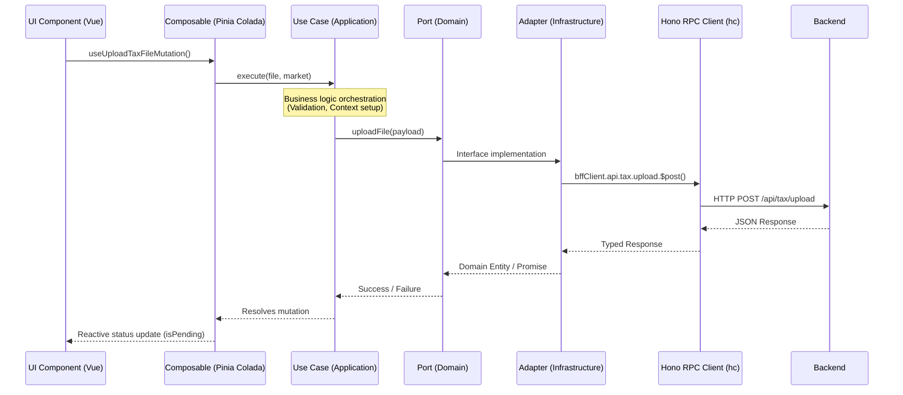
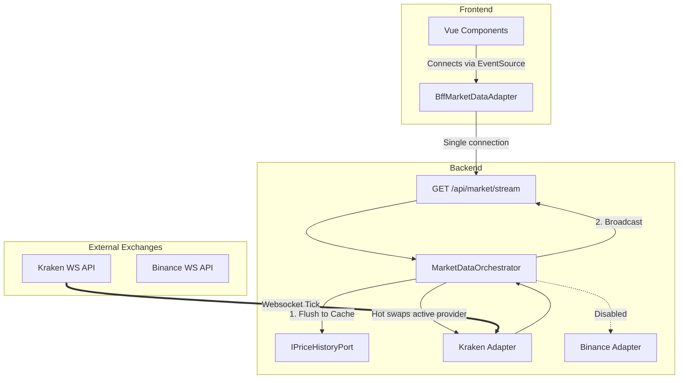
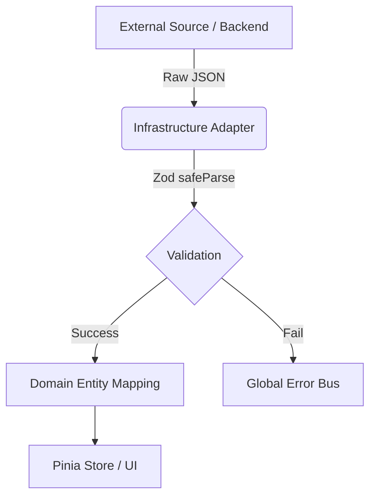
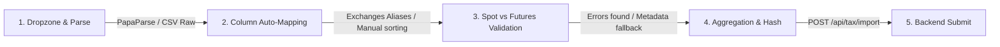

# Core Architecture

This document covers the high-level architecture of the application, detailing the Monorepo structure, the Hexagonal Architecture pattern used across modules, and the role of the Hono Backend For Frontend (BFF).

## Overview

Kryptofolio leverages a strict **Hexagonal Architecture** within a PNPM Workspaces monorepo.

### Monorepo Structure

The project is divided into specialized decoupled packages:
- **`apps/backend/`**: The core production backend (Hono + SQLite + DuckDB). It is cleanly separated into two main entry points:
  - `app.ts`: The pure Hono application definition, routing, and middlewares.
  - `index.ts`: The server bootstrapper, database initializer, and job orchestrator.
- **`packages/database/`**: Database abstraction layer with migrations and generic connection ports for SQLite and DuckDB.
- **`packages/core-domain/`**: Pure business logic (e.g., Services, Normalizers). Completely framework-agnostic.
- **`packages/shared-types/`**: Zod schemas, DTOs, and type definitions shared across the entire monorepo.

The core principle is that the Domain layer (now isolated in `@kryptofolio/core-domain` and `@kryptofolio/shared-types`) is completely isolated from external concerns, meaning no framework imports, no database logic, and no external UI dependencies.

> [!NOTE]
> **Client-Side Domain Boundaries:** The frontend's domain does *not* compute core financial records like FIFO cost-basis matching or realized/unrealized PnL. The frontend acts as a structured presentation client. Its Domain and Application layers are dedicated to UI state orchestration, local storage settings, credential vault encryption, error handling, and translation state management. The calculations are delegated to the backend.

All external data enters the system through the **Anti-Corruption Layer (ACL)**, primarily using Zod schemas for Data Transfer Objects (DTOs), before being mapped to internal Branded Types and strict Domain Entities.

## Backend & Database Orchestration

Instead of the frontend making direct external calls or relying on hardcoded static data files, Kryptofolio implements a centralized backend (`apps/backend`) using **Hono**. This backend acts as the single source of truth for data fetching, calculations, caching, and serving mock data during development.

### Data Flow & Dependency Injection

The frontend communicates with the backend entirely through `hono/client` (`hc<AppType>`). This guarantees end-to-end type safety. The data flow strictly adheres to Hexagonal Architecture, ensuring the UI components never directly call the network or the adapters.

> [!TIP]
> `BffClient.ts` handles the connection securely routing to `VITE_API_URL` which points to our backend.



The Backend relies on a centralized Dependency Injection (DI) container (`apps/backend/src/core/infrastructure/di/container.ts`). This container securely instantiates Domain Services (like `FifoMaterializerService`) injecting their required Adapters (SQLite/DuckDB) and configuration ports. The Hono routing layer fetches these instances from the container rather than instantiating them directly, keeping the route definitions perfectly decoupled from business logic implementations.

**Architectural Rules for Data Flow:**
1. **Reads (Queries):** Simple read operations may bypass Use Cases and let the composables delegate directly to the injected Domain Port (acting as a Repository). This follows CQRS principles.
2. **Writes (Mutations):** All state-changing operations MUST be orchestrated through an explicit `UseCase` class in `src/core/application/use-cases/`.
3. **Ports:** All dependencies are injected via Vue's `provide`/`inject` system using strictly typed `InjectionKey`s (e.g., `VAULT_PORT_KEY`).

### Backend as the Single Source of Truth

The Hexagonal Architecture ensures the frontend is agnostic to the actual network implementation. Mocks and network logic are managed exclusively at the backend layer.

- **Frontend Consistency**: The frontend always injects and utilizes the `Rest*` adapters, which point to the backend.
- **Backend Responsibilities**: The backend dictates whether it serves static mock data (until DB integration is complete) or real database queries. This ensures the frontend consistently experiences network latency, asynchronous loading states, and identical payloads regardless of the environment.

### Real-Time Market Data Architecture

To provide live ticker prices and global metrics without exhausting browser resources or hitting third-party rate limits from the client, Kryptofolio uses a **Server-Sent Events (SSE)** architecture orchestrated by the backend:



**Key benefits of this approach:**
- **Hot-Swapping:** The user can change their active provider (e.g., from Kraken to Binance) in the Vault. The Orchestrator tears down the Kraken WebSocket and spins up Binance, pushing new data down the exact same SSE pipe. The frontend requires zero reconnection logic.
- **Data Freshness & REST Synchronization:** Every tick is automatically saved to the `IPriceHistoryPort`. This guarantees that standard REST API calls (`/api/market/global`) are instantly synchronized with the live stream state.

## Anti-Corruption Layer (ACL)

To prevent external API changes from breaking the UI, all adapters must run data through Zod DTOs before instantiating Domain Entities.

**Financial Precision & Boundary Enforcement:** 
To prevent IEEE-754 floating-point precision loss, all financial primitives (prices, amounts, fees) cross the system boundary strictly as strings. The ACL enforces this via `preciseAmountSchema` (Zod validation with regex constraints). Only after passing this strict validation are these strings instantiated into `Money` Value Objects inside the Domain Layer, where operations are safely handled by `decimal.js`.



---

## 🗄️ Dual-Database Analytical Architecture

Kryptofolio operates as a **local-first, single-user** application. To balance the need for reliable data entry (OLTP) and heavy mathematical calculations for taxes (OLAP), the system implements a Dual-Database strategy:

1. **Transactional Ledger (SQLite):** Acts as the single source of truth for the user's data (Transactions, Accounts, Vault). To avoid IEEE-754 floating-point errors, all financial values are stored as `TEXT` and handled in TypeScript via `decimal.js`.
2. **Analytical Engine (DuckDB):** Operates entirely in-memory as a high-performance query engine. It establishes a zero-copy connection to the SQLite database (`ATTACH ... TYPE SQLITE`) and executes complex vectorized calculations (e.g., FIFO queues via Window Functions) on the fly, casting TEXT to `DECIMAL(38,18)`.
3. **Federated Historical Storage (Parquet):** Time-series data like daily price ticks are stored in Hive-partitioned Parquet files on disk. DuckDB seamlessly federates this data (`LEFT JOIN`) with the SQLite ledger to compute dynamic metrics like TTWROR and unrealized PnL.

```mermaid
flowchart TD
    subgraph Storage Layer (Disk)
      SQLite[(SQLite Ledger)]
      Parquet[Parquet Historical Prices]
    end

    subgraph Analytical Engine (In-Memory)
      DuckDB{DuckDB (OLAP)}
      DuckDB -- "Zero-Copy ATTACH" --> SQLite
      DuckDB -- "Federated Query" --> Parquet
    end

    subgraph Application Layer
      App[Backend Use Cases]
      App -- "Write/Read Transactions" --> SQLite
      App -- "Query FIFO/PnL" --> DuckDB
    end
```

---

## 🧹 Data Ingestion Wizard Architecture

The **Data Ingestion Wizard** (`apps/frontend/src/modules/data-ingestion/`) is a key component structured using a decoupled, multi-step pipeline pattern:



### Steps Breakdown:
1. **File Parsing & Upload:** CSV/XLSX files are parsed in-browser using `PapaParse` or equivalent utilities.
2. **Column Auto-Mapping:** Mappings are matched automatically against aliases for Binance, Kraken, Coinbase, KuCoin, and Bitunix. If headers are unknown, they default to a `metadata` pass-through object rather than breaking the parser.
3. **Manual Adjustments:** The user can manually map unassigned headers using a dropdown where options are sorted alphabetically based on their translated labels (ensuring quick scanning).
4. **Validation:** Checks are run based on `marketType`:
   - **Spot:** Requires `date` and `tx_type`.
   - **Futures:** Requires `date`, `tx_type` and trade variables like `amount`, `symbol`, `price_fiat`, `asset`. For settlement rows (PnL), if `pnl_currency` is missing, it falls back to the quote currency or asset.
5. **Aggregation & Normalization:** Rows are aggregated and normalized (e.g., timezone to UTC ISO, transaction direction), and a SHA-256 ID hash is generated to avoid duplicate imports.
6. **Submission & Invalidation:** Submitting via `useSubmitIngestionMutation` makes an RPC call to `/api/tax/import`. Upon success, the transactions query caches are invalidated, automatically refetching the tables in the UI.

---

## 💰 FIFO Tax Engine & Custody Ledger

Portfolio tax lots are computed exclusively in DuckDB, from a data-driven `fifo_event_policy`
relation rather than inline `tx_type` predicate lists, and custody (which account physically holds
an asset) is tracked by a separate double-entry ledger that never influences which lot a sale
consumes. Each exchange source's own CSV conventions — fee denomination, gross/net/fee convention,
whether a row writes one movement onto both directional columns — are declared once as a
**source format profile** (`packages/core-domain/src/domain/services/sourceProfile/`) rather than
guessed by the column mapper.

> [!NOTE]
> This is substantial enough to warrant its own document. See
> **[FIFO Tax Engine, Custody Ledger & Source Format Profiles](fifo-tax-engine.md)** for the full
> ingestion pipeline, the fee model, the custody ledger's `ownwallet-<ASSET>` counterparty, and the
> DuckDB view dependency graph (`v_flattened_fifo_events` → `v_acquisitions`/`v_disposals` →
> `v_fifo_matches` → `v_calculated_tax_lots`, plus `v_lot_custody_allocation` on a wholly separate
> ordering).

---

## 🤖 AI Agent Ready (Future Feature)

Although the AI Agent integration (using Vercel AI SDK and Mastra) is a future capability, the application has been designed from the ground up to support it:

- **Isolated Use Cases:** Use cases in `src/core/application/use-cases/` are completely isolated from Vue/UI, expecting pure DTOs.
- **Function Calling Compatibility:** These Use Cases and their Zod schemas are structured so they can be exposed directly as **LLM Tools** (Function Calling) for an AI Agent.
- **Natural Language Execution:** A future LLM agent will be able to invoke operations (e.g., query the vault, request a tax report summary, import a new CSV) by matching user natural language prompts directly to the Use Cases' inputs, without bypassing validation rules or rewriting data models.

