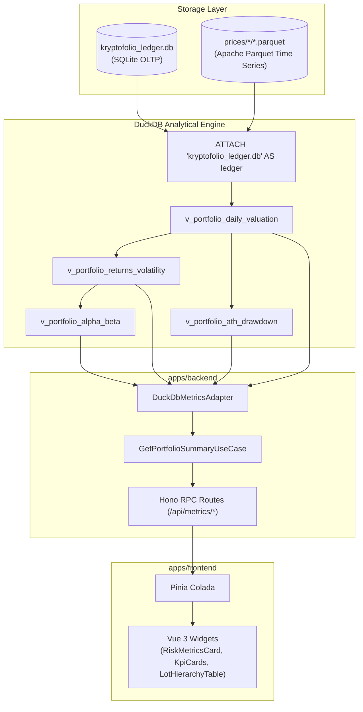

# DuckDB Analytics & Time-Series Engine Architecture (Phase 2B)

This document details the architecture, SQL view definitions, domain isolation patterns, and synchronization protocols behind the Kryptofolio **DuckDB Performance & Risk Metrics Engine**.

---

## 1. High-Level Architecture Overview

Kryptofolio uses a **Dual-Database OLTP/OLAP Pattern**:
- **SQLite Ledger (`kryptofolio_ledger.db`)**: Transactional truth (OLTP). Holds raw spot/futures transactions, accounts, assets, and persisted tax lots.
- **DuckDB Engine**: Ephemeral analytical engine (OLAP). Attaches to SQLite in zero-copy mode (`ATTACH 'kryptofolio_ledger.db' AS ledger (TYPE SQLITE);`) to calculate time-series metrics, portfolio valuation, drawdowns, and institutional risk metrics dynamically using SQL Window Functions.



---

## 2. Core SQL Analytical Views

The analytical engine creates 4 foundational vectorized views inside DuckDB:

### 2.1. Daily Portfolio Valuation (`v_portfolio_daily_valuation`)
Computes running balances per asset and evaluates daily portfolio value using ASOF join logic with historical prices.

### 2.2. Portfolio Returns & Volatility (`v_portfolio_returns_volatility`)
Calculates daily log/percentage returns and 30-day annualized volatility:
$$\text{Volatility}_{30d} = \sigma(\text{daily\_returns}_{30d}) \times \sqrt{365}$$

### 2.3. ATH Drawdown (`v_portfolio_ath_drawdown`)
Tracks rolling All-Time-High (ATH) portfolio values and percentage drawdowns:
$$\text{Drawdown}_{\%} = \frac{\text{Daily Value} - \text{Rolling ATH}}{\text{Rolling ATH}}$$

### 2.4. Risk Alpha & Beta (`v_portfolio_alpha_beta`)
Computes portfolio covariance against BTC market benchmark to calculate Beta ($\beta$) and Alpha ($\alpha$):
$$\beta = \frac{\text{Cov}(R_p, R_m)}{\text{Var}(R_m)}$$

---

## 3. Pure Domain Isolation (`PreciseAmount`)

To guarantee strict Domain Layer isolation (no external `decimal.js` library imports in domain ports), all financial values in the core domain use **Branded Value Objects**:

```typescript
export type PreciseAmount = string & { readonly __brand: 'PreciseAmount' };

export const toPreciseAmount = (val: string | number): PreciseAmount =>
  String(val) as PreciseAmount;
```

- **Domain Layer (`ILedgerPort`, `IPriceProviderPort`)**: Operates exclusively with `PreciseAmount` string types.
- **Infrastructure / Application Layers**: Perform `Decimal` math operations using `new Decimal(amount)` when calculating gains, and convert back to `PreciseAmount` on boundaries.

---

## 4. Multi-Database Rebuild Synchronization Protocol

When the user triggers `POST /api/portfolio/rebuild`:
1. `FifoMaterializerService` clears stale tax lots in SQLite.
2. DuckDB re-runs vectorized FIFO lot matching across `ledger.spot_transactions`.
3. Materialized tax lots are persisted back into `ledger.tax_lots` in SQLite.
4. DuckDB analytical views instantly refresh their zero-copy view over SQLite.
5. The API returns updated summary and KPI metrics mapped to the user-configured base currency (`userSettingsPort`).

---

## 5. API Endpoints Contract (`/api/metrics`)

| Method | Endpoint | Description |
|---|---|---|
| `GET` | `/api/metrics/kpis` | Total equity, cost basis, realized PnL, unrealized PnL, Win Rate, Best/Worst asset. |
| `GET` | `/api/metrics/risk` | Sharpe ratio, 30d annualized volatility, max drawdown %, Alpha, Beta. |
| `GET` | `/api/metrics/performance` | Daily portfolio valuation time-series. |
| `GET` | `/api/metrics/drawdown` | Daily drawdown percentage time-series. |
