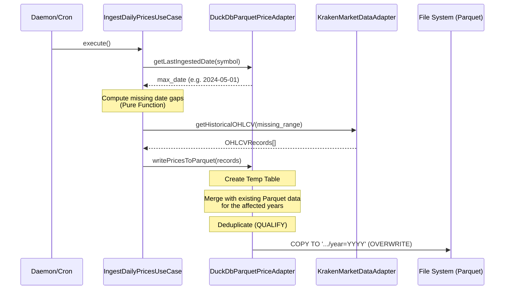

# DuckDB & Parquet Time-Series Architecture

This document outlines the architecture, data flow, and design decisions behind the Alucard system's time-series data ingestion (specifically historical OHLCV prices) using **DuckDB** and **Apache Parquet**.

## 1. High-Level Overview

While the transactional ledger (SQLite) is excellent for maintaining the immutable, exact state of user transactions, it is inherently inefficient for storing millions of rows of time-series data (like daily historical prices for hundreds of cryptocurrencies). 

To solve this, we implemented a **Hybrid Data Architecture**:
- **SQLite:** Transactional truth (OLTP).
- **DuckDB + Parquet:** Analytical time-series processing (OLAP).

This architecture separates heavy analytical workloads from the main transactional database, ensuring the UI remains fast while unlocking the ability to query decades of pricing data instantly.

---

## 2. Architecture & Data Flow

The ingestion pipeline is designed around **Clean Architecture** and the **Functional Sandwich** pattern. The domain logic (`IngestDailyPricesUseCase`) orchestrates the flow without knowing anything about DuckDB, Parquet, or Kraken.

### 2.1. The Ingestion Flow



### 2.2. The Parquet Merge Strategy (Crucial Edge Case)

DuckDB's `COPY ... (FORMAT PARQUET, PARTITION_BY (year), OVERWRITE_OR_IGNORE true)` is atomic at the directory level. If we attempt to append new daily records by calling `COPY` directly on the new payload, **DuckDB will erase the entire historical partition for that year** and replace it with just the new rows.

To safely append data while respecting Hive partitions, the `DuckDbParquetPriceAdapter` implements a **Merge & Rewrite Strategy**:
1. It identifies which years are affected by the new data.
2. It executes a `UNION ALL` between the existing Parquet data for those years and the new incoming rows.
3. It deduplicates the rows using a `QUALIFY ROW_NUMBER() OVER (...) = 1` window function (resolving conflicts by taking the most recent insert).
4. It executes the `COPY TO` command, safely overwriting the partition with the newly combined dataset.

---

## 3. What We Gain With This Architecture

This specific implementation offers several massive advantages over traditional database approaches:

### 3.1. RAM Agnosticism & Extreme Performance
DuckDB doesn't load data into memory. When the backend initializes, it executes:
```sql
CREATE VIEW IF NOT EXISTS historical_prices AS 
SELECT * FROM read_parquet('data/historical/prices/*/*.parquet', hive_partitioning=true)
```
This simply tells DuckDB where the files are. When the domain asks for `SELECT MAX(date)`, DuckDB reads the Parquet metadata (which contains min/max statistics for every column) and returns the answer in milliseconds **without scanning the actual rows**.

### 3.2. Cryptographic Precision (DECIMAL 38,18)
Floating-point math (`FLOAT`, `DOUBLE`) introduces rounding errors (e.g., `0.1 + 0.2 = 0.30000000000000004`). In crypto accounting, precision is critical. We force DuckDB to cast all financial values to `DECIMAL(38,18)` before saving them to Parquet. This guarantees that prices and volumes are stored and calculated with exact mathematical precision up to 18 decimal places.

### 3.3. Infinite Scalability via Hive Partitions
Because we write to disk using `PARTITION_BY (year)`, the file system looks like this:
```text
data/historical/prices/
├── year=2022/data.parquet
├── year=2023/data.parquet
└── year=2024/data.parquet
```
If the user requests a chart for the last 30 days, DuckDB's query planner automatically prunes the directories and **completely ignores** the files from 2022 and 2023. This means the database speed remains constant whether you have 1 year of data or 100 years of data.

---

## 4. API Contracts & Ports

The architecture strictly adheres to the Dependency Inversion Principle. The core domain only interacts with the following TypeScript Port:

```typescript
export interface IPriceIngestionPort {
  /**
   * Returns the most recent date (YYYY-MM-DD) stored in the Parquet layer.
   * Instantaneous O(1) read via Parquet metadata.
   */
  getLastIngestedDate(symbol: string): Promise<string | null>;

  /**
   * Persists a batch of OHLCV records to Hive-partitioned Parquet files.
   * Internally handles the merge/deduplication strategy.
   */
  writePricesToParquet(records: OHLCVRecord[]): Promise<void>;
}
```

The concrete implementation, `DuckDbParquetPriceAdapter`, is injected via the `container.ts` DI setup. This allows us to theoretically swap DuckDB for ClickHouse or Google BigQuery in the future without changing a single line of business logic.
