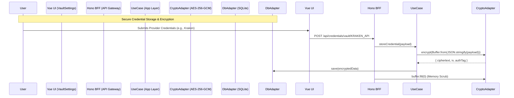

# Local Secrets Management System (Vault)

> [!IMPORTANT]
> **Privacy First Architecture**: This module ensures that highly sensitive API keys (e.g., Kraken API, OpenAI via Mastra) are never stored in plaintext and never leave the local machine.

## High-Level Overview

The Local Secrets Management System (Vault) provides a secure enclave for Kryptofolio to store and retrieve third-party credentials. Because Kryptofolio is designed to run locally via Native Desktop or isolated Docker containers (future roadmap), we cannot rely on external KMS solutions (like AWS KMS or HashiCorp Vault).

To mitigate the risk of physical file exfiltration or RAM heap dumps, this system utilizes **AES-256-GCM** authenticated encryption. The system is designed following strict **Hexagonal Architecture (Ports & Adapters)** principles to ensure decoupling of cryptographic algorithms and database engines from the core business logic.

## Architecture & Data Flow

### Hexagonal Design

The Vault module is decoupled into three distinct layers to ensure testing, purity, and maintainability:

- **Domain Layer**: Defines pure interfaces like `IVaultCredentialsPort` (for persistence) and `ICryptographyPort` (for encryption/decryption operations).
- **Application Layer**: Contains dedicated Use Cases (`UnlockVaultUseCase`, `StoreServiceCredentialUseCase`, `GetVaultStatusUseCase`, `ToggleVaultProviderUseCase`) that orchestrate the domain logic without any knowledge of HTTP frameworks or SQLite.
- **Infrastructure Layer**: Implements the technical details via adapters (`SqliteVaultAdapter`, `AesGcmCryptographyAdapter`). The database lifecycle is fully encapsulated here, removing module-level IIFEs and allowing deterministic initialization.



## Security Posture & Mitigations

1. **Authentication Tags (GCM)**: `AES-256-GCM` produces a 16-byte authentication tag. If the SQLite database is maliciously tampered with, the cipher will reject the payload upon decryption.
2. **Buffer Memory Scrubbing**: V8 (Node.js/Bun) handles strings immutably, making them susceptible to memory scraping. The cryptographic adapter strictly receives `Buffer` objects, allowing the BFF to execute `buffer.fill(0)` immediately after network transmission.
3. **Pino Log Redaction**: The logger strips `apiKey` and `authorization` payloads via `pino.redact` to ensure they never leak in standard output.

## Dynamic Vault Registry

Kryptofolio supports a dynamic vault registry that abstracts provider configuration from the Frontend. Instead of hardcoding form fields in Vue, the frontend dynamically renders inputs based on the registry definition provided by the backend.

### API Contracts

#### `GET /api/credentials/vault/providers`

Lists all available integration providers that can be configured in the vault.

- **Response** (200 OK):
  ```json
  [
    {
      "id": "KRAKEN_API",
      "name": "Kraken",
      "fields": [
        { "key": "apiKey", "label": "API Key", "type": "text" },
        { "key": "apiSecret", "label": "API Secret", "type": "password" }
      ]
    }
  ]
  ```

#### `GET /api/credentials/vault/status`

Checks if the vault is unlocked, which services are currently configured, and which are actively enabled.

- **Response** (200 OK):
  ```json
  {
    "isUnlocked": true,
    "configuredServices": ["KRAKEN_API"],
    "enabledServices": ["KRAKEN_API"]
  }
  ```

#### `POST /api/credentials/vault/:service`

Stores a new credential payload for a specific service.

- **URL Params**: `service` (e.g., `KRAKEN_API`)
- **Request Body**:
  ```json
  {
    "payload": {
      "apiKey": "sk-proj-...",
      "apiSecret": "super-secret"
    }
  }
  ```

#### `PATCH /api/credentials/vault/:service/status`

Toggles the enabled status of an existing provider without deleting its credentials.

- **URL Params**: `service` (e.g., `KRAKEN_API`)
- **Request Body**:
  ```json
  {
    "enabled": false
  }
  ```

#### `POST /api/credentials/vault/unlock`

Unlocks the vault in Docker/Web environments using a Master Password.

- **Request Body**:
  ```json
  {
    "password": "user-master-password"
  }
  ```

## Setup & Execution

### Mock Mode Testing

The infrastructure layer supports a robust `MOCK_MODE` via `process.env.MOCK_MODE=true`. When enabled, the database adapter initializes libSQL with an in-memory instance (`url: ':memory:'`). This allows developers to clone, run `pnpm dev:mock`, and safely test Use Cases without writing an actual `kryptofolio.db` artifact locally.

### Docker Pro Mode (Zero-Touch) [🛣️ Roadmap / Future]

> [!NOTE]
> **Roadmap Feature**: The following section outlines the intended deployment strategy for Docker. Currently, Dockerization is a planned feature and is not yet implemented in the repository.

If you run Kryptofolio in Docker and do not want to enter the Master Password on every container restart, you can provision the vault key via environment variables:

```yaml
# docker-compose.yml
services:
  api:
    environment:
      - KRYPTO_MASTER_KEY=your_base64_encoded_32byte_key
```

> [!WARNING]
> Only use `KRYPTO_MASTER_KEY` if your Docker host environment is fully trusted and isolated.
