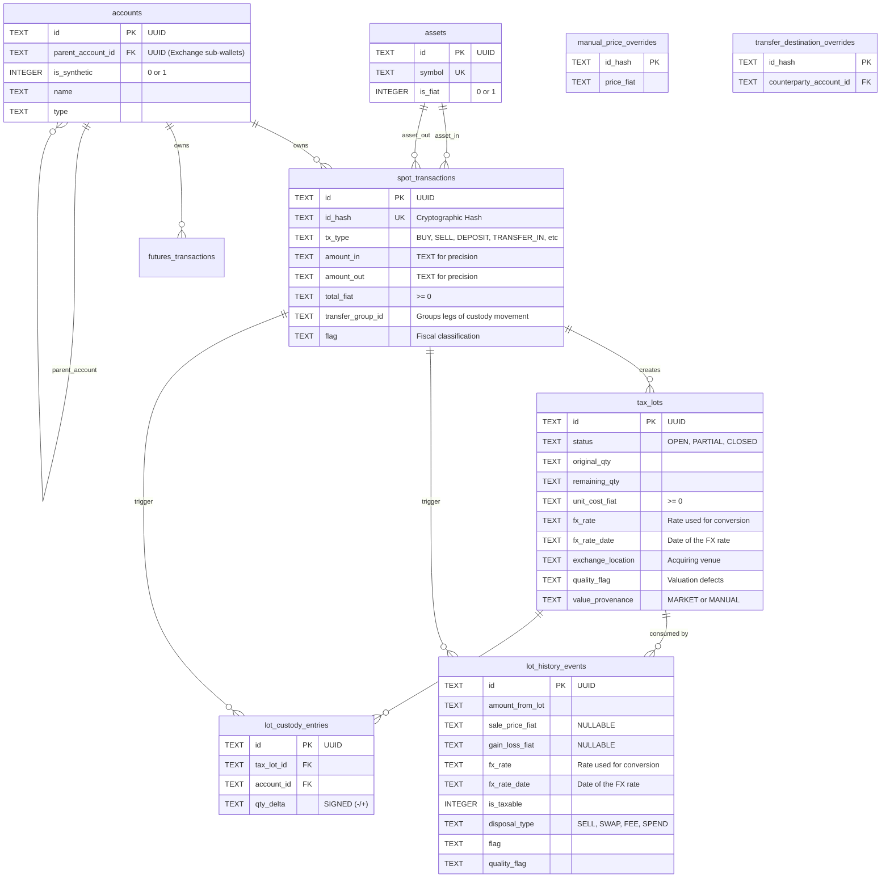

# SQLite Transactional Ledger Architecture

This document outlines the architecture, schema, and design patterns of the **Alucard Transactional Ledger**, an OLTP database implemented in SQLite (`kryptofolio_ledger.db`). It serves as the immutable source of truth for all financial transactions, maintaining precision, referential integrity, and a non-destructive audit trail.

## 1. High-Level Overview

The ledger is designed to solve common crypto accounting problems:
- **Precision Loss:** Floating point numbers (`REAL`) cause rounding errors in cryptocurrencies (e.g., BTC, ETH). All financial amounts and prices are strictly stored as `TEXT` and manipulated via `Decimal.js` in the application layer.
- **Idempotency:** Exchanges often export duplicate rows or allow overlapping CSV exports. We prevent duplication using a deterministic cryptographic hash (`id_hash`).
- **Auditability:** Financial data must never be hard-deleted. A soft-delete policy (`deleted_at`) is enforced alongside an `audit_log` that tracks all changes via native SQLite triggers.

> [!NOTE]
> For information on how time-series data (like historical daily prices) is handled outside of SQLite to prevent database bloat, see the [DuckDB & Parquet Time-Series Architecture](file:///Users/nelo/proyectos/dashboar-portfolio/docs/architecture/duckdb-parquet-time-series.md).

---

## 2. Entity Relationship Diagram

The database revolves around Accounts, Assets, and Transactions (Spot and Futures), which then feed into the analytical Tax computation tables.



---

## 3. Core Tables & Constraints

SQLite is configured with `PRAGMA journal_mode = WAL` and `synchronous = NORMAL` for high concurrency. All tables use `STRICT` mode to prevent silent type coercion.

### 3.1. Infrastructure Tables
- **`accounts`**: User portfolios, exchanges, and custom wallets. Now supports a hierarchical structure via `parent_account_id`, allowing nested locations like "Binance -> Earn" or "Ledger -> Cold".
- **`assets`**: Global dictionary of known cryptocurrencies, fiat currencies, and commodities.
- **`exchange_rates`**: Daily historical FX rates (e.g. EUR/USD) populated by the boot fetch mechanism and ECB backfill script, used for dynamic fiat value conversions.

### 3.2. Transaction Tables
- **`spot_transactions`**: The superset table for all standard crypto movements. 
  - Supports 15 distinct `tx_type` enumerations (e.g., `BUY`, `SELL`, `STAKING`, `AIRDROP`, `TRANSFER_IN`, `TRANSFER_OUT`).
  - Uses `CHECK` constraints to ensure that if an amount exists, its corresponding asset ID must also exist.
  - Ensures amounts only contain valid numeric characters via `GLOB '*[0-9]*'`.
  - `total_fiat` and `price_fiat` are strictly non-negative magnitudes.
- **`futures_transactions`**: Specialized ledger for derivatives. Tracks `realized_pnl`, `funding_amount`, and `settlement_asset_id`.

### 3.3. Tax and Analytical Tables
Generated post-ingestion by the analytical engine (FIFO/LIFO algorithms):
- **`tax_lots`**: Represents acquired assets acting as the cost basis for future sales. It retains the original `exchange_location` for provenance. If `unit_cost_fiat` was derived via FX conversion, `fx_rate` and `fx_rate_date` are persisted for strict reproducibility.
- **`lot_history_events`**: Represents the consumption (disposal) of a lot, calculating the specific Capital Gain or Loss. It separates fiscal classifications (`flag`) from valuation defects (`quality_flag`, including `MISSING_FX_RATE`), and allows `sale_price_fiat` to be NULL when unresolved.
- **`lot_custody_entries`**: A double-entry custody ledger. Records movements without altering cost-basis or timestamps, enabling true traceability via `qty_delta` (intentionally signed).

### 3.4. User-Authored Override Tables
User adjustments are segregated from derived tables so recalculation never destroys them:
- **`manual_price_overrides`**: Allows users to manually declare the fiat price for a given transaction hash.
- **`transfer_destination_overrides`**: Allows users to declare the counterparty account for outbound transfers that couldn't be auto-reconciled.

---

## 4. The Audit Log & Triggers

To maintain strict financial compliance, no update or delete operation destroys data silently.

1. **Soft Deletes:** Every table has a `deleted_at` timestamp. Deleting a transaction via the UI simply populates this field.
2. **`audit_log` Table:** Stores the exact before-and-after state of modified rows as JSON payloads.
3. **Automated Triggers:** We use SQLite `AFTER UPDATE` triggers to automatically generate these audit trails without requiring application-level logic.

Example trigger for `spot_transactions`:
```sql
CREATE TRIGGER IF NOT EXISTS trg_spot_tx_audit AFTER UPDATE ON spot_transactions BEGIN
    INSERT INTO audit_log (id, table_name, record_id, action, old_values, new_values)
    VALUES (
        lower(hex(randomblob(16))),
        'spot_transactions', NEW.id, 'UPDATE',
        json_object('tx_type', OLD.tx_type, 'status', OLD.status, 'deleted_at', OLD.deleted_at),
        json_object('tx_type', NEW.tx_type, 'status', NEW.status, 'deleted_at', NEW.deleted_at)
    );
END;
```

---

## 5. Exposing Data: Analytical Views

Since the application uses **DuckDB** for heavy OLAP analytics, we expose the SQLite data securely using Views. 

These `v_active_*` views automatically filter out soft-deleted records and alias columns for ergonomic querying, acting as the boundary layer between the OLTP and OLAP systems.

```sql
CREATE VIEW IF NOT EXISTS v_active_spot_transactions AS 
    SELECT * FROM spot_transactions WHERE deleted_at IS NULL;

CREATE VIEW IF NOT EXISTS v_active_tax_lots AS
    SELECT *, acquisition_timestamp AS date FROM tax_lots WHERE deleted_at IS NULL;

CREATE VIEW IF NOT EXISTS v_active_lot_history_events AS
    SELECT * FROM lot_history_events WHERE deleted_at IS NULL;

CREATE VIEW IF NOT EXISTS v_active_lot_custody_entries AS
    SELECT * FROM lot_custody_entries WHERE deleted_at IS NULL;
```

These raw views are the foundation for the advanced analytical pipeline executed within **DuckDB**:

### 5.1. Vectorized Spot FIFO Engine
DuckDB takes the raw transactions and passes them through a sophisticated flattening process:
- **`v_flattened_fifo_events`**: Splits single Swap transactions into completely independent Acquisition and Disposal legs, converting fees into independent crypto disposals. It strictly ignores transfers between own wallets (`TRANSFER_IN`, `TRANSFER_OUT`) as taxable events, except for their gas fees.
- **Window Functions**: We rely on DuckDB's native window functions (`SUM() OVER (PARTITION BY asset_id ORDER BY timestamp)`) to align and consume lots chronologically without explicit `while` loops, boosting throughput immensely compared to Node.js loops.

### 5.2. Real-Time PnL & ASOF Joins
DuckDB evaluates the real-time unrealized PnL via `DuckDbPortfolioAnalyticsAdapter`. Using the real-time price feeds injected via the Appender API (`bulkInsert`), DuckDB executes `ASOF` (As-Of) style temporal and conditional joins, calculating the exact current fiat valuation of the entire portfolio with sub-millisecond latency.

### 5.3. Spanish Tax (IRPF) Categorization
The tax pipeline aggregates all realized gains into strictly defined tax bases:
- **`savings_base_yields` (Base del Ahorro):** Standard capital gains from trades, sales, staking, and futures/derivatives realized PnL.
- **`general_base_airdrops` (Base General):** Earned income via airdrops or promotional tokens.

### 5.4. FX Resolution: `v_fx_daily`

Every dated rate lookup in the analytical layer goes through one view, so the resolution rule has a
single definition rather than a copy per consumer.

```sql
CREATE OR REPLACE VIEW v_fx_daily AS
SELECT rate_date, pair, rate, is_reciprocal
FROM (
    SELECT CAST(date AS DATE) AS rate_date, pair, rate, is_reciprocal,
           ROW_NUMBER() OVER (PARTITION BY rate_date, pair ORDER BY is_reciprocal) AS preference
    FROM (
        -- Direct pairs, as the ECB publishes them
        SELECT date, pair, CAST(rate AS DECIMAL(18,12)) AS rate, 0 AS is_reciprocal
        FROM ledger.exchange_rates
        UNION ALL
        -- Synthesised inversions, second-class by construction
        SELECT date, SPLIT_PART(pair, '/', 2) || '/' || SPLIT_PART(pair, '/', 1),
               CAST(1.0 / CAST(rate AS DOUBLE) AS DECIMAL(18,12)), 1
        FROM ledger.exchange_rates
        WHERE TRY_CAST(rate AS DECIMAL(38,18)) IS NOT NULL
          AND TRY_CAST(rate AS DECIMAL(38,18)) <> 0
    )
)
WHERE preference = 1;
```

Three properties are load-bearing:

| Property | Why it is that way |
|---|---|
| **Direct rates win over reciprocals** | `exchange_rates` is ECB-quoted and holds `USD/EUR`, not `EUR/USD`. The inversion is computed in `DOUBLE` and bounded at twelve decimals, so it is recorded with `is_reciprocal = 1` and ranked below any direct quote for the same date and pair. A direct rate is never derived, only read. |
| **Resolution is backward-looking** | Consumers join with `ASOF LEFT JOIN … AND fx.rate_date <= <the figure's own date>`. A Sunday resolves the preceding Friday; a rate published *after* the target date is never returned. |
| **One view, not a CTE per query** | It began as two CTEs inside `v_flattened_fifo_events`. The display conversion needs the same resolution, and a second hand-written copy is precisely how the two would drift apart. |

> [!NOTE]
> Reading `v_fx_daily` through the SQLite extension is not free. Adapters that join it more than once
> per statement pin it into a `MATERIALIZED` CTE first — four ASOF joins over a bare view reference
> re-scan the underlying table four times.

### 5.5. Display Currency Is a Bound Parameter, Never Engine State

DuckDB once carried its own `user_settings` table, seeded with `'USD'`, which
`v_portfolio_daily_valuation` read to decide its output currency. It has been **removed**, and
nothing in the analytical layer resolves a target currency from stored state.

The reason is that DuckDB here is a derived cache: it is rebuilt from SQLite on demand and holds
nothing SQLite does not already have. A settings row living only in DuckDB is therefore a second
source of truth that survives no rebuild and can silently disagree with the SQLite `user_settings`
the rest of the system reads.

So the target currency reaches every query as a **bound parameter**, supplied per call by the use
case:

```
                       SQLite user_settings.base_currency
                                    │
                                    ▼
                            use case resolves it
                                    │
                                    ▼  bound as $1 / $2
      adapter query ──ASOF JOIN──▶ v_fx_daily ──▶ figure in the display currency
```

`v_portfolio_daily_valuation` now aggregates in canonical **EUR** with no settings lookup at all,
because it sums assets whose price series are denominated differently and must reduce them to one
unit before summing; EUR is the only currency reachable from any other by a *published* ECB rate
rather than an inverted one. The outer query converts EUR into the display currency **per date**, so
a chart is never a single rate applied to all of history.

> [!WARNING]
> Never reintroduce a currency setting into the DuckDB schema. Two consequences follow immediately:
> the value is lost on the next rebuild, and any view reading it becomes untestable against a
> requested currency — which is how the same ledger came to return identical figures under two
> different currency labels.

---

## 6. Performance Indices

To ensure high-performance querying, especially during tax reconstruction (which requires strict chronological sorting), composite indices are applied to the most critical query paths:

- `idx_spot_transactions_asset_time`: `(asset_in_id, timestamp)`
- `idx_spot_transactions_account_time`: `(account_id, timestamp)`
- `idx_tax_lots_asset_status`: `(asset_id, status)`
- `idx_lot_history_events_lot`: `(tax_lot_id)`

These indices guarantee that analytical scans across millions of rows can rapidly filter by exchange or sort by date without full table scans.
