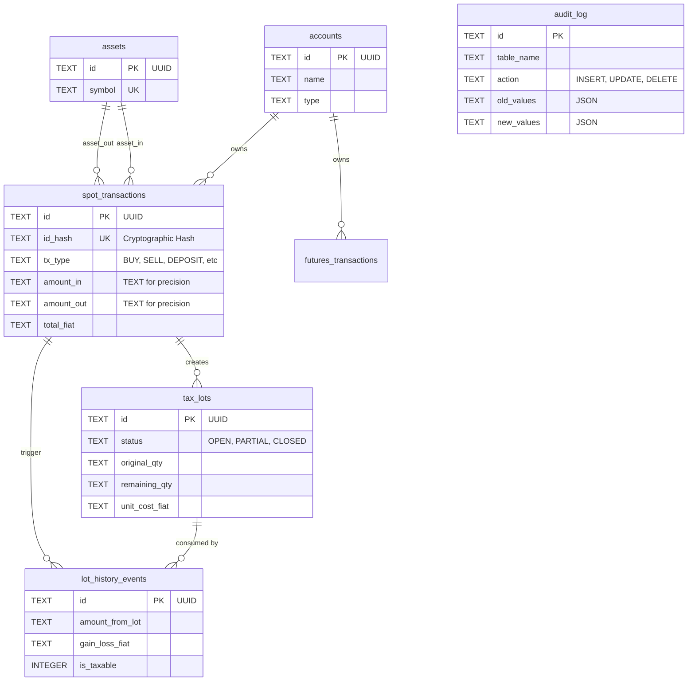

# SQLite Transactional Ledger Architecture

This document outlines the architecture, schema, and design patterns of the **Alucard Transactional Ledger**, an OLTP database implemented in SQLite (`kryptofolio_ledger.db`). It serves as the immutable source of truth for all financial transactions, maintaining precision, referential integrity, and a non-destructive audit trail.

## 1. High-Level Overview

The ledger is designed to solve common crypto accounting problems:
- **Precision Loss:** Floating point numbers (`REAL`) cause rounding errors in cryptocurrencies (e.g., BTC, ETH). All financial amounts and prices are strictly stored as `TEXT` and manipulated via `Decimal.js` in the application layer.
- **Idempotency:** Exchanges often export duplicate rows or allow overlapping CSV exports. We prevent duplication using a deterministic cryptographic hash (`id_hash`).
- **Auditability:** Financial data must never be hard-deleted. A soft-delete policy (`deleted_at`) is enforced alongside an `audit_log` that tracks all changes via native SQLite triggers.

---

## 2. Entity Relationship Diagram

The database revolves around Accounts, Assets, and Transactions (Spot and Futures), which then feed into the analytical Tax computation tables.



---

## 3. Core Tables & Constraints

SQLite is configured with `PRAGMA journal_mode = WAL` and `synchronous = NORMAL` for high concurrency. All tables use `STRICT` mode to prevent silent type coercion.

### 3.1. Infrastructure Tables
- **`accounts`**: Identifies the exchange, wallet, or custom portfolio (e.g., Binance, Ledger). Primary key is a UUID.
- **`assets`**: Dictionary of all traded tokens and fiat currencies (e.g., `BTC`, `EUR`, `USDT`).

### 3.2. Transaction Tables
- **`spot_transactions`**: The superset table for all standard crypto movements. 
  - Supports 14 distinct `tx_type` enumerations (e.g., `BUY`, `SELL`, `STAKING`, `AIRDROP`).
  - Uses `CHECK` constraints to ensure that if an amount exists, its corresponding asset ID must also exist (e.g., `CHECK ((amount_in IS NULL) = (asset_in_id IS NULL))`).
  - Ensures amounts only contain valid numeric characters via `GLOB '*[0-9]*' AND NOT GLOB '*[^-0-9.]*'`.
- **`futures_transactions`**: Specialized ledger for derivatives. Tracks `realized_pnl`, `funding_amount`, and `settlement_asset_id`.

### 3.3. Tax and Analytical Tables
Generated post-ingestion by the analytical engine (FIFO/LIFO algorithms):
- **`tax_lots`**: Represents acquired assets acting as the cost basis for future sales.
- **`lot_history_events`**: Represents the consumption (disposal) of a lot, calculating the specific Capital Gain or Loss.

---

## 4. The Audit Log & Triggers

To maintain strict financial compliance, no update or delete operation destroys data silently.

1. **Soft Deletes:** Every table has a `deleted_at` timestamp. Deleting a transaction via the UI simply populates this field.
2. **`audit_log` Table:** Stores the exact before-and-after state of modified rows as JSON payloads.
3. **Automated Triggers:** We use SQLite `AFTER UPDATE` triggers to automatically generate these audit trails without requiring application-level logic.

Example trigger for `spot_transactions`:
```sql
CREATE TRIGGER IF NOT EXISTS trg_spot_tx_audit AFTER UPDATE ON spot_transactions BEGIN
    INSERT INTO audit_log (id, table_name, record_id, action, old_values, new_values)
    VALUES (
        lower(hex(randomblob(16))),
        'spot_transactions', NEW.id, 'UPDATE',
        json_object('tx_type', OLD.tx_type, 'status', OLD.status, 'deleted_at', OLD.deleted_at),
        json_object('tx_type', NEW.tx_type, 'status', NEW.status, 'deleted_at', NEW.deleted_at)
    );
END;
```

---

## 5. Exposing Data: Analytical Views

Since the application uses **DuckDB** for heavy OLAP analytics, we expose the SQLite data securely using Views. 

These `v_active_*` views automatically filter out soft-deleted records and alias columns for ergonomic querying, acting as the boundary layer between the OLTP and OLAP systems.

```sql
CREATE VIEW IF NOT EXISTS v_active_spot_transactions AS 
    SELECT * FROM spot_transactions WHERE deleted_at IS NULL;

CREATE VIEW IF NOT EXISTS v_active_tax_lots AS
    SELECT *, acquisition_timestamp AS date FROM tax_lots WHERE deleted_at IS NULL;
```

These raw views are the foundation for the advanced analytical pipeline executed within **DuckDB**:

### 5.1. Vectorized Spot FIFO Engine
DuckDB takes the raw transactions and passes them through a sophisticated flattening process:
- **`v_flattened_fifo_events`**: Splits single Swap transactions into completely independent Acquisition and Disposal legs, converting fees into independent crypto disposals. It strictly ignores transfers between own wallets (`TRANSFER_IN`, `TRANSFER_OUT`) as taxable events, except for their gas fees.
- **Window Functions**: We rely on DuckDB's native window functions (`SUM() OVER (PARTITION BY asset_id ORDER BY timestamp)`) to align and consume lots chronologically without explicit `while` loops, boosting throughput immensely compared to Node.js loops.

### 5.2. Real-Time PnL & ASOF Joins
DuckDB evaluates the real-time unrealized PnL via `DuckDbPortfolioAnalyticsAdapter`. Using the real-time price feeds injected via the Appender API (`bulkInsert`), DuckDB executes `ASOF` (As-Of) style temporal and conditional joins, calculating the exact current fiat valuation of the entire portfolio with sub-millisecond latency.

### 5.3. Spanish Tax (IRPF) Categorization
The tax pipeline aggregates all realized gains into strictly defined tax bases:
- **`savings_base_yields` (Base del Ahorro):** Standard capital gains from trades, sales, staking, and futures/derivatives realized PnL.
- **`general_base_airdrops` (Base General):** Earned income via airdrops or promotional tokens.

---

## 6. Performance Indices

To ensure high-performance querying, especially during tax reconstruction (which requires strict chronological sorting), composite indices are applied to the most critical query paths:

- `idx_spot_transactions_asset_time`: `(asset_in_id, timestamp)`
- `idx_spot_transactions_account_time`: `(account_id, timestamp)`
- `idx_tax_lots_asset_status`: `(asset_id, status)`
- `idx_lot_history_events_lot`: `(tax_lot_id)`

These indices guarantee that analytical scans across millions of rows can rapidly filter by exchange or sort by date without full table scans.
