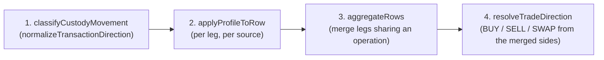
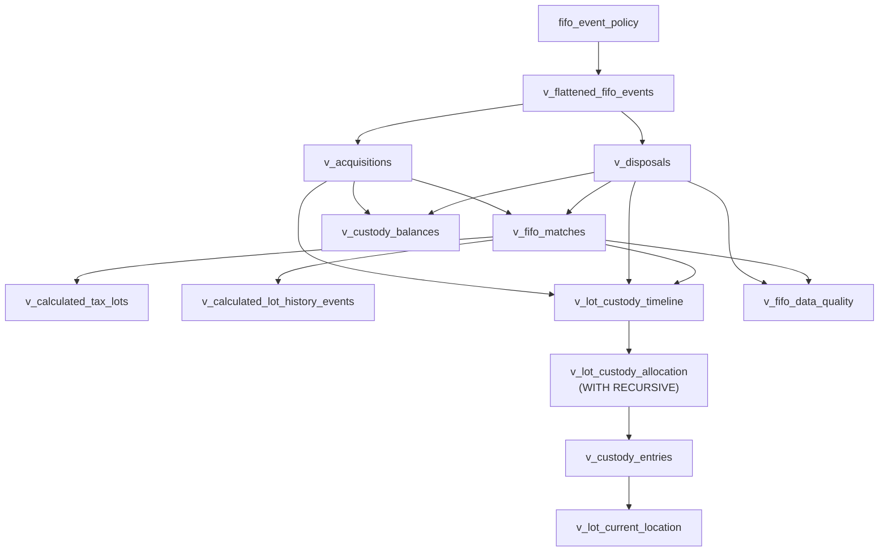

# FIFO Tax Engine, Custody Ledger & Source Format Profiles

> Where a lot's fiscal identity ends and where its custody begins, why the two are computed by
> different queries, and how a source's own CSV conventions are stated as data instead of guessed
> by a parser.

## Table of Contents

- [Why this document exists](#why-this-document-exists)
- [Two orderings, deliberately never merged](#two-orderings-deliberately-never-merged)
- [The ingestion pipeline](#the-ingestion-pipeline)
- [Source format profiles](#source-format-profiles)
- [The unified fee model](#the-unified-fee-model)
- [The custody double-entry ledger](#the-custody-double-entry-ledger)
- [DuckDB read-side views](#duckdb-read-side-views)
- [The two-stage currency chain](#the-two-stage-currency-chain)
- [Data-quality flags vs. fiscal classification](#data-quality-flags-vs-fiscal-classification)
- [Frontend: rendering a `null` gain honestly](#frontend-rendering-a-null-gain-honestly)
- [Invariants worth remembering](#invariants-worth-remembering)

## Why this document exists

For most of this project's life, the FIFO engine could not tell a sale from a wallet transfer. A
`WITHDRAWAL` from Kraken to a personal wallet closed a real tax lot exactly as a `SELL` would; the
`DEPOSIT` on the other end opened a brand-new lot with no history and no cost basis. Measured on
the development ledger, that produced **73 phantom disposal events from zero actual `SELL`
transactions**, fabricated **64 zero-cost-basis lots out of 96**, and — because fiat magnitudes
were sign-inconsistent at ingestion — turned some of those phantom disposals into *positive*
reported gains instead of losses.

Fixing this required more than a filter tweak. The transaction-type list that was supposed to
exclude transfers from taxation existed in three places, one of which had no filter at all, so the
same defect kept re-entering through the branch nobody was looking at. Fixing it properly meant
building a place for "where is this asset right now" to live that is structurally incapable of
influencing "which lot does a sale consume" — because those are different questions with different
legally-mandated answers, and the previous code answered both with the same events.

> [!NOTE]
> The FIFO matching algorithm itself — a cumulative-interval-overlap join in `v_fifo_matches` — was
> already correct and is unchanged. Everything described here sits around it: what counts as an
> event in the first place, and what happens to an asset that never generates one.

## Two orderings, deliberately never merged

Spanish IRPF requires **global, per-asset FIFO**: when you sell, you consume your oldest lot of
that asset regardless of which account acquired it or which account you're selling from. Custody —
which account physically holds a lot's quantity right now — is a completely separate question, and
answering it with a different ordering would be legally wrong, because it would let a non-taxable
transfer reorder which lot a future sale consumes.

```
  TAXATION FIFO                        CUSTODY ALLOCATION FIFO
  ─────────────────────────────        ────────────────────────────────
  scope:   global per asset            scope:   per (account, asset)
  orders:  acquisition_timestamp       orders:  acquisition_timestamp
  drives:  which lot a SALE consumes   drives:  which lot's quantity MOVES
  effect:  fiscal — gain/loss          effect:  none — attribution only
  view:    v_fifo_matches (unchanged)  view:    v_lot_custody_allocation
```

A prior design considered pairing outbound and inbound transfer legs by a time window plus an
amount tolerance (the model [Wealthfolio](https://github.com/wealthfolio/wealthfolio) and
[Ghostfolio](https://github.com/ghostfolio/ghostfolio) both use, in different forms). It was
rejected: self-custody spanning years exceeds any window, fees break amount equality, and two
same-asset transfers in succession can cross-match. The chosen model instead needs no pairing at
all — see [The custody double-entry ledger](#the-custody-double-entry-ledger).

> [!WARNING]
> A lot is **never split into new rows** when it moves between accounts. One acquisition remains
> one row with its original `acquisition_timestamp` and `unit_cost_fiat` forever; only its
> *custody* — which account currently holds how much of it — changes. Splitting the row would
> create a new position in the global FIFO queue, silently reordering which lot a later sale
> consumes as a side effect of a non-taxable transfer.

## The ingestion pipeline

Every row — CSV or wizard-submitted — passes through one pure function,
[`prepareIngestionRows`](../packages/core-domain/src/domain/services/normalizer/ingestionPipeline.ts),
in a specific order that its own doc comment justifies precisely:



1. **Classify direction first.** `classifyCustodyMovement` reads the sign of the amount and the
   asset moved to decide a row's fiscal meaning, before aggregation destroys that sign by
   redistributing it into `amount_in`/`amount_out`. Run the other way round — as the code
   originally did — the classifier receives a record with no sign left to read, answers
   `UNCLASSIFIED` for exactly the case it exists to resolve, and the raw label survives to be
   mapped by whatever runs last.
2. **Apply the source profile next, per leg**, while each leg's own asset is still in scope — see
   [Source format profiles](#source-format-profiles). What an omitted fee currency means, and
   whether a row writes one movement onto both directional columns, are facts about *the source*,
   not the row.
3. **Aggregate rows that share one operation** into merged records, now that each leg's direction
   and fee denomination are already resolved.
4. **Resolve a `trade` row's real direction last**, from the merged record — see
   [`tradeDirection.ts`](../packages/core-domain/src/domain/services/normalizer/tradeDirection.ts).
   `trade` is the same label Kraken writes on both legs of both a purchase and a sale; the
   direction only exists once both sides of the record are present. `resolveTradeDirection` reads
   which side is fiat and which is the asset (`paidInMoney` → `BUY`, `receivedMoney` → `SELL`,
   neither → `SWAP`) and rejects a record it cannot resolve rather than defaulting it — which is
   what previously recorded every sale in the corpus as a purchase.

> [!NOTE]
> `prepareIngestionRows` is pure and runs on the backend, not just the wizard's browser preview.
> Re-ingesting a file is therefore deterministic regardless of which frontend version originally
> submitted it, and the ledger receives both legs of a movement instead of one client-merged
> record.

Timezone conversion also happens exactly once, inside this boundary, via
[`dateNormalizer.ts`](../packages/core-domain/src/domain/services/normalizer/dateNormalizer.ts)'s
`normalizeToUtcIso(dateStr, timeStr, timezone)`, using the timezone declared on the ingestion
request. Previously the frontend converted a row's local time to UTC correctly, and the backend
then re-interpreted the already-UTC string by asserting it was already UTC a second time —
silently shifting every timestamp by the user's UTC offset.

## Source format profiles

A header-name column mapper can say that a CSV column named `Comisión de la operación` holds
`fee_amount`. It structurally cannot say that the number in that column is a *euro valuation* of a
fee actually paid in HBAR, or that the quantity that really moved is the origin column minus the
destination column — those are facts about how one specific exchange writes its exports, not about
what a column is called. `packages/core-domain/src/domain/services/sourceProfile/` is the seam
where each source states those facts once, as data, so nothing downstream has to special-case a
source by name.

```ts
// packages/core-domain/src/domain/services/sourceProfile/types.ts
export interface SourceFormatProfile {
  readonly id: SourceProfileId;
  readonly label: string;
  readonly market: DeclaredMarket;          // SPOT | FUTURES | UNDECLARED
  readonly signature: HeaderSignature;      // how the file is recognised, before mapping
  readonly feeDenomination: FeeDenomination;
  readonly feeConvention: FeeConvention;
  readonly directionalFill: DirectionalFill; // ONE_SIDED | BOTH_SIDES_WRITTEN
  readonly columnRoles: ColumnRoles;         // real refs vs. category labels
  readonly invariant: ProfileInvariant;      // an optional self-check
}
```

Six profiles are declared in
[`profiles.ts`](../packages/core-domain/src/domain/services/sourceProfile/profiles.ts):
`kraken-spot`, `kraken-futures`, `bit2me-spot`, `bitvavo-spot`, `bitunix-spot`, `tangem`, and a
`generic` fallback reached only by the *absence* of a signature match, never by matching it.

**Detection** ([`detectSourceProfile.ts`](../packages/core-domain/src/domain/services/sourceProfile/detectSourceProfile.ts))
runs on the raw header row, before any column mapping exists, using required-plus-forbidden
signature matching. It reports ambiguity rather than silently resolving it by declaration order —
an earlier draft picked the first array match, which meant adding a new profile could silently
steal another source's files depending on where it was inserted in the list. The detected profile
is always confirmable by the user in the wizard and is a **required field** on the ingestion
contract, never an optional one with a default, so the wizard's preview and the persisted ledger
cannot disagree about which profile was used.

**Appliers** ([`appliers.ts`](../packages/core-domain/src/domain/services/sourceProfile/appliers.ts))
are the pure functions of `(profile, row)` that both the wizard's browser-side preview and the
backend's persistence call — the *same* implementation, so a quantity can never be computed one way
in the preview and another way in the stored ledger. Key entry points:

- `resolveFeeDenomination(profile, row)` → `ABSENT | ZERO | ASSET_QUANTITY | FIAT_VALUATION | PENDING_REVIEW`
- `resolveGrossNetFee(profile, row)` → derives whichever of gross/net/fee the source didn't supply
- `routeFee(denomination, convention)` → decides whether a fee is an asset disposal or a fiat basis adjustment
- `reduceDirectionalSides(profile, row)` → collapses a row that writes one movement onto both directional columns (all 42 real Bit2Me `Deposit` rows do this) down to the single side that actually moved
- `checkProfileInvariant(profile, rows)` → verifies whatever redundancy the source's own data can fail, e.g. a running balance or an over-determined `quantity × price + fee = paid` row

> [!WARNING]
> `isMergeKey(profile, column)` is **default-deny**: a column is only a valid merge key for
> aggregating multi-leg rows if the profile explicitly lists it under `columnRoles.references`.
> Bit2Me's `Grupo` column looked like an operation-linking key by name; it actually holds a wallet
> compartment label with five possible values across a multi-year history, and merging rows on it
> collapsed 706 real rows down to 5.

## The unified fee model

Every source expresses `gross = net + fee`, but each supplies a different two of the three
figures, and states the fee's unit differently:

| `FeeConvention` | Meaning | Example source |
|---|---|---|
| `NET_PLUS_FEE` | Reported amount is net; fee charged on top | Kraken |
| `GROSS_AND_NET` | Both magnitudes written; fee is their difference | Bit2Me |
| `FEE_INSIDE_TOTAL` | Reported total already contains the fee | Bitvavo |
| `UNDETERMINED` | Unmeasured source; only a non-zero fee needs review | `generic` fallback |

The fee's **denomination** is resolved independently, per row, into one of:

- `ASSET_QUANTITY` — a quantity of an asset, so it's a disposal that reduces a lot's holdings
- `FIAT_VALUATION` — a fiat figure that adjusts basis and must leave every quantity untouched
- `ZERO` — an explicit zero, needing no convention (`gross = net + 0` holds under either)
- `ABSENT` — an empty cell; the source stated nothing, which is not the same as stating none was charged
- `PENDING_REVIEW` — the denomination and convention disagree, or the source cannot be resolved

> [!NOTE]
> `FIAT_VALUATION` is a **resolution outcome**, never something a profile declares directly. It is
> decided per row, at `routeFee`, from whether the fee's stated currency matches the unit the row
> itself moves. The reason: Bit2Me prices an HBAR withdrawal's fee in euros on one row and charges a
> euro fee on a euro-funded trade on another — the same `NAMED_COLUMN` denomination resolves
> differently depending on what else is on the row, so hard-coding the outcome into the profile
> table would be wrong for one of the two cases every time.

The whole resolution runs on `decimal.js`, never `number`: a fee derived as `2.236429 − 1.536429`
is `0.7000000000000002` in IEEE-754 float64, and that residual would itself be recorded as a
disposal.

## The custody double-entry ledger

Custody tracks *where an asset physically sits* — which account, at what quantity — completely
separately from taxation. Every crypto `WITHDRAWAL` / `TRANSFER_OUT` / `DEPOSIT` / `TRANSFER_IN` is
recorded as balanced debit/credit entries per asset. When the counterparty account is unknown (the
common case — most exports name only one side of a transfer), it resolves to a synthetic per-asset
account `ownwallet-<ASSET>`, which acts as both sink and source:

```
  CUSTODY LEDGER — per asset, double entry, zero heuristics
  ═══════════════════════════════════════════════════════════════════

  WITHDRAWAL 179.11 XRP from Kraken:spot     (destination unknown)
        Kraken:spot        −179.11
        ownwallet-XRP      +179.11    ◀── default sink
        Kraken:spot        −  0.20    ◀── network fee: disposed, leaves custody

  DEPOSIT 178.91 XRP into Ledger             (source unknown)
        ownwallet-XRP      −178.91    ◀── default source
        Ledger             +178.91
  ───────────────────────────────────────────────────────────────────
  ownwallet-XRP residual:  +0.20      ◀── the measurable fee margin
```

There is **no time window and no amount-matching heuristic anywhere in this model.** Pairing is
replaced by balances, which makes the result order-independent, idempotent across rebuilds, and
immune to fee drift. The residual left in `ownwallet-<ASSET>` after netting every movement *is*
the measurable fee margin, and its sign is diagnostic:

| Residual sign | Meaning | Flag |
|---|---|---|
| Positive | Crypto left known accounts and hasn't reappeared — genuinely self-custodied, or an unrecorded fee | `CUSTODY_RESIDUAL` (low severity, only past fee-scale tolerance) |
| Negative | More crypto arrived than ever left: something entered from an unrecorded source — a holding with **no cost basis** | `UNTRACKED_INFLOW` (high severity) |

`UNTRACKED_INFLOW` is the fiscally dangerous case a time/amount-pairing model cannot express at
all: pairing either finds a match or gives up, it has no vocabulary for "a balance appeared from
nowhere."

**Account hierarchy.** `accounts.parent_account_id` gives exchange sub-wallets first-class identity
(`Kraken:spot`, `Kraken:earn`, `Kraken:futures`), so a blocked-in-staking balance is distinguishable
from a free one. `accounts.is_synthetic` marks `ownwallet-<ASSET>` rows: they participate fully in
custody arithmetic but are excluded from user-facing account selectors and account-count metrics.

**Manual overrides** (`manual_price_overrides`, `transfer_destination_overrides`) are calculation
*inputs*, never edited outputs. The user can assign a fiat value to a transaction whose price could
not be resolved, or correct a movement's inferred counterparty away from `ownwallet-<ASSET>` to a
real account they forgot to declare. Both tables feed into the same DuckDB recompute and are never
written or deleted by reconciliation — a rebuild can freely delete and rebuild every derived row
without touching what the user declared.

## DuckDB read-side views

All of this is computed in `packages/database/src/adapters/DuckDbAdapter.ts`, attached in-memory to
the SQLite ledger, never in application-layer JavaScript loops.



- **`fifo_event_policy`** — a DuckDB table seeded once at bootstrap from the compile-time-exhaustive
  `FIFO_EVENT_POLICY: Record<SpotTxType, FifoEventPolicy>` in `@kryptofolio/shared-types`. Each
  `tx_type` declares four independent booleans — `generatesAcquisition`, `generatesDisposal`,
  `generatesFeeDisposal`, `taxableDisposal` — replacing three hand-written `NOT IN (...)` predicate
  lists that had drifted out of sync (one had no filter at all). `DEPOSIT`, `WITHDRAWAL`,
  `TRANSFER_IN`, `TRANSFER_OUT` and `MIGRATION_SWAP` all generate **no** principal acquisition and
  **no** principal disposal — but still generate a fee disposal, because a crypto network fee paid
  while transferring is still a real disposal of that crypto.
- **`v_flattened_fifo_events`** — joins every completed transaction against the policy table and
  emits `ACQUISITION` / `DISPOSAL` rows per branch. Historical prices are resolved via `ASOF LEFT JOIN` against `ledger.exchange_rates` to convert prices into the reporting currency (falling back to a reciprocal rate if a direct pair is absent). Emits `NULL` whenever a price can't be resolved or converted, plus a `value_provenance` (`MANUAL`, `MARKET`, or `MARKET_CONVERTED`) and a `currency_mismatch` boolean per row. If `MARKET_CONVERTED`, the FX rate and its date are persisted for strict auditability.
- **`v_acquisitions` / `v_disposals`** — global per-asset FIFO ordering via window functions
  (`SUM(amount) OVER (PARTITION BY asset_id ORDER BY timestamp, tx_id)`), producing the cumulative
  quantity intervals the matcher joins against.
- **`v_fifo_matches`** — the actual FIFO matcher: a cumulative-interval-overlap join between
  acquisitions and disposals. Unchanged by this work; it was already correct.
- **`v_calculated_lot_history_events`** — drives the frontend's lot history view. `flag` is read
  verbatim from the source transaction (e.g. `WALLET_ACTIVATION` for a Tangem wallet-activation
  receipt) rather than recomputed, so the existing AEAT fiscal-classification audit trail survives
  untouched. `is_taxable` is `1` only when `quality_flag IS NULL AND taxable_disposal`.
- **`v_lot_custody_allocation`** — the one genuinely sequential piece: allocates a movement's
  quantity oldest-first *per account*, drawing from what prior movements left in that account. This
  cannot use the cumulative-interval trick `v_fifo_matches` uses, because each step's allocation
  depends on every prior step for that account. It's implemented as `WITH RECURSIVE ... USING KEY`,
  which overwrites intermediate state in place rather than accumulating a snapshot per step. This
  view has **zero fiscal effect** — it decides which lot's quantity physically moved, never which
  lot a sale consumes.
- **`v_custody_entries` / `v_lot_current_location` / `v_custody_balances`** — one debit and one
  credit per allocated slice (so a movement nets to zero for its asset by construction), the
  current physical location of each lot's quantity, and per-`ownwallet-<ASSET>` residual balances.
- **`v_fifo_data_quality`** — surfaces `MISSING_PRICE`, `CURRENCY_MISMATCH`, `CUSTODY_RESIDUAL`,
  `UNTRACKED_INFLOW` and related flags for the pending-review UI, without ever blocking a rebuild.

> [!WARNING]
> Financial values move through these views as `DOUBLE` during derivation but are always emitted
> back out as `PRINTF('%.12f', ...)`-formatted strings cast to `DECIMAL(38,18)`. SQLite stores every
> financial column as `TEXT` behind a `GLOB` `CHECK` that admits no exponent form — a raw DuckDB
> `DOUBLE` written back unformatted can silently emit scientific notation that violates the
> constraint on write-back.

## The two-stage currency chain

A figure a user reads has crossed **two** conversions, and they are specified separately because they
answer different questions and fail for different reasons.

```
  price series          transaction's own            what the user asked
  (e.g. USD)            fiat_currency (e.g. EUR)     to see (e.g. USD)
      │                          │                          │
      │  stage 1                 │  stage 2                 │
      └──[rate @ tx date]───────▶└──[rate @ figure's date]─▶│
         materialisation-time        read-time
         PERSISTED                   NEVER PERSISTED
```

| | Stage 1 — market price into transaction currency | Stage 2 — transaction currency into display currency |
|---|---|---|
| When | At materialisation, while building a lot's cost basis | At read time, per query |
| Where | `v_flattened_fifo_events` | The read adapters, joining `v_fx_daily` |
| Persisted | Yes — `fx_rate` / `fx_rate_date` on the row | **No.** The display currency is unknown when the row is written |
| Failure means | The engine could not build this basis → `MISSING_FX_RATE`, a `quality_flag` | The lot is sound and the *view* cannot express it → an `UNCONVERTIBLE` conversion outcome |
| Reversible | No. It is part of the recorded lot | Yes, at any moment, by asking for another currency |

The two compose; neither replaces the other. Stage 1 is unchanged by the display-currency work.

### Each figure converts at its own date

Stage 2 never applies one rate to a whole result set. The rate date follows from what kind of figure
it is:

| Figure | Rate dated to |
|---|---|
| A lot's cost basis | its **acquisition** date |
| A realized gain, and any per-event disposal figure | its **disposal** date |
| Present value: equity, current value | the **latest** rate in the ledger |
| A point of a daily series | that **point's own** date |
| Unrealized PnL | *not converted at all* — derived by subtracting the two already-converted terms |

The rule itself is a pure function (`resolveRateBasis`) in `packages/core-domain`, outside the query
layer, so "a realized gain converts at its disposal date" is assertable without a database. The
adapters *apply* a basis; they do not choose one.

> [!WARNING]
> Conversion happens **per row, before any aggregation**. Two lots of the same asset can differ in
> both native currency and acquisition date, so converting the aggregate applies a single rate to
> figures that each earn their own. That is the defect this chain exists to remove, and summing first
> reinstates it.

### The identity case is not a conversion

When a figure is already in the requested currency, no rate is read at all: the identity is cut in
the `JOIN` predicate rather than by a `CASE` over its result, and the outcome is `NATIVE` rather than
`CONVERTED` with a rate of `1`.

This is not cosmetic. `exchange_rates` holds `USD/EUR` only, so `EUR/USD` is an inversion bounded at
twelve decimals; a USD figure round-tripped through EUR comes back changed in its last places. A
conversion to the currency you were already in must be the identity function, and the type makes that
visible instead of leaving it inferred from a rate value.

### Three outcomes, and a fourth state the UI must hold

`ConvertedAmount` (in `packages/shared-types`) is a closed union: `CONVERTED` carries its rate and
rate date, `NATIVE` carries neither, and `UNCONVERTIBLE` carries the **native** amount and the
currency it is really in — never zero, never the figure multiplied by a fallback of one.

A per-event figure is additionally nullable, and `null` is a genuinely different state:

| State | Means | Remedy |
|---|---|---|
| `null` | No price was ever resolved for this event | Value the event |
| `UNCONVERTIBLE` | The figure exists; no rate covered its date | Fetch the missing rate |
| `NATIVE` / `CONVERTED` | A figure the view can express | — |

So a renderer decides among **four** outcomes, not three. `null >= 0` is `true` in JavaScript and
`Number(undefined) >= 0` is `false`, which means an unguarded sign comparison reports an unresolved
figure as a profit and a failed conversion as a *loss* — a loss the user never had, and one nobody
disputes. `getEventVariant` in `useTaxCalculations.ts` is the reference ordering: activation → exempt
→ unresolved → unconverted → gain/loss by sign.

> [!NOTE]
> A display conversion that fails is **not** a lot quality defect. `MISSING_FX_RATE` is persisted
> under a SQLite `CHECK` and means the engine could not build the basis; a failed display conversion
> is read-time, unpersistable in principle, and travels as a separate signal. The same lot must never
> read as defective in EUR and healthy in USD.

### The read that materialises is never converted

`ITaxCalculatorPort` exposes two reads over the same events, and the split is load-bearing:

- **`calculateLotsAndEvents`** — native figures, always. `FifoMaterializerService` persists from it.
- **`getConvertedDisposalEvents`** — figures in a requested currency, for anything a user reads.

Converting inside the first would write display-converted figures into `lot_history_events`, where
they are indistinguishable from natively-denominated ones and therefore unrecoverable. A test fixes
the native contract rather than leaving it to convention.

## Data-quality flags vs. fiscal classification

Two columns on `lot_history_events`, deliberately never merged:

| Column | Vocabulary | Answers |
|---|---|---|
| `flag` (pre-existing) | `WALLET_ACTIVATION`, … | "what kind of operation is this" — fiscal classification, consumed by the AEAT audit trail |
| `quality_flag` (new) | `MISSING_PRICE`, `MISSING_FX_RATE`, `CURRENCY_MISMATCH`, `CUSTODY_RESIDUAL`, `UNTRACKED_INFLOW`, `CUSTODY_IMBALANCE`, `NEGATIVE_COST_BASIS`, `ORPHAN_LOT`, `UNKNOWN_TX_TYPE` | "what is wrong with its numbers" — a valuation or integrity defect (e.g. `CURRENCY_MISMATCH` is now scoped to a manual override in a foreign currency, while `MISSING_FX_RATE` denotes an unconvertible historical market price) |

A wallet-activation event whose price can't be resolved must be able to carry *both* values at
once. A single column would force a precedence rule between them, and the frontend's
`useTaxCalculations.ts` already encodes a precedence for a different purpose (`WALLET_ACTIVATION` →
exempt → unresolved → gain/loss) that would silently start masking valuation defects if the two
vocabularies were the same column.

## Frontend: rendering a `null` gain honestly

`apps/frontend/src/views/TaxReport/composables/useTaxCalculations.ts` treats an event's
`gainLossEur` as three distinct states, checked in this order:

```ts
// Priority: WALLET_ACTIVATION → non-taxable (exempt) → unresolved → gain / loss by sign.
//
// The `null` check is load-bearing, not defensive: `null >= 0` is `true` in JavaScript, so
// ...
if (event.flag === 'WALLET_ACTIVATION') return 'activation'
// ...
if (event.gainLossEur === null) return 'unresolved'
```

and separately, for colouring a raw number:

```ts
// `null` means the figure could not be resolved, which is not the same as zero and must not be
// coloured as a profit — `null >= 0` is `true` in JavaScript, so an unguarded comparison would.
export function gainLossClass(value: number | null): string {
  if (value === null) return 'text-muted-foreground'
  // ...
}
```

Previously, a lot whose price couldn't be resolved carried `null`, and `null >= 0` evaluating to
`true` in JavaScript rendered it with the same green profit badge as a real gain. `null` is now a
real, distinct rendering state from both `exempt` (wallet activation) and a loss.

This mirrors a fix one layer out in `apps/frontend/src/core/infrastructure/dtos/`: an unresolved
value from the backend stopped being coerced to `0` at the anti-corruption boundary, which was the
surviving twin of the backend's `COALESCE(price, 0.0)` defect described above.

## Invariants worth remembering

> [!WARNING]
> **Custody FIFO never influences taxation FIFO, and vice versa.** They are computed by different
> views over different orderings (`v_fifo_matches` vs. `v_lot_custody_allocation`) precisely so a
> non-taxable transfer can never reorder which lot a sale consumes. If you ever find yourself
> wanting `v_lot_custody_allocation` to affect `remaining_qty` or emit a `lot_history_event`, that's
> the defect this whole design exists to prevent.

> [!WARNING]
> **A missing price is `NULL`, never a fabricated default.** `COALESCE(price, 1.0)` was the worst
> possible failure mode: it produces a plausible-looking number instead of an obviously-wrong one.
> The event is still emitted — with `quality_flag = 'MISSING_PRICE'` and `is_taxable = 0` — because
> a dropped event is invisible and an auditable-but-excluded one is reviewable.

> [!NOTE]
> **Quantities keep the source's own decimal scale.** `Decimal.abs().toString()` used to silently
> reformat a value like `7704.160` to `7704.16`, discarding a trailing zero that was part of the
> source's own stated precision. The profile invariant checks (`checkOverDeterminedRow`,
> `checkRunningBalance`) compare figures at the source's own scale for the same reason: a tolerance
> is what hides real drift.

## See also

- [Architecture](architecture.md) — monorepo structure and the dual-database strategy this engine sits inside
- [Backend](backend.md) — how `FifoMaterializerService`, `IngestAndMaterializeUseCase` and the DuckDB adapters fit into the Hono backend
